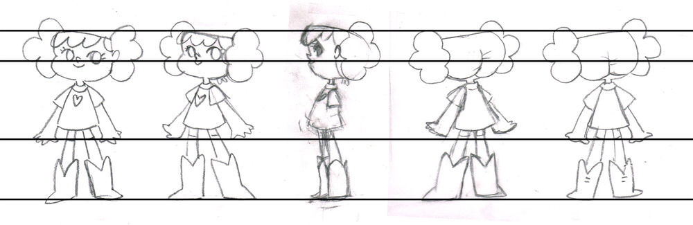
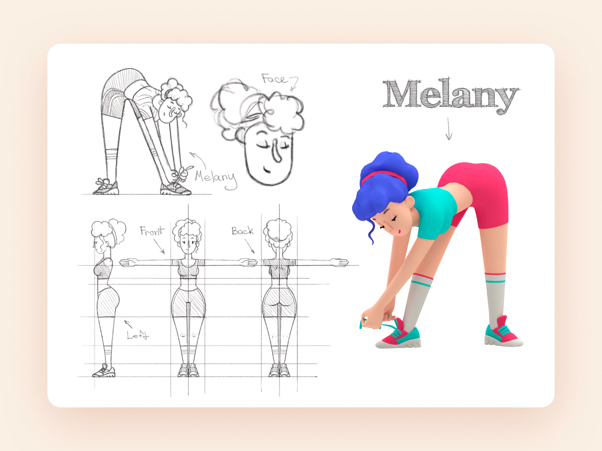
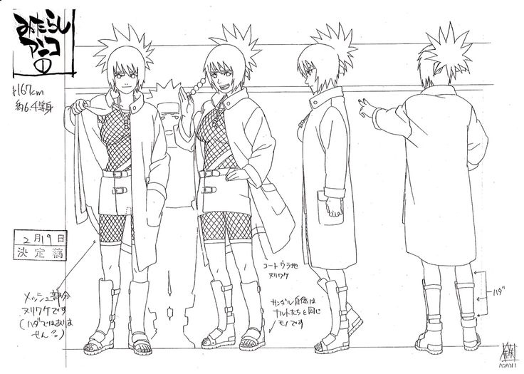
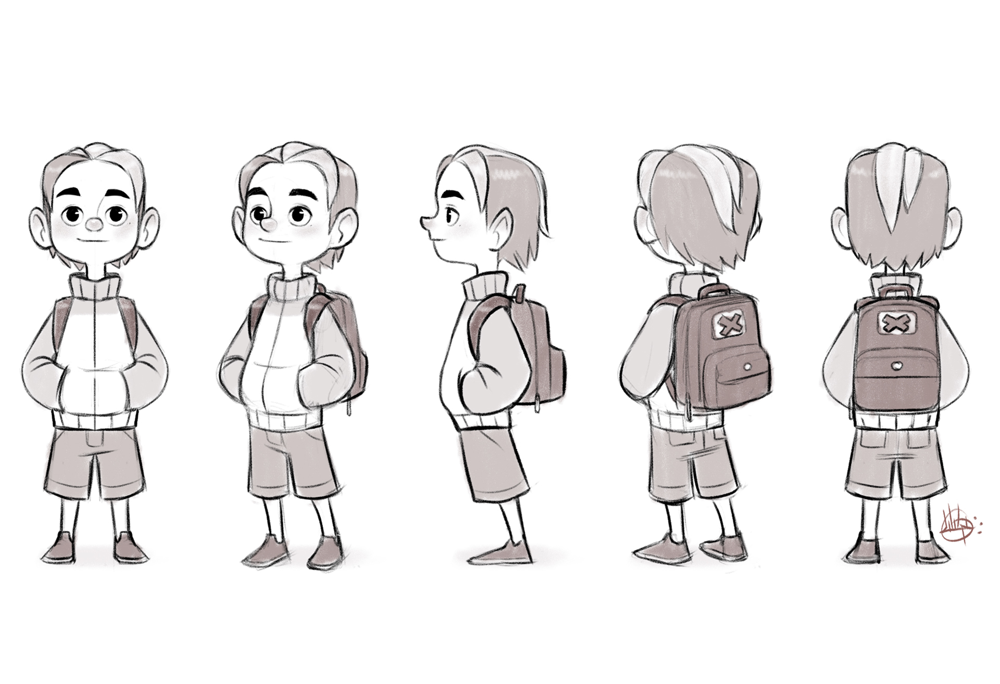

http://www.simplearttips.com/tutorials-blog/turnaround-sheet

我們在看各種動畫或遊戲角色設計設定稿或Guidebook的時候一定會看到一種圖是畫出角色各個不同角度的樣子。

這個圖是做什麼用的呢？
其實應該很直觀就可以看得出來，就是來告訴製作團隊這個角色全貌長什麼樣子。

有趣的是不同產業、不同的產品專案會使用來表現角色全貌的方式都有些微的差異，稱呼這種圖示的名字也各有不同，例如三視圖、Turn Around......等等。

幾乎所有的設定稿與Guidebook最核心的功能都是說明與溝通，所以如果看到自己正在用的方式和知名公司或其他體系使用不同的方式或名字時不需要緊張，只要確認現在使用的方式有達到完整的說明效果，那這個方法就成立。

像最早我學習3D動畫的時候就是直接教3D動畫專用的三視圖，因3D動畫在建模時需要看到完全正面、完全側面和完全背面（沒有透視時的造型），讓建模師比較好建模，且要畫成T POSE的樣子（如圖），因為3D角色製作流程中有一個環節是骨骼綁定（Rigging），做成T POSE會讓這個環節出來的動畫效果更好。

https://dribbble.com/shots/13169495-Training-Service-Illustration/attachments/4771729?mode=media

而如果是2D動畫，依據不同風格，有些只會畫正面、側面和背面，呈現角色的基本站姿與身上有什麼物件，不會像3D動畫那樣畫成T POSE。（就我在網路上搜尋，這種圖叫Model sheet，只是我不曾實際接觸過動漫和傳統2D動畫業界，不敢肯定他們慣用的名字是什麼。）

https://line.17qq.com/articles/kngpqwky_p5.html

有些2D作品風格如果比較立體，或是原設計者很要求細節的話，就會把各個角度的細節畫一整圈，所以會叫Turn Around。

通常會有這樣的差異是因為各公司或創作者有自己的習慣與流程，如果今天換成是你要來創作的話，就需要思考自己設計的呈現方式有沒有符合且足夠的表達自己想要的設計，而其他一起參與的人能不能理解這張圖。

只要follow這個邏輯去做就可以囉！

---

我們是 Peckystudios 。
擅長設計吉祥物與角色相關的動靜態設計，這裡是我推廣創作的部落格，希望大家能藉由我的內容從創作中找到樂趣。

如果您正在尋找設計師為您設計吉祥物，
歡迎您到[服務項目](https://peckyhsieh.wixsite.com/peckystudiosservice)頁面瞭解相關資訊
也歡迎您寄信到 peckystudios@gmail.com 與我聯絡！

謝謝

---

如果喜歡我們的文章，歡迎到[我們的選物店](https://www.rakuten.com.tw/shop/peckystudio/)支持我們，讓我們更有動力創作喔！