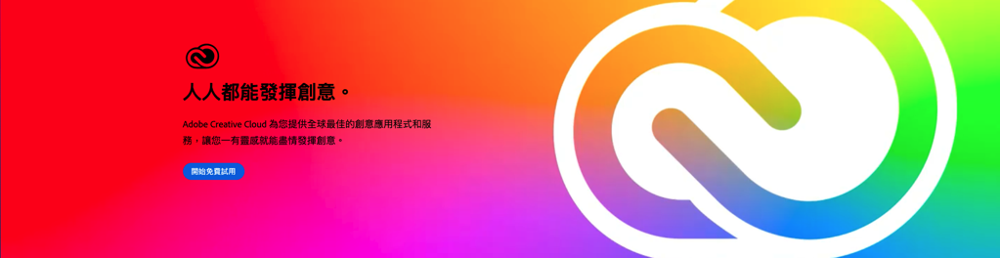
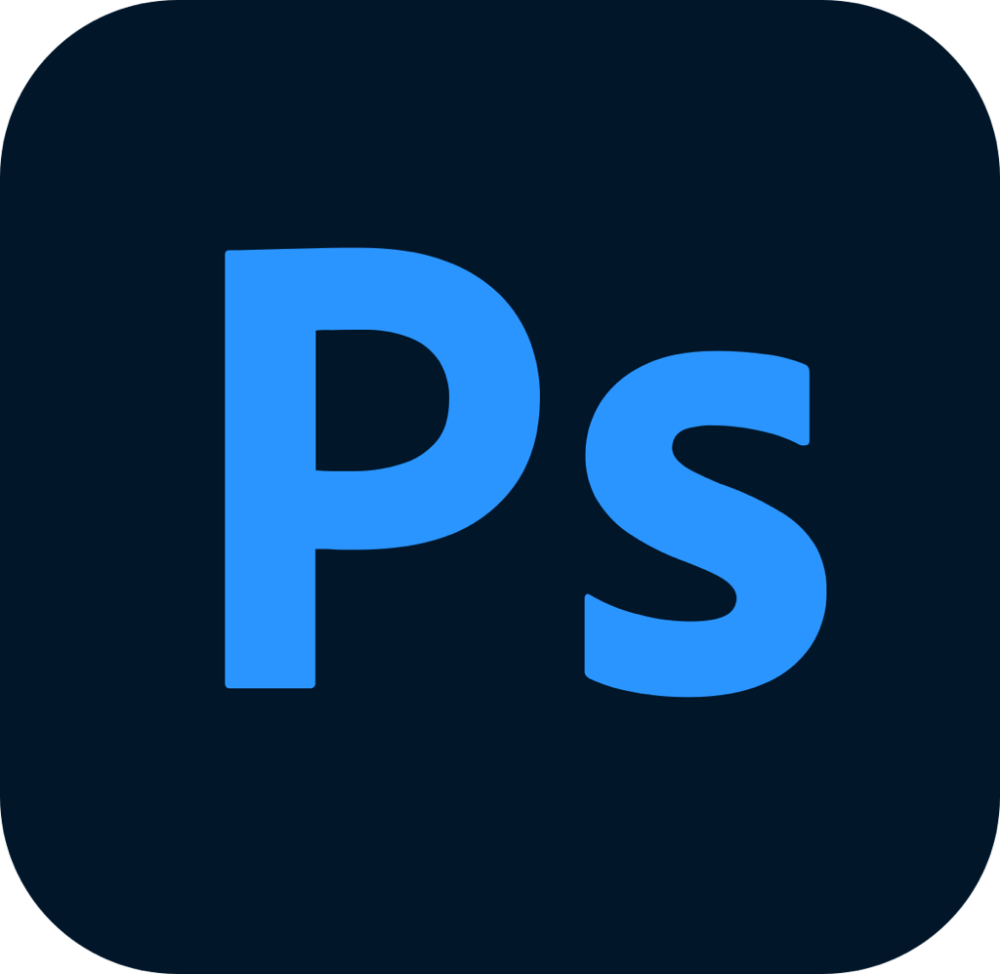
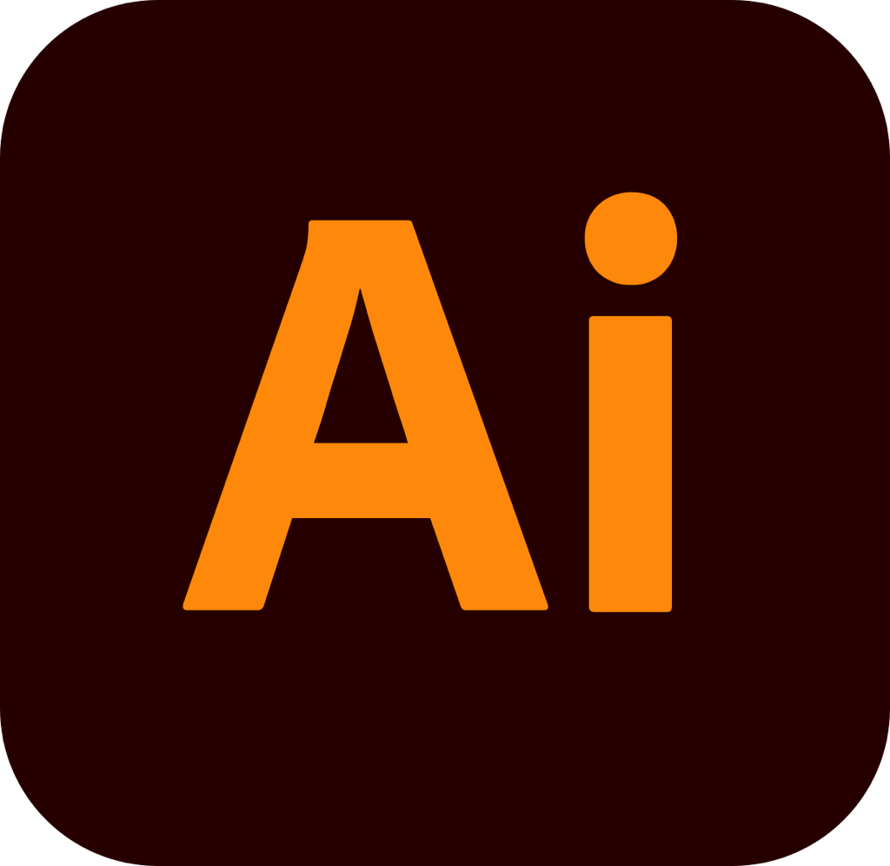
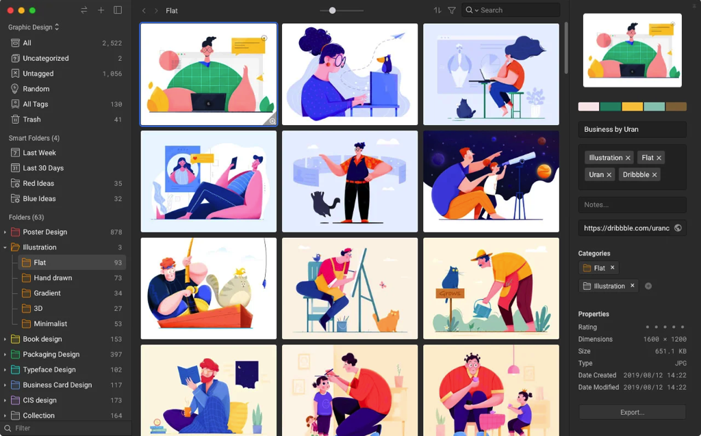
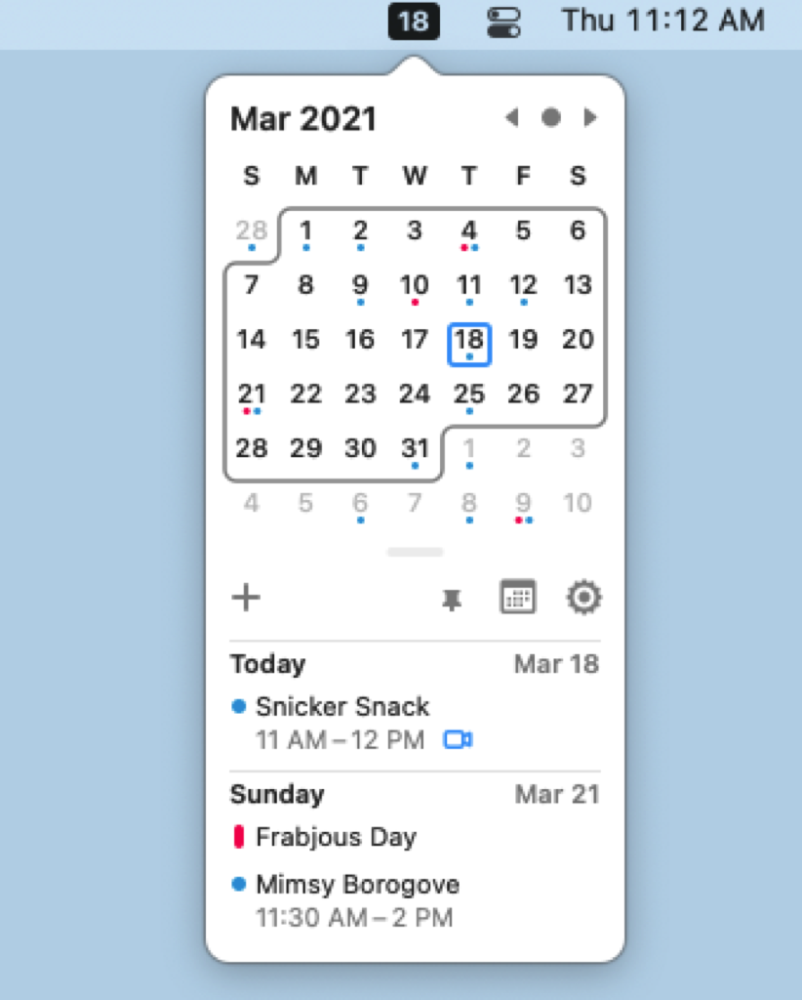
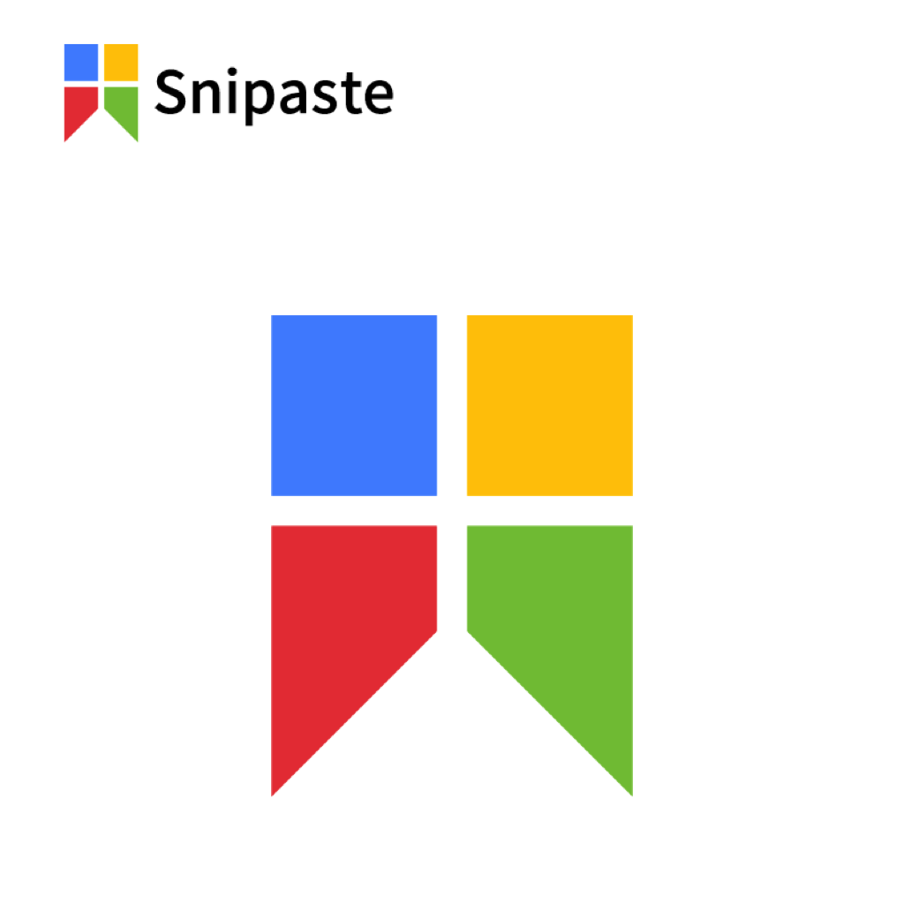
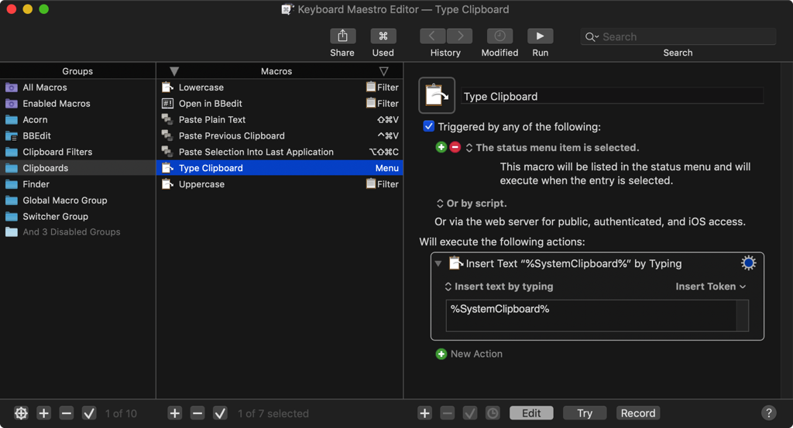
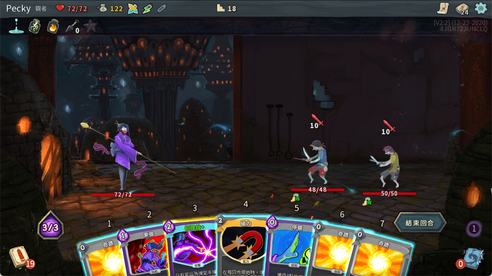

小時候第一次使用電腦是使用Windows，直到後來學習設計後，慢慢開始接觸Apple系列的產品。

目前我已經用過Apple系列的3台電腦，這邊整理出我現在最常使用的軟體工具：

## 1. Adobe 系列

這系列可能大部分人都知道了，就是專門在設計設計軟體的公司出的一系列設計工具。
我自己最常使用的是以下 3 個：

### Photoshop

這個是我第一個接觸的Adobe，是在我大約國中時期就接觸了，當時為了學電繪，自己悶著頭在網路上找教學自己學，當時的教學資源真的沒有現在豐富，學得有點辛苦。不過這段學習對於我後續考大學準備作品集到大學課程學習都很有幫助。

### illustrator

以拉是我在大學時才學會的軟體，我還有印象在課堂上頭很痛聽不懂老師在說什麼，畢竟向量繪圖的概念是第一次聽到，雖然以前數學課也有學過，但使用的方式不一樣真的需要一定的時間來習慣。

以拉後來也隨著我學習 Motion Design 而常常出場，甚至在後續設計角色的時候，因為我使用電繪版手會不舒服，畫出來的線都不是很漂亮，我後來就用以拉來克服，也慢慢在這裡找到自己畫畫的方式。

### AfterEffects

大學三年級的時候，當時在 Vimeo 裡面有很多 Motion Design 的作品，我當時就很有興趣，也剛好自己是在系學會幫忙攝影，會需要處理影像，也就開始碰觸 AfterEffects 和 Premiere 。從這時開始就對於AE越來越熟悉，後續工作也很常使用，外掛也越買越多🤣。

## 2. Eagle

這個是我在出社會之後購買的，真的是最佳投資！

[Eagle](https://tw.eagle.cool/) 是一個整理圖片素材的 App ，他的目標就是讓設計師可以將圖片都蒐集在同一個地方。我們可以針對圖片下標籤，也可以針對圖片的某個地方下標註，非常方便。

檔案機制也不像很多軟體把你的檔案鎖住，而是使用比較開放的方式直接讀取使用者自己的硬碟空間資料，對於在乎隱私的使用者是一個很大的優點。

他是買斷制，所以我買了四五年到現在還可以使用，而且開發者在這個過程中也一直在更新和改正各種非常好用的功能，像是對於各種不同格式的檔案支援、搜尋優化、App 開啓速度（本來就很快了還更快）等等。每一次更新幾乎都有驚喜！

如果想在 Google 順利搜尋到這個 App，記得要使用「Eagle App」這組關鍵字。

## 3.  AppCleaner

我每次只要使用新電腦，就會開始嘗試各種 App ，有些 App 使用了一次就知道不喜歡，所以會需要刪除。有時候直接將 App 丟進垃圾桶會刪不乾淨，就很需要 AppCleaner 的協助。他可以幫我們找到與要刪除的 App 有關的資料一起清除。

App 半身也滿輕巧，放在電腦裡隨時備用也不擔心！

少部分軟體程式比較複雜，會有他們自己的移除方式，如果有要刪除一些比較龐大的 App ，或是用了系統安全性比較深層資料的工具，就需要多多確認喔！

## 4. Itsycal

Itsycal 是一個免費的月曆工具，只要在[這裡](https://www.mowglii.com/itsycal/)下載並安裝就可以使用了。

因為我們 Mac 沒有像 Windows 一樣可以直接在桌面快速點開的月曆，對於我這種常常需要看日期的人很困擾。

我一開始還特別在 App Store 買了一個工具，怎知在某次系統升級之後就不能用了！
後來很幸運在網路上找到 Itsycal 這個免費工具，還比我花錢買的工具好用！

## 5. The Unarchiver

The Unarchiver 是一個免費解壓縮工具，支援大部分的壓縮檔（Zip, RAR, 7-zip, Tar, Gzip and Bzip2...等等）。檔案非常輕巧，且安裝後，平常只要直接雙擊壓縮檔就會自動執行，導致我用久了都會忘記我有安裝這個 App 🤣，非常推薦！

這個 App 讓我想起以前用 Windows 時也是要先下載 WinRAR 這個解壓縮工具，還真懷念！

## 6. Snipaste

[Snipaste](https://zh.snipaste.com/)也是一個免費而且是雙平臺的截圖工具，我很喜歡他的一點就是我可以按下快速鍵之後快速的框選出我想要截圖的範圍，並且複製，後續可以快速的貼到 Line 或是正在寫的文件裡。在框選的過程中甚至可以直接對截圖範圍進行修改和上字，對於要製作簡單的教學是快速又方便的工具。

## 7. Keyboard Maestro

[Keyboard Maestro](https://www.keyboardmaestro.com/main/) 算是 Mac 比較深度的玩法，他可以自動化的做到你在電腦上執行的幾乎任何事，只要你有辦法寫出來就可以辦到。我自己其實大部分都是用在自己設定某些快捷鍵開啓 App 或是某些機械式工作，我會自己設計一個自動化流程讓他幫我執行，也可以到他們的[官方論壇](https://forum.keyboardmaestro.com/)和 [官方 Wiki](https://wiki.keyboardmaestro.com/doku.php)看看別人的分享，也許會有收穫喔！

## 8. Alfred

[Alfred](https://www.alfredapp.com/) 是一個類似 Mac 內建的 Spotlight 功能的App ，不過他可以做到的事情更多，我們可以使用快速鍵叫出 Alfred ，快速鍵盤輸入進關鍵字找到軟體或是把輸入的文字直接丟到 google 搜尋。如果有付費的話，還可以自訂自動化流程工具，有些其他 App 也支援串接 Alfred ，在使用者的工作流程就很方便！

## 9. Spotify

[Spotify](https://www.spotify.com/tw/)是很知名的串流音樂平臺，我其實用非常久了，在 Mac 上當然也要裝。從早期的只有西方流行，到現在連日本、臺灣各種小眾音樂也會在上面出現，我也常在裡面聽 Podcast ，雖然 Apple 自己就有 Podcast ，只是我已經習慣聽音樂就開 Spotify ，且界面也都已經習慣了所以就繼續使用。

## 10. Steam

[Steam](https://store.steampowered.com/)是一個販售各種遊戲的平臺，經過 Steam 的軟體遊玩的遊戲也有幫忙存檔的功能，對於不想煩惱太多的玩家算是滿方便的。因很多人買了遊戲卻沒有空玩，常常被戲稱 Steam 本身就是一款遊戲蒐集遊戲🤣。

這邊就推薦一下我自己比較常玩的2款遊戲：

  
### Slay the Spire
這是一款 Roguelike 的卡牌遊戲，每一次遊玩可以選擇一種職業來爬塔，每一種職業使用的卡牌不一樣，且通常可以每一個職業都會有兩三種分支的玩法（看玩家如何選擇獲得的卡牌），一開始是看到好色龍在玩，買下來後覺得意外的耐玩，推薦給大家。
	

### The Binding of Isaac: Rebirth

這也是一款 Roguelike 的遊戲，每一次開始遊玩你會扮演 Isaac 探索每一層的房間，你會使用眼淚來攻擊怪物，探索過程中你會隨機的獲得各種道具，運氣好的話會獲得幫助極大的道具，讓你可以玩到最後一關，所以每一次的遊玩體驗起來都是不同的故事，非常有趣。

---

我們是 Peckystudios 。
擅長設計吉祥物與角色相關的動靜態設計，這裡是我推廣創作的部落格，希望大家能藉由我的內容從創作中找到樂趣。

如果您正在尋找設計師為您設計吉祥物，
歡迎您到[服務項目](https://peckyhsieh.wixsite.com/peckystudiosservice)頁面瞭解相關資訊
也歡迎您寄信到 peckystudios@gmail.com 與我聯絡！

謝謝

---

如果喜歡我們的文章，歡迎到[我們的選物店](https://www.rakuten.com.tw/shop/peckystudio/)支持我們，讓我們更有動力創作喔！