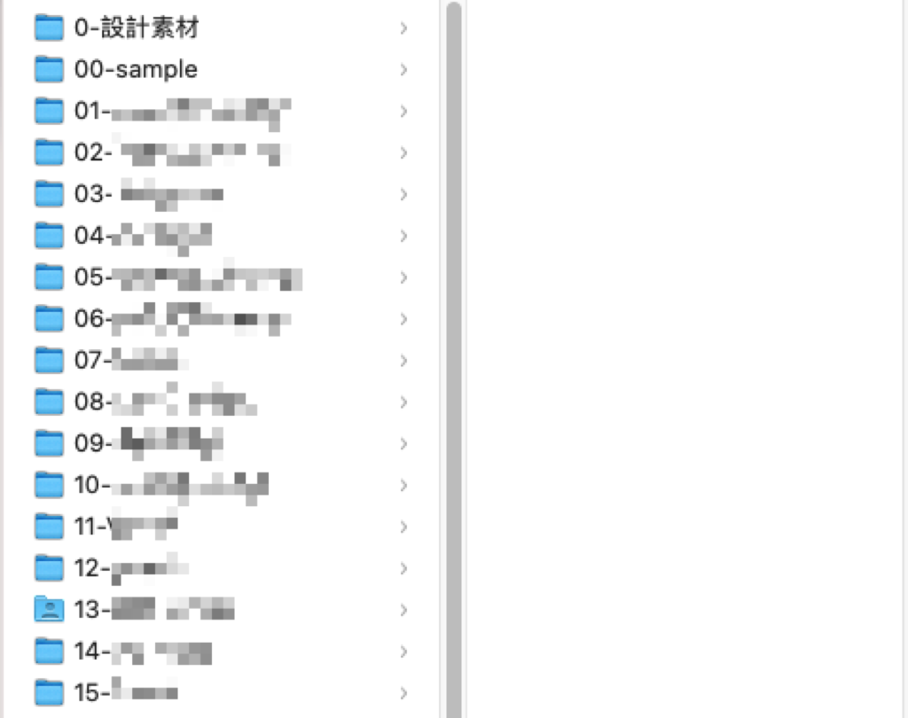
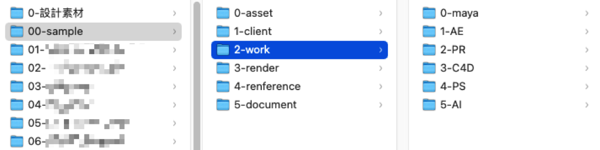
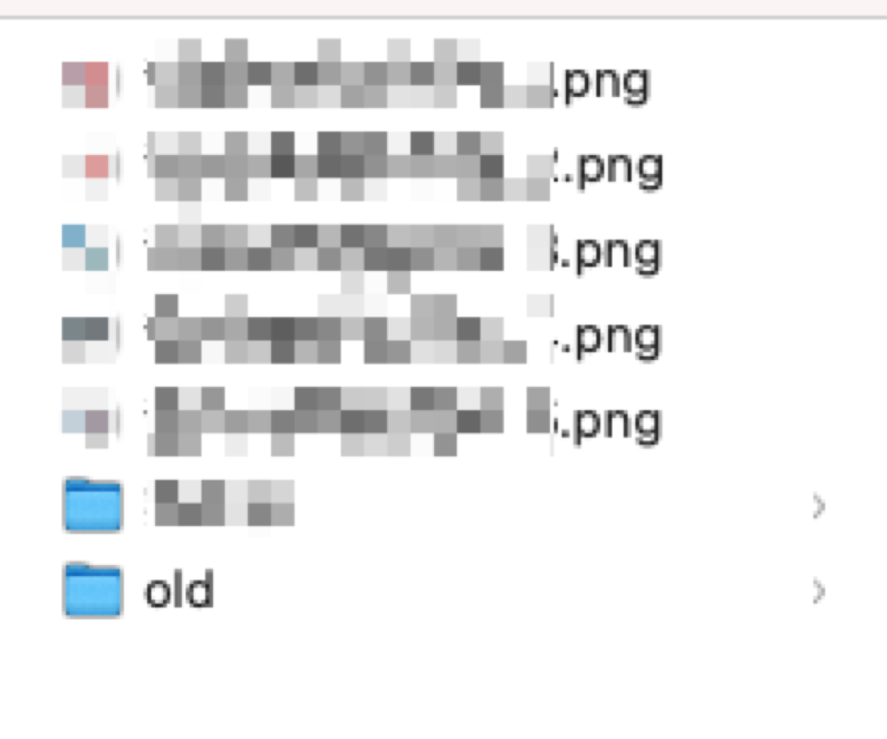

---

title: 多媒體設計師是如何整理電腦檔案的，每個人都該會的電腦技巧！

categories:
    - 軟體工具
date: 2021-09-17 00:00:00
description: 這個方法是我在第一份工作的時候我的同事分享給我的，非常感謝他告訴我，多虧學會這件事讓我在往後的工作上省了非常多的時間。
image: designerhowtosortfile.png
slug: designerhowtosortfile
draft: false
tags:
    - 軟體工具
    - 整理檔案
    - 文件

---

這個方法是我在第一份工作的時候我的同事分享給我的，非常感謝他告訴我，多虧學會這件事讓我在往後的工作上省了非常多的時間。

我是學3D動畫出身，剛開始整理檔案時是以3D動畫需求設計，直到後來因為學習 Motion Graphics Design 與進入創業公司，在裡面做過平面設計、遊戲設計、角色設計，所以我的資料整理方式變得很有彈性，在這裡想分享給大家，希望大家能在工作上節省很多時間。

# 基本邏輯

因為自己接觸很多種專案，所以教給大家的方式是以比較有彈性的方式設計，所以不管你今天是設計師或是一般上班族，相信也會對妳/你有所幫助。

## 專案名稱

只要有新的專案我就會開一個新的資料夾，不管這個專案是小還是大，尤其我們這個行業有時候無法預期專案會不會在未來突然長大，最好都在一開始就處理乾淨會最省力。

在檔案的最上層我會使用英文取名，因為我們在做 3D 或是 Motion Design 的時候會因為資料夾路徑中有中文而出錯，所以我就一直以來都是使用英文命名。如果你沒有這個問題也歡迎使用中文沒關係。

另外分享如果有些專案英文名字如果真的太難取，我推薦使用拼音的方式取名。（我現在就是使用拼音輸入法打繁體中文，因為我無法同時記住注音鍵位和英文鍵位，自從學會拼音輸入法就沒有這個問題，對我的頭腦負擔小很多）。

我也習慣在專案前面加上編號，看你的專案數量會是多少可以選擇從01或是001開始，我們的電腦系統會幫我們將資料夾以數字順序來排序檔案，這樣每次進到這個專案路徑裡面，每個專案的位置都會一樣，可以降低每次進到這裡面尋找檔案的時間。不要小看這一點時間，累積起來可以是好幾個小時。

如果除了數字之外還想增加一個分類的層級，可以像A001、B001這樣，電腦會依照他的邏輯去排序，Windows和Mac OS邏輯不太一樣，可以嘗試成自己習慣的方式。

## 專案內分類

我基本上會有這些分類：
- assets
- client
- work
- render
- reference
- document

### assets
通常是放原始素材的地方，或是被連結進軟體的檔案，例如 illustrator 、 After Effects 等等軟體都會有連結的情況。

### client
客戶或是廠商提供的素材檔案，有時候會和 assets 混用，可以依照專案狀況自由調整，不需要執著於一定要怎麼用。另外也可以直接把這個資料夾放進assets裡面。

### work
專門放執行檔案的地方，例如 .ai 、 .aep 、 .psd 等等執行設計或是其他軟體的執行檔案，是我每個專案一定會用到的分類，可以視需求再細分不同軟體的資料夾。

### render
render 是3D 動畫裡面會使用的詞彙，我們製作 3D 動畫要輸出動畫檔案時我們會稱呼這個動作為「渲染」，英文就是 render 。我後來都將所有「執行檔製作完成輸出出來的檔案」都放在這裡，例如製作完 Photoshop 修圖後的完稿檔案、製作好的 Motion Graphics 動畫等等，都會放在這裡。

### reference
這個可能比較是設計行業會用到的資料夾，我是拿來放自己找的參考資料，尤其是圖檔，有時候會遇到參考圖是客戶給的，這種我就都會放到 client 資料夾內。

### document
文件專區，所有 word 、 PDF 、 pages 等等文件類型的東西我都會放這裡，這樣如果突然要找某份文件就馬上知道可以進來這邊找，以免散亂在以上資料夾找不到。

# Tips

## 先製作模板資料夾

如果你覺得每次都要新增資料夾很麻煩，也可以先製作一個空的sample資料夾模板，每次新增專案的時候就複製出來修改名稱就可以用了。模板可以用000開頭來命名，會讓這個模板出現在最上面，這樣每次要用都可以在最前面找到，比較方便。

## 把最終檔案放外層

這個是一個雖然無奈但是可以方便自己的技巧😂。

如果今天遇到了 work 或是 render 裡面的檔案數量過多，已經會影響到每次進到資料夾尋找檔案的方便性，那就可以開一個名稱叫 old 的資料夾，把比較舊版的資料放進去，在檔案外層只留下最新版的檔案，這樣就可以保留找檔案的效率，也可以保留舊版本的資料，兩全其美。

# 總結

工作有時候很惱人，如果可以從小地方開始調整，讓自己更輕鬆，累積起來其實非常可觀，像我現在其實工作速度很快，省下的時間可以拿來休息或是學習，是很划算的工作習慣，畢竟時間真的非常珍貴。

這邊教大家這個方法不是希望大家完全照著我的方式使用，歡迎你把這樣的邏輯改成自己的方式，也歡迎你來跟我或是大家分享你的方法，也許經過你的分享又可以讓我每次工作的效率更好😊。

---

我們是 Peckystudios 。
擅長設計吉祥物與角色相關的動靜態設計，這裡是我推廣創作的部落格，希望大家能藉由我的內容從創作中找到樂趣。

如果您正在尋找設計師為您設計吉祥物，
歡迎您到[服務項目](https://peckyhsieh.wixsite.com/peckystudiosservice)頁面瞭解相關資訊
也歡迎您寄信到 peckystudios@gmail.com 與我聯絡！

謝謝

---

如果喜歡我們的文章，歡迎到[我們的選物店](https://www.rakuten.com.tw/shop/peckystudio/)支持我們，讓我們更有動力創作喔！