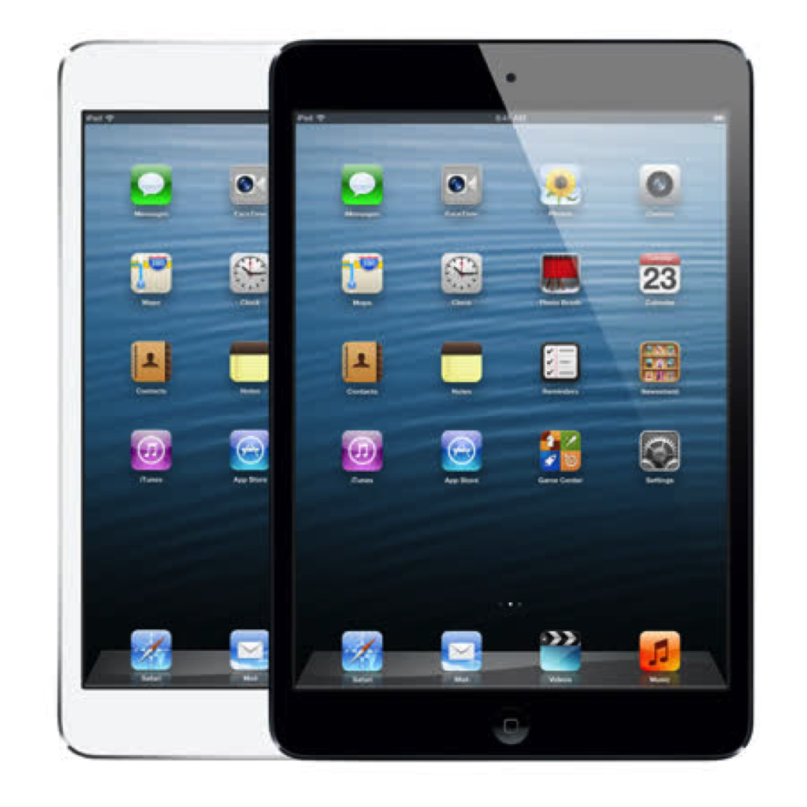

---

title: 2021年iPad mini 1 代還可以做什麼？
categories:
    - 生活風格
    - 3C產品
date: 2021-11-08 00:00:00
description: 原本擺在家裡生灰塵的 iPad mini 1 ，某天因為好奇他還可不可以動，被我拿出來玩，究竟只能升級到 iOS 9 的 iPad mini 還可以做什麼呢？
image: 2021年iPad mini 1 代還可以做什麼？.png
slug: whatcanipadmini1doin2021
draft: false
tags:
    - ipad
    - iPad mini
    - 閱讀
    - 電子書
    - 畫畫
    - 購物
    - 老物新用

---

原本擺在家裡生灰塵的 iPad mini 1 ，某天因為好奇他還可不可以動，被我拿出來玩，究竟只能升級到 iOS 9 的 iPad mini 還可以做什麼呢？

最近在 YouTube 的自動推薦下，看到居然還有人在 2021 年購買 iPad mini 1 代，還拍攝了開箱影片，覺得很驚訝！
[Unboxing iPad Mini 1 from Shopee (2021) | Serial number checked](https://youtu.be/m5_THL-xTro)

後來仔細想想可能是發展中國家，購買新款 iPad 負擔不起，且之前疫情的關係，需要一台 iPad 來上線上課程（視訊），才會有人在這個時間點購買如此舊款的產品。

說到這邊你可能已經很驚訝的發現這台 iPad mini 竟然還可以視訊！？

真的可以喔！我到現在還可以下載到 Zoom ，並且可以開啟使用，雖然我現在沒有這個需求，還是覺得很神奇！

現在來看看他還可以做什麼事吧！

# 閱讀

我一直有閱讀電子書的習慣，雖然已經有 iPad 2018 和 iPad pro 2020 ，但 iPad mini 這種體型和重量在閱讀上還是比較舒服，也比手機螢幕大！

目前 iOS 9 還可以下載的閱讀器是 Marvin 、樂天Kobo（App Store會下載舊版的相容性版本）、hyread 3 、Google play 圖書。

基本上這已經是所有我有在使用的閱讀 App 了！

目前體驗上，閱讀時只有開啟 App 的讀取時間要稍微等一下，閱讀中的反應速度是很 OK 的，如果你有用過 E-Ink 電子閱讀器，那這台 iPad mini 1 在閱讀上的表現你應該可以接受。

## Marvin

這個 App 可以讓你放入 Epub 來閱讀，我放了幾本閱讀起來都沒有問題，而且還有朗讀功能，超級厲害👍！

## 樂天Kobo

我主要買書的地方，原本以為不能安裝，但我在 App Store 的已購項目裡面下載到相容性版本，最棒的是新書也可以正常同步和閱讀！超級令人開心！

## Hyread 3 

一樣可以正常借閱書籍沒問題，雖然版本稍舊，但幾本功能都可以使用，可以看書已足矣。

## Google play 圖書

也可以正常登入使用，下載書的速度比較慢一點，也可以正常閱讀書籍。

# 看影片

平板拿來看 Youtube 影片是很基本的功能，那這台可以正常使用嗎？

我的答案是勉強可以，因 Youtube 不支援 iOS 9 了，所以要使用瀏覽器瀏覽 YouTube 網頁，才可以正常觀看。

可惜的是解析度不明原因預設一直是 360p ，相對模糊，而且沒辦法修改預設值到比較好的設定。

建議使用 Puffin web browser 觀看，速度比 Safari 好一點點。

雖然有以上缺點，但我倒是推薦可以使用這台老機子來聽 Lofi 音樂，蠻有感覺的～

# 看漫畫

這邊唯一推薦漫畫人極速版，問題和前面一樣只有開啟的時候 Loading 比較久，正在閱讀的時候真的沒什麼困擾，頂多遇到網路不好會卡就是了。

目前已經在上面看 2 部漫畫，體驗並不差，重點是 iPad mini 真的很輕。

# 玩遊戲

這個就真的有點勉強，但可以玩一些非常非常輕度的遊戲，像動物管理員或是 dots 這樣的遊戲，比較大型的遊戲都是閃退到爆炸😂

# 筆記

目前測試起來手寫的 App 有 Notability 和 Metamoji note lite 可以使用，可惜的是 Notability 不知為何檔案和新版的不相通，所以 iCloud 的雙向同步無法使用，超級可惜，如果可以的話我就可以直接用這台作為隨身攜帶的筆記本了。

如果是打字筆記的話首推熊掌記，付費的同步功能依舊非常快速強大，唯一讓我受不了的反而是 iOS 9 的輸入法，有一些不太能理解的 bug 😅。

如果要免費的話，simplenote 也是一個不錯的選擇，可以試試看。

# 總結

我沒有想到這台 2012年的 iPad mini 1 還可以做那麼多事，讓我覺得很驚訝又驚喜，光是可以看書就很值得了！

目前已經下單一個通用版的主動式電容觸控筆，準備拿來試試看能不能稍微做一點筆記，如果不行我手機也可以使用，並不會虧錢。

研究這些的過程真的相當有趣， Apple 品牌的產品真的相當耐用，好好珍惜的話真的可以用很久不會壞，直到用到不能更新為止。

如果家裡也有像這一台一樣的老舊平板，不用急著丟，也許會發現更多用途喔！

---

我們是 Peckystudios 。
擅長設計吉祥物與角色相關的動靜態設計，這裡是我推廣創作的部落格，希望大家能藉由我的內容從創作中找到樂趣。

如果您正在尋找設計師為您設計吉祥物，
歡迎您到[服務項目](https://peckyhsieh.wixsite.com/peckystudiosservice)頁面瞭解相關資訊
也歡迎您寄信到 peckystudios@gmail.com 與我聯絡！

謝謝

---

如果喜歡我們的文章，歡迎到[我們的選物店](https://www.rakuten.com.tw/shop/peckystudio/)支持我們，讓我們更有動力創作喔！