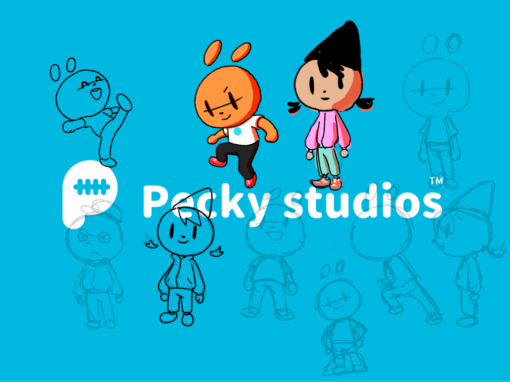
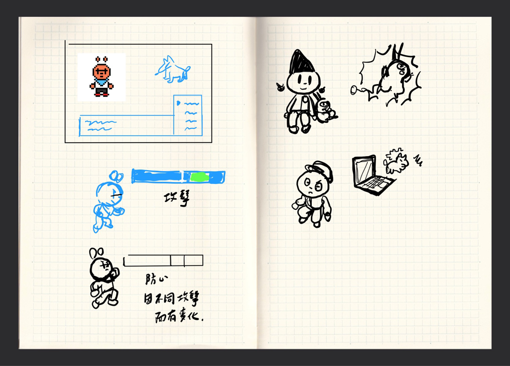
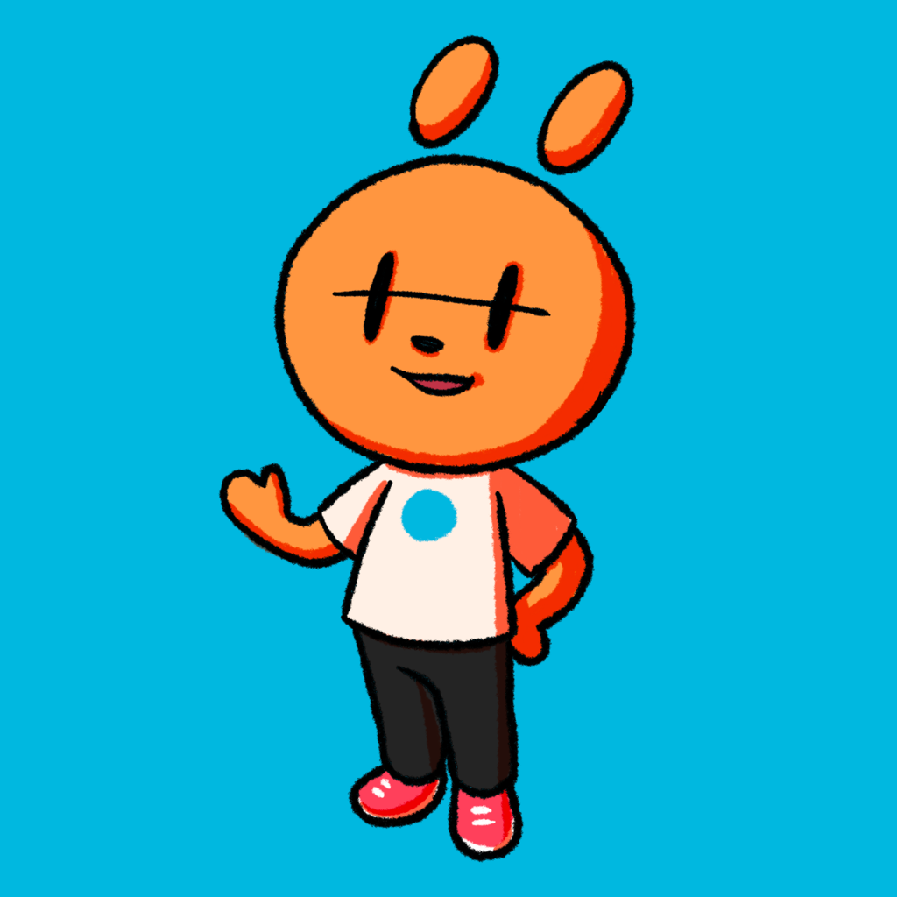
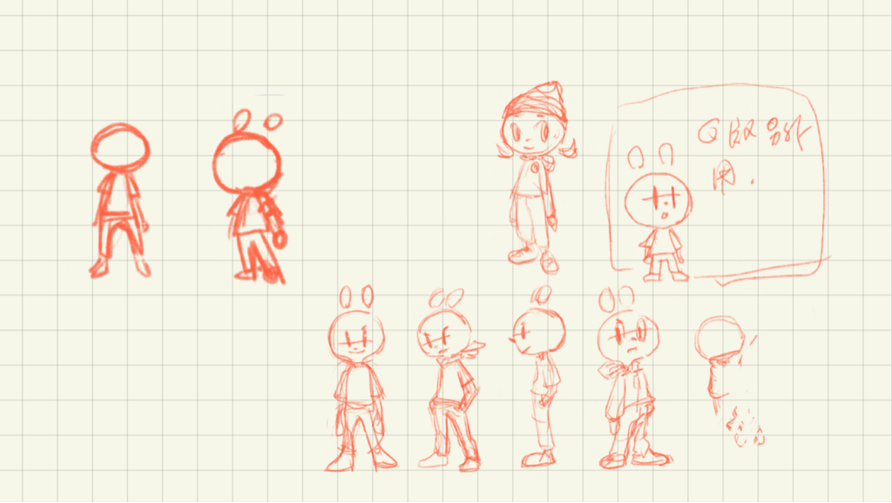

---

title: Creative DevLog 001｜Heart Beater （暫）世界觀故事開發記錄
categories:
    - IP經營
    - 角色設計
    - 筆記系統
    - 藝術創作
date: 2021-11-10 00:00:00
description: 既然我們是推廣創作的網站，我們當然也喜歡自己創作作品。 Peckystudios 正在開發首個自主開發的IP，現在還在早期開發階段，藉由這個 Blog ，一邊記錄整個創作的過程，一邊也分享給喜歡創作的觀眾，可以跟我一起經歷創作的有趣過程。

image: C98F5AE3-81D5-47F9-B5A0-65C023886865.png
slug: creativedevlog001
draft: true
tags:
    - ipad
    - iPad pro
    - IP
    - 創作
    - 世界觀
    - Devlog
    - 畫畫
    - 筆記工具
    - 軟體工具

---

既然我們是推廣創作的網站，我們當然也喜歡自己創作作品。 Peckystudios 正在開發首個自主開發的IP，現在還在早期開發階段，藉由這個 Blog ，一邊記錄整個創作的過程，一邊也分享給喜歡創作的觀眾，可以跟我一起經歷創作的有趣過程。

隨著時間發展，世界會越來越大，所以我也選用了一些方便的工具來創作，目前主要為 Flomo 、 Noteplan 3 、 InfDraft 、 Procreate和 Goodnotes ，這幾個都是 iPad 上可以使用的 App ，對於有想法的時候，比起電腦， iPad 在快速開始創作還是略勝一籌。

世界觀的主軸目前還處於很模糊的狀態，因為未來想要有一個遊戲作品，所以在這裡猶豫比較多，想過要不要有魔法、對戰等等系統，但也考量我完全是一個遊戲開發新手（目前在曾經任職的公司算是參與過 3 - 5 款小遊戲而已），想自主開發的話，在第一款遊戲最好不要太複雜，所以到現在還是很猶豫世界觀要怎麼設計。

角色設計的部分，本身就是角色設計師的我是比較清楚要怎麼做，目前是拿自己以前大學創作出來的角色再重新整理，針對表現力，尤其在對大眾來說，如何表現情緒可以比較好理解調整很多，另外也為了討喜將角色比例進行修改，目前暫定變成 2.5 頭身的樣子。

除了遊戲作為曝光的管道，我也有準備開設 Instagram 帳號來經營 IP 。目前規劃是這邊放比較日常休閒的內容，簡單放鬆的小故事，大型的故事會放到之後比較好呈現敘事的遊戲或是其他媒介上面，現在還是以我目前可以負荷的創作內容為主。

世界觀設定是多多益善，極有可能創作的 100% 的內容，最後在故事呈現的時候只能呈現 10% 甚至 5% 的內容，但這完全不會虧，因為同一個世界觀還可以創作很多不同視角的故事，可以再創作不同的產品。

我是用工作的空檔或是下班後休息時間來想世界觀和角色設計，雖然每天都只有一點點記錄，但累積起來也是有一定的量了，尤其目前使用 Flomo ，所有快速、Rough 的想法會丟在裡面，有空的時候就打開來看，每張卡片來回翻看也會有新想法，是個簡單又不錯的工具。

接下來還會有什麼樣的內容，就敬請期待了～！

 
---

我們是 Peckystudios 。
擅長設計吉祥物與角色相關的動靜態設計，這裡是我推廣創作的部落格，希望大家能藉由我的內容從創作中找到樂趣。

如果您正在尋找設計師為您設計吉祥物，
歡迎您到[服務項目](https://peckyhsieh.wixsite.com/peckystudiosservice)頁面瞭解相關資訊
也歡迎您寄信到 peckystudios@gmail.com 與我聯絡！

謝謝

---

如果喜歡我們的文章，歡迎到[我們的選物店](https://www.rakuten.com.tw/shop/peckystudio/)支持我們，讓我們更有動力創作喔！