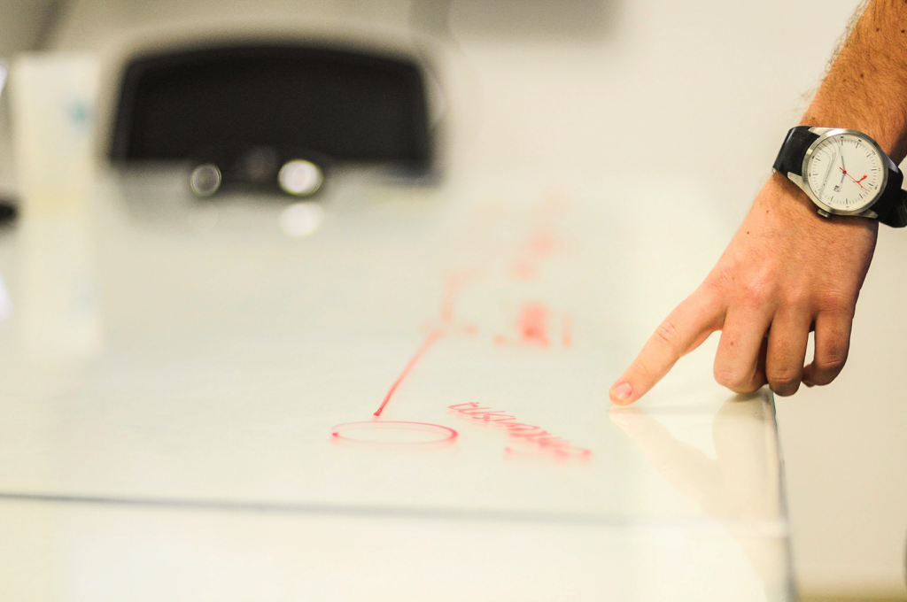
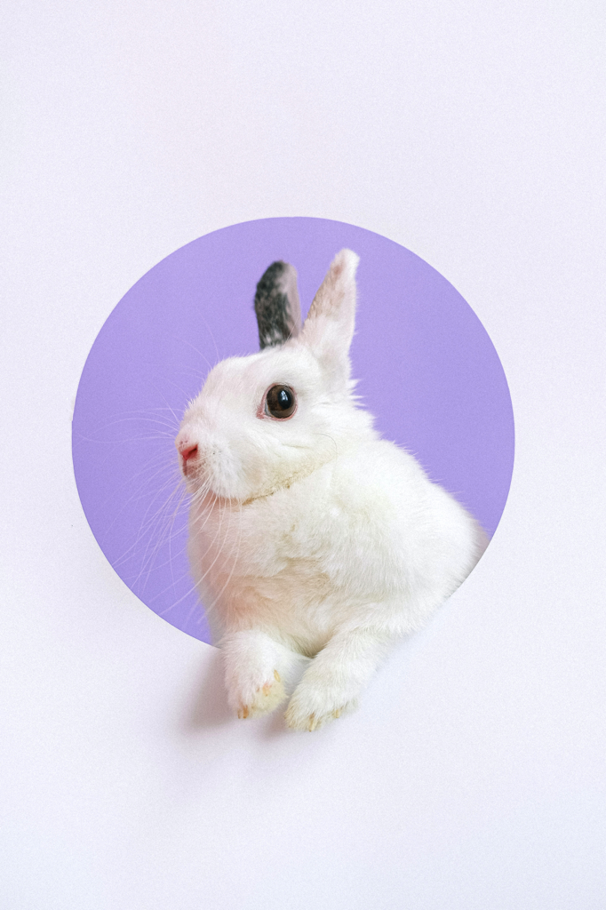
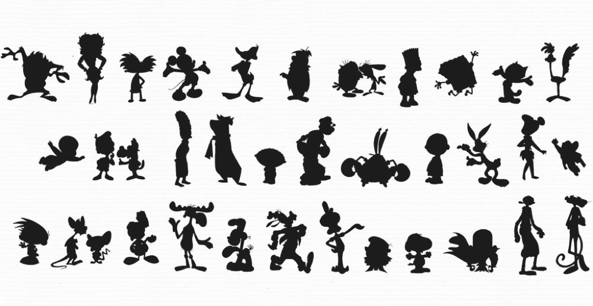
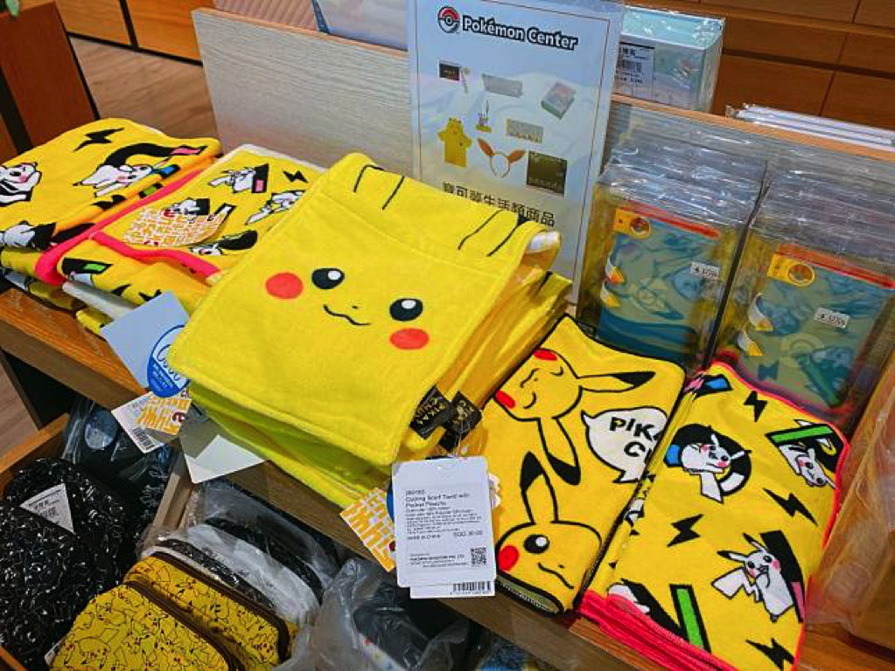

---

title: 吉祥物設計從哪裡開始？ 7 個吉祥物角色設計的要素技巧
categories:
    - IP經營
    - 角色設計
    - 吉祥物

date: 2021-11-12 00:00:00
description: 雖然設計吉祥物有時候天馬行空也很有趣，但漫無目的的設計還是比較困難的，我們在設計的時候可以從以下要素來做為起點，以免想法過於發散最後收斂不出一個作品來。

image: 49EE1575-5E1F-418D-BB5A-56784293DAB4.png
slug: 7mascotdesigntips
draft: true
tags:
    - IP
    - 創作
    - 吉祥物
    - 吉祥物設計
    - 角色
    - 角色設計
    - 要素
    - 技巧

---

雖然設計吉祥物有時候天馬行空也很有趣，但漫無目的的設計還是比較困難的，我們在設計的時候可以從以下要素來做為起點，以免想法過於發散最後收斂不出一個作品來。

# 定位目標客群
這一步驟很重要，我也在很多文章提過好幾次，因為我們在設計任何東西的時候，不可能滿足這個世界上的所有人，我們只能針對某一個客群設計。

我可以理解創作者或是設計師會有想要自己的作品被很多人喜歡的心理，而且市面上大受歡迎的 IP 例子比比皆是，但在設計時務必先忍耐，先以一個客群開始吸引為佳，當你在一個固定的圈子裡面已經有固定的粉絲時，再去想如何擴展客群是比較好的做法。

# 原型

## 造型原型
為了吉祥物要討喜，我們可能會比較常以動物或是人們較為常見的物件為基底來設計角色。這有幾個好處：

### 熟悉感
人會對比較喜歡常看見的事物，如果吉祥物的設計是用常見的動物來設計，好處就是人們一看就知道是什麼動物，例如兔子、貓和狗等等這些非常常見的可愛動物，人們會比較快速的接受你設計的角色。

但用常見的動物也有缺點，就是用這些常見的動物的角色非常多，例如臺灣黑熊被用好幾次了，創作者和設計師要怎麼在吉祥物角色海裡面脫穎而出，就是看創作者和設計師的功力如何了。

### 辨識度
我們會希望人們記住我們設計出來的，如果今天我們是設計一個熊或是兔子，人們第一眼還沒認識這個吉祥物就會至少記得他是一隻或是他是一隻兔子，我們只要在後續用吸引人的角色個性塑造和故事來加強記憶點，就可以讓觀衆更有印象。

## 角色原型
大家看過那麼多影視，電影、電視劇、動畫、漫畫等等，是不是感覺裡面有很多不同作品的角色給人類似的感覺？例如奸詐的角色、負責搞笑的角色等等。就像京劇裡面角色有分：生、旦、淨、末、丑，這也是類似的概念，我們可以為自己的角色找一個參考的角色原型來設計。

[Character Design | Silhouettes](https://characterdesignreferences.com/visual-library-2/character-design-silhouette)

# 造型
造型輪廓是角色的要素之中非常非常重要的要素，因為我們人眼睛在處理一張圖的時候，會先辨識輪廓，再來辨識明暗，之後才會是色彩。造型輪廓可以迅速讓頭腦去運作，猜想眼前這張圖的內容是什麼。所以在設計吉祥物或是任何角色的時候，第一件事情就是務必記得確認自己的角色造型好不好被辨識。

# 顏色
光是一個顏色就可以讓不同人有不同的情緒感受，所以在設計吉祥物時也要好好確認自己的角色整體看起來給人什麼樣的感受。

這邊分享我自己比較常使用的配色技巧，我會讓角色全身50-70%是同一個顏色，其他細節再以其他顏色去輔助搭配，這樣設計出來我們就很明顯可以看出「這一個吉祥物（主要）是什麼顏色」，他就會變成一個角色的代表色了。

依據不同的設計場合，也可以多試試看其他的配色方法，不是只有一種方法喔～！

# 個性
沒有個性的吉祥物角色就是一張圖而已，如果我們可以為一個角色設定一個非常寫實生動的個性，這會讓觀眾覺得這個角色栩栩如生，能夠讓觀眾更有代入感會想要更加認識這個吉祥物角色。

# 故事
故事可以讓人記住，也可以讓人傳唱。我們可以藉由故事打動人心藉由角色表演來傳達故事讓觀眾能夠喜愛上角色。

生活中處處有故事，如果沒有靈感的話，可以多出去走走，觀察生活週遭，或是多和朋友聊聊，增廣見聞，也許你就會有好靈感了。

另外分享在個性與故事中最常被使用的技巧，就是「衝突」。我們可以在個性中設計反差，例如壯碩的角色害怕蟲，這兩者反差出來的表演效果最為讓人記住。故事中我們也可以為每一個場景設計衝突，讓觀衆看得欲罷不能，還想知道後續會發生什麼事。

[「寶可夢快閃店」新光三越南西可愛登場！多款皮卡丘週邊、伊布家族睡眠玩偶準備收服 | 妞新聞 | LINE TODAY](https://today.line.me/tw/v2/article/gYkjqG)

# 衍生
吉祥物設計時有一項特別重要，我們要注意未來我們產出的圖可能要被重複使用，所以畫的時候如果用 Photoshop ，那就要記得圖開大一點，如果你可以用向量繪圖軟體那更好，例如 illustrator ，就沒有什麼大小的問題。

為了未來可能要與廠商溝通，Guidebook 也要先做起來預備好。

# 總結
已經摩拳擦掌想開始設計了嗎？趕快開始吧！
設計自己的吉祥物真的很有趣，我也是每次設計都很開心才喜歡上設計吉祥物，所以也希望大家一起試試看！
 
---

我們是 Peckystudios 。
擅長設計吉祥物與角色相關的動靜態設計，這裡是我推廣創作的部落格，希望大家能藉由我的內容從創作中找到樂趣。

如果您正在尋找設計師為您設計吉祥物，
歡迎您到[服務項目](https://peckyhsieh.wixsite.com/peckystudiosservice)頁面瞭解相關資訊
也歡迎您寄信到 peckystudios@gmail.com 與我聯絡！

謝謝

---

如果喜歡我們的文章，歡迎到[我們的選物店](https://www.rakuten.com.tw/shop/peckystudio/)支持我們，讓我們更有動力創作喔！