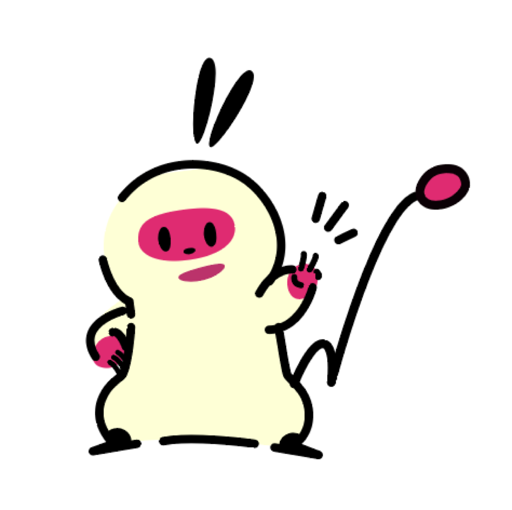
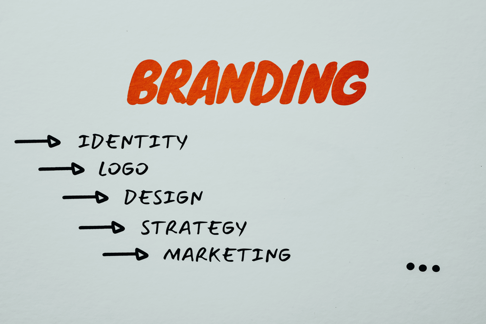
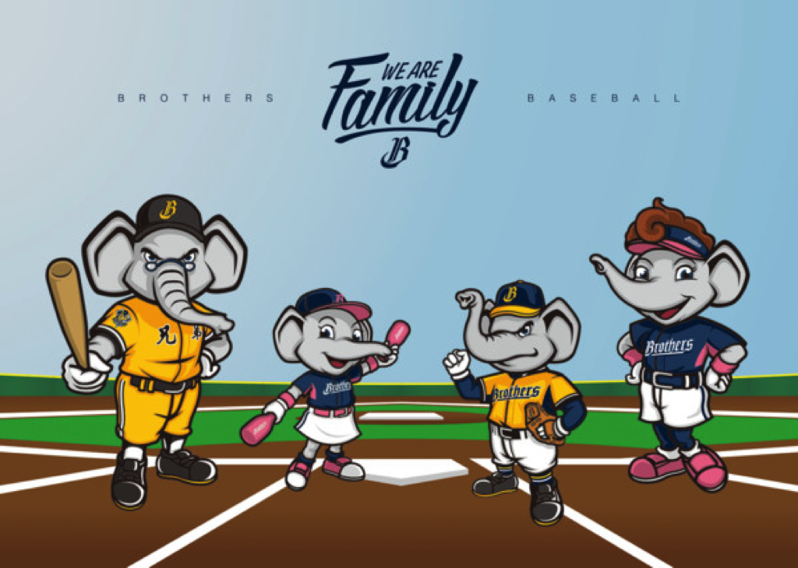
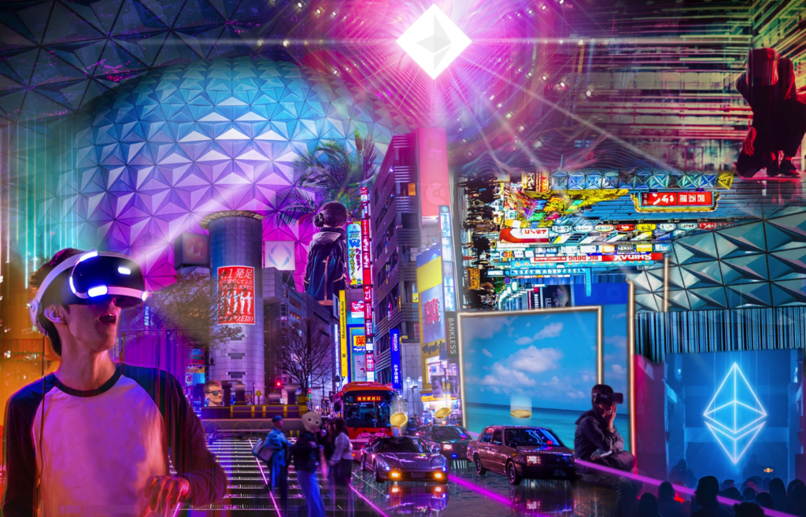

現在是自媒體時代，不管你是一般人、Youtuber、部落客還是IG經營者，每個人隨時都在生產內容，每個人都希望自己的內容可以佔領觀衆一定的注意力，所以現在建立個人品牌是一個熱門的話題，身為自媒體創作者的你可以用什麼方式來行銷自己呢？

# 為自己設計一款吉祥物吧！

吉祥物過去可以是代表一個活動、團隊、品牌甚至是公司，例如奧運會、棒球隊、大同電鍋等等，藉由吉祥物來象徵自己的正向價值。而到了現在這個時代，我們自媒體創作者為什麼不也創造一個吉祥物來代表自己呢？畢竟我們也是希望不斷的產生正向價值啊！

我就有為自己的品牌設計吉祥物和角色，希望他可以成為我的個人品牌的精神象徵，藉由小 Pon 不按牌理出牌的個性，讓大家看到這個可愛的圖像就可以想到我這個推廣每個人都可以自由創作的個人品牌。

# 每個品牌都是獨特的，吉祥物也是。

個人品牌最重要的就是傳遞自己的價值，而每個人可以提供的價值都是獨一無二的。

以我為例子，我擅長設計可愛的角色，對於動態設計也小有研究，也喜歡觀察現今 IP 是如何發展的，而也許你也是擅長設計可愛的角色，但與我不同，你的繪畫技巧相當雄厚，可以創造很有深度的場景設計。

即使我們看起來擁有類似的能力，但每個人都有很多不同的面向，各自都可以找出自己與他人不同的地方，這就是我們的個性。

既然個人品牌都是獨一無二的，那針對品牌設計的吉祥物也會是最獨特且擁有自己個性的角色，這樣是不是也增長了自己品牌的辨識度了呢？

讓吉祥物來幫忙傳遞自己的價值也是一個比較易於理解的方式，可以減少溝通的困難。

# 藉由吉祥物行銷自己

[兄弟本週主題日　象一家人大團圓 | ETtoday運動雲 | ETtoday新聞雲](https://sports.ettoday.net/news/761144)

有了吉祥物之後，我們可以藉由代表我們的精神象徵的圖像來宣傳自己，就像品牌 LOGO 一樣，但吉祥物因為是擬人化的角色，他可以傳遞更多的故事、更多的情緒，豐富度會比單純的 LOGO 更多。

經過擬人化的吉祥物可以經由表演、生動的表情、清楚的情緒表現快速的被人們理解，所以我們可以藉由這個優勢來讓吉祥物的舉手投足之間傳達很多訊息。

# 吉祥物可以引領你接觸原本接觸不到的人事物！

[Subspace | Dedicated Network For Real-Time Applications](https://subspace.com/)

現在虛擬世界、元宇宙、NFT也相當火紅，裡面其實薀藏了相當多 IP 經營的元素，對這類型的虛擬吉祥物角色需求也會越來越多，如果你未來也想要執行相關的策略，如果原本就有在經營自己的吉祥物，在做策略上的結合也會更輕鬆。例如將吉祥物做成週邊產品、懶人包、IG 和 FB 貼文、甚至遊戲、線上服務等等。

甚至在未來，我們可以將自己的吉祥物角色與其他品牌的吉祥物或產品合作，在活動中共同曝光或是生產新形態的產品，這些都可以讓創作者接觸到很多原本品牌不會接觸的人事物。

延伸吉祥物的應用，我們甚至可以讓他與多媒體結合，如果有活動或是展覽，結合光雕投影或是互動裝置，又有很多原本想不到的、可以和觀衆接觸的方式。

是不是很吸引人呢？

對這個趨勢我可是很興奮的，畢竟自己非常喜歡 IP 相關的議題，能有更多機會可以接觸自己平常接觸不到的東西，是很棒的一件事！

# 總結

吉祥物是一個需要長期經營的行銷方式，如果你希望將自己的個人品牌長久經營，就可以試試看為自己設計一隻吉祥物角色，可以為你的個人品牌增添很多樂趣，對於受眾或是創作者而言都是！

如果不擅長設計角色，也可以找擅長設計可愛吉祥物角色的設計師幫忙，或是喜歡風格的插畫家，只要是符合自己個人品牌調性的都可以嘗試看看喔！

 
---

我們是 Peckystudios 。
擅長設計吉祥物與角色相關的動靜態設計，這裡是我推廣創作的部落格，希望大家能藉由我的內容從創作中找到樂趣。

如果您正在尋找設計師為您設計吉祥物，
歡迎您到[服務項目](https://peckyhsieh.wixsite.com/peckystudiosservice)頁面瞭解相關資訊
也歡迎您寄信到 peckystudios@gmail.com 與我聯絡！

謝謝

---

如果喜歡我們的文章，歡迎到[我們的選物店](https://www.rakuten.com.tw/shop/peckystudio/)支持我們，讓我們更有動力創作喔！