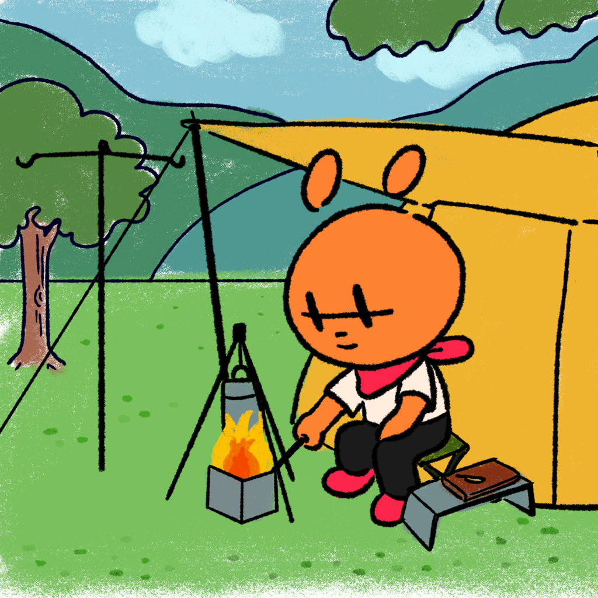

---

title: Creative DevLog 002｜Heart Beater（暫）角色與美術研究
categories:
    - IP經營
    - 角色設計
    - 吉祥物
    - 藝術創作

date: 2021-11-29 00:12:00
description: 接續上次的紀錄，這幾天花了很多時間研究角色風格與美術，雖然我較擅長畫角色，但我在畫場景的部分份其實非常弱，對於我想要發展世界觀造成一定的障礙。

image: IMG_0106.png
slug: creativedevlog002
draft: true
tags:
    - IP
    - IP開發
    - 創作
    - 吉祥物
    - 吉祥物設計
    - 角色
    - 角色設計

---
接續上次的紀錄，這幾天花了很多時間研究角色風格與美術，雖然我較擅長畫角色，但我在畫場景的部分份其實非常弱，對於我想要發展世界觀造成一定的障礙。

我在尋找一個自己可以接受，視覺上也能夠好看的美術風格。我發現超級難的，畢竟畫 IP 角色，在風格上一開始最好要統一好讓人記住，不像我平常畫畫時可以很自由的配色，用很強烈的線條，再加上我自己畫畫技能有很多缺陷，最近幾個月才終於在練習中找到一種適合自己，可以上出好看線條的方式。

也許我可以把自己擅長的自由粉臘筆畫風和 IP 角色結合在一起，甚至在數位版內容中直接不設計背景，直接使用 pattern 等等，讓他風格化和簡單化，還要再多嘗試！

設計工作通常最花時間的就是前面尋找風格的時候，相信等到有一個好的SOP之後，後面在產內容的時候就會順暢許多。

上次有提到我想要製作遊戲，所以有空檔的時候也有研究一下遊戲引擎，卡最嚴重的地方就是我選擇的遊戲引擎 Godot 有自己的程式語言 GDscript ，網路上教學都是英文，在學習時稍微吃力一點，我只能用重複看或是看到不懂的地方先跳過，多看幾個教學也許相互有內容的互補，後面再回頭看一樣的教學就看得懂了。

雖然目前沒有製作 3D 內容的計畫，但基於未來可能會用到，且有機會在生產內容時省略很多工時，有慢慢熟悉 Blender 的介面。這個軟體免費開源，真的很佛心，一般 3D 軟體像是 Maya 、 C4D 費用都超級貴的！

因為以前是學 3D 的，所以看教學時真的比 Godot 輕鬆，很容易理解他們在幹嘛、對比 Maya 有什麼差別、有哪些操作要學起來比較方便等等。

謝謝你看到這邊，我的開發進展其實滿慢的，畢竟不是專職做這個，只能用很零碎的時間做很零碎的事情，不過我相信這一天一天累積起來，也會很可觀的！

如果你喜歡我的作品，或是喜歡看我這個不定時更新的 DevLog，想支持我的話歡迎到我的商店消費，買一張幾十元的貼紙對我也是莫大的支持！

 
---

我們是 Peckystudios 。

擅長設計吉祥物與角色相關的動靜態設計，這裡是我推廣創作的部落格，希望大家能藉由我的內容從創作中找到樂趣。

如果您正在尋找設計師為您設計吉祥物，歡迎您到[服務項目](https://peckyhsieh.wixsite.com/peckystudiosservice)頁面瞭解相關資訊，也歡迎您寄信到 peckystudios@gmail.com 與我聯絡！

謝謝

---

如果喜歡我們的文章，歡迎到[我們的選物店](https://www.rakuten.com.tw/shop/peckystudio/)支持我們，讓我們更有動力創作喔！