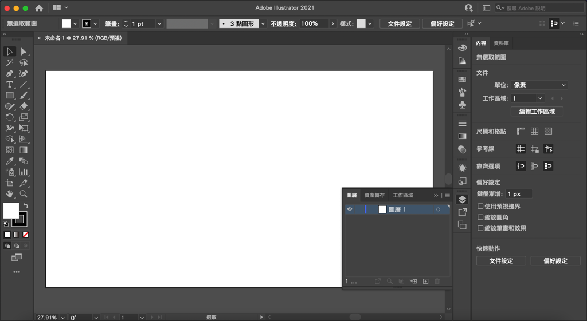
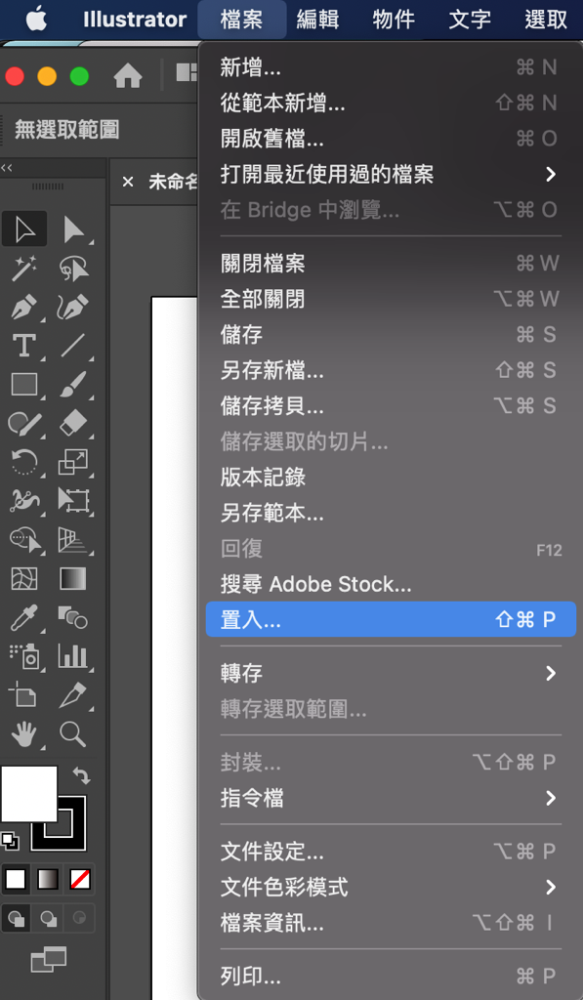
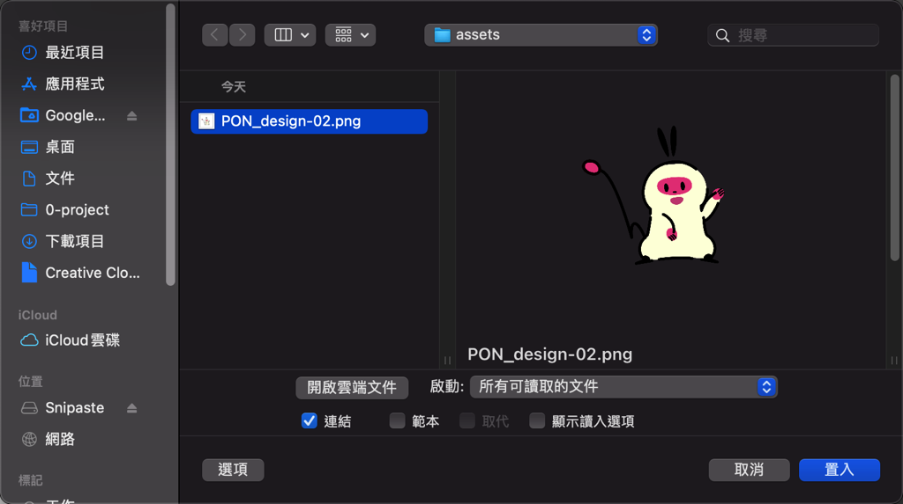
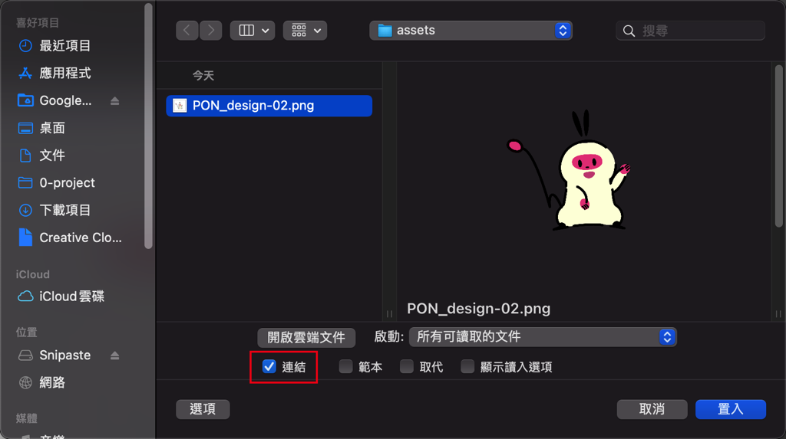
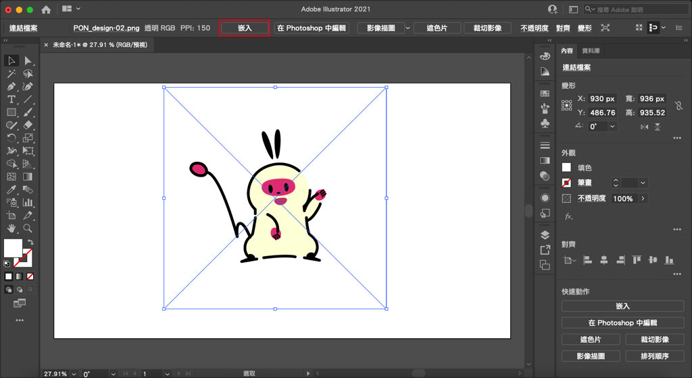
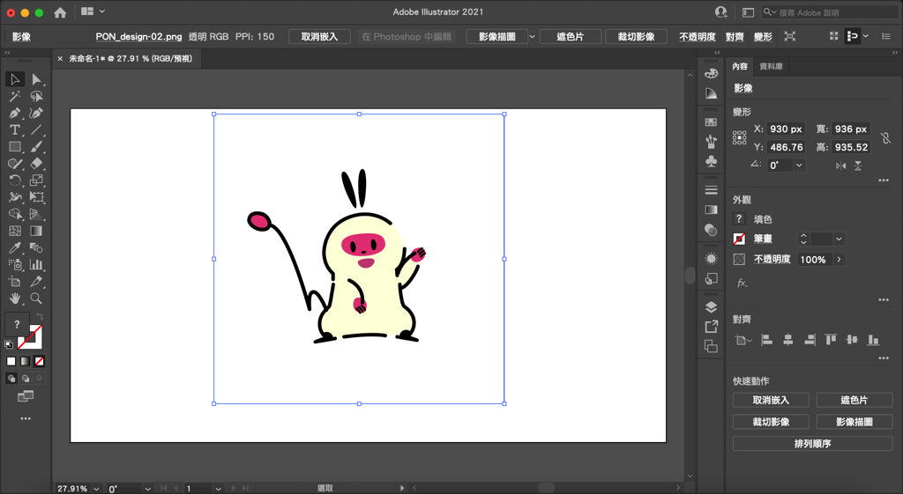

---

title: 如何置入圖檔（png、jpg、psd檔）到illustrator？置入、連結、嵌入
categories:
    - illustrator

date: 2022-08-05 00:00:00
description: 1. 在Photoshop或是Procreate等等其他繪圖軟體繪製的圖片，想放入illustrator（AI）排版 2. 希望在置入圖檔後可以編輯原始檔，在illustrator裡面可以自動更新 3. 希望把圖檔嵌入illustrator的ai檔裡面，把檔案傳給別人時裡面包含圖檔

image: 如何置入圖檔（png、jpg、psd檔）到illustrator？置入、連結、嵌入.png
slug: illustrator001-importfiles
draft: false
tags:
    - illustrator
    - 教學

---

# 問題
1. 在Photoshop或是Procreate等等其他繪圖軟體繪製的圖片，想放入illustrator（AI）排版
2. 希望在置入圖檔後可以編輯原始檔，在illustrator裡面可以自動更新
3. 希望把圖檔嵌入illustrator的ai檔裡面，把檔案傳給別人時裡面包含圖檔

以上問題是3種不同的功能，會在以下文章內介紹。

# 解決方案
## 1. 置入
假設我們現在要將此圖放入 illustrator 。

1. 首先先開啟一個新的 illustrator 檔案。

2. 點選「檔案 -> 置入」

3.  選取想要置入的檔案

4. 點擊一下想要放置的位置，圖片就會出現囉！這樣就成功置入啦！

### Bonus :  
這邊置入的檔案，jpg、png、psd等等檔案都可以喔！如果你有一個特殊的檔案也可以置入看看就知道可不可以使用。

## 2. 圖檔連結
接續第一點的解決方案，其實illustrator預設的設定就已經是圖檔連結，也就是說，如果你編輯了你置入的圖檔，在illustrator裡面也會進行更新。

這邊還是簡單介紹一下置入時要注意的事項：

置入圖檔時記得這邊要勾選就可以了，點擊置入圖檔就會是連結狀態喔！

### Bonus :
如果是用Photoshop編輯檔案，要記得存檔後，illustrator 連結才會更新喔！

## 3. 嵌入
雖然圖檔連結很方便，有時候還是會希望圖檔被包在ai檔裡面，例如圖檔要包給客戶的時候，或是不希望檔案連結太多圖檔的時候。

在使用這個功能時也請注意不要一下包太多圖檔，圖檔太多的話檔案會太重，開起來會很吃力喔！

其實很簡單，可以看到剛剛我們放進來的圖檔選取時有一個叉叉，這個表示這個圖檔是用連結的。

選取圖檔之後，點選上方的「嵌入」就可以將圖檔嵌入囉！非常簡單。
點擊之後就可以發現圖檔上面的叉叉不見了，這就表示成功了。

以上就是今天的教學，如果有什麼問題歡迎在下面留言，也歡迎留言給我鼓勵喔！

---

我們是 Peckystudios 。

擅長設計吉祥物與角色相關的設計，這裡是我推廣創作的部落格，希望大家能藉由我的內容從創作中找到樂趣。

如果您正在尋找設計師為您設計吉祥物，歡迎您到[服務項目](https://peckyhsieh.wixsite.com/peckystudiosservice)頁面瞭解相關資訊，也歡迎您寄信到 peckystudios@gmail.com 與我聯絡！

謝謝

---

如果喜歡我們的文章，歡迎到[我們的選物店](https://www.rakuten.com.tw/shop/peckystudio/)支持我們，讓我們更有動力創作喔！