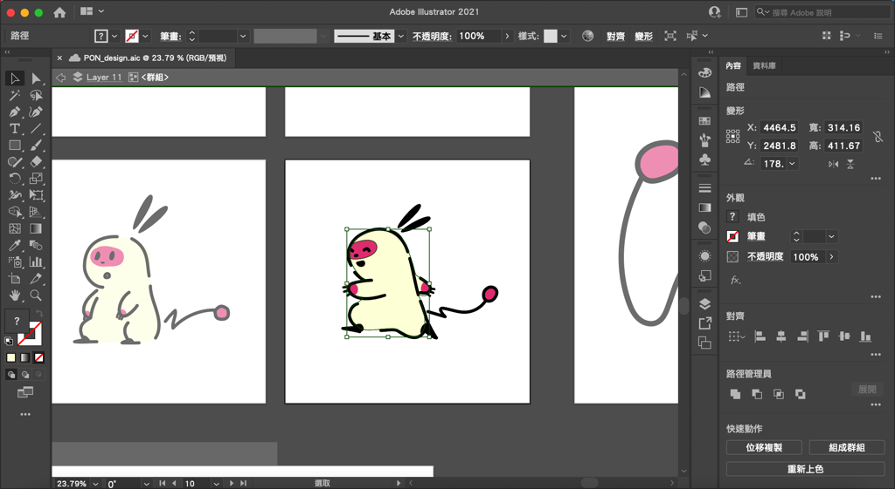
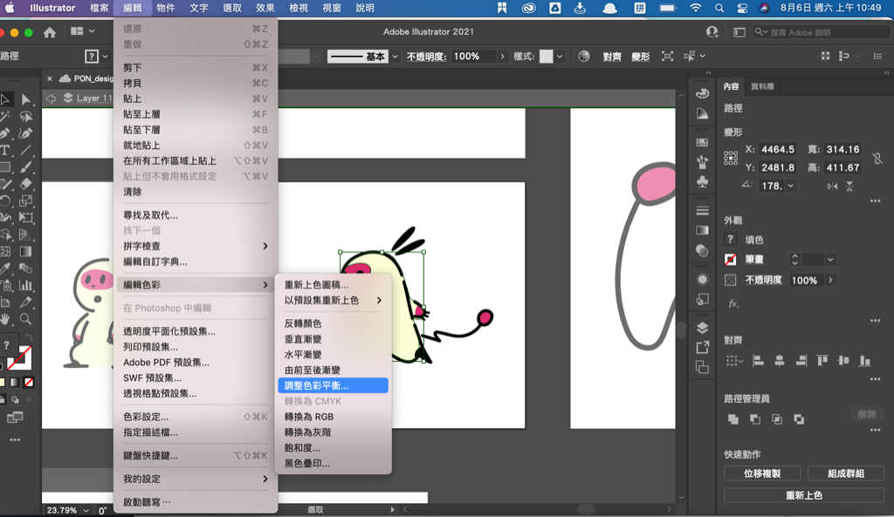
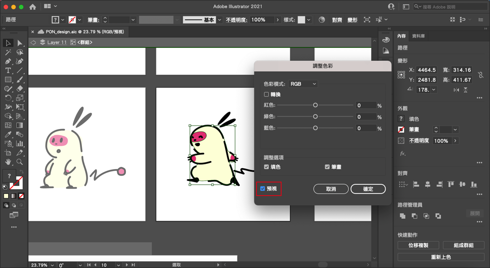
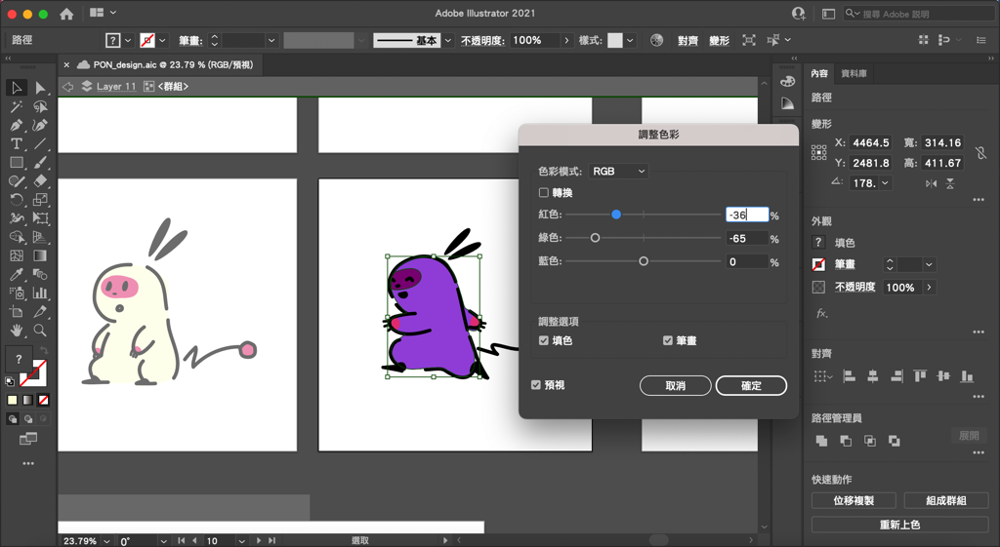

---

title: 如何用illustrator調整顏色？調整色彩平衡
categories:
    - illustrator

date: 2022-08-06 00:00:00
Description: 1. 在畫好向量圖之後，客戶突然要改變整體的顏色 2. 多個物件想一起改變色調
image: 如何用illustrator調整顏色？調整色彩平衡.png
slug: illustrator-coloradjust
draft: false
tags:
    - illustrator
    - 教學
    - 技巧
    - 顏色

---

# 問題
1. 在畫好向量圖之後，客戶突然要改變整體的顏色
2. 多個物件想一起改變色調

以上問題可以使用 illustrator 的調整色彩平衡來修改。

# 解決方案
先選取想要改變顏色的地方。

點擊「編輯 > 編輯色彩 > 調整色彩平衡」

會跳出調整色彩的視窗，這邊就可以調整顏色了，記得要將「預視」打開，才看得到調整後的顏色是什麼喔！

以上就是今天的教學，如果有什麼問題歡迎在下面留言，也歡迎留言給我鼓勵喔！

---

我們是 Peckystudios 。

擅長設計吉祥物與角色相關的設計，這裡是我推廣創作的部落格，希望大家能藉由我的內容從創作中找到樂趣。

如果您正在尋找設計師為您設計吉祥物，歡迎您到[服務項目](https://peckyhsieh.wixsite.com/peckystudiosservice)頁面瞭解相關資訊，也歡迎您寄信到 peckystudios@gmail.com 與我聯絡！

謝謝

---

如果喜歡我們的文章，歡迎到[我們的選物店](https://www.rakuten.com.tw/shop/peckystudio/)支持我們，讓我們更有動力創作喔！