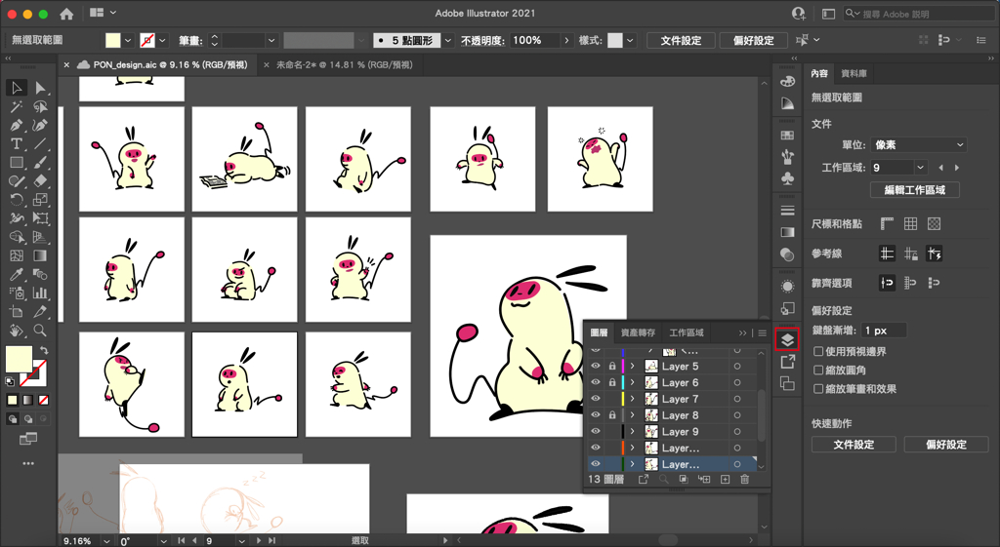
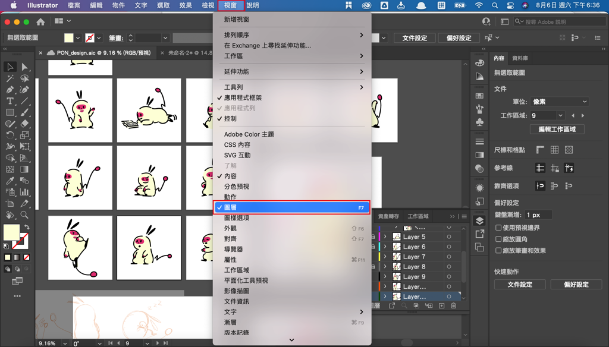
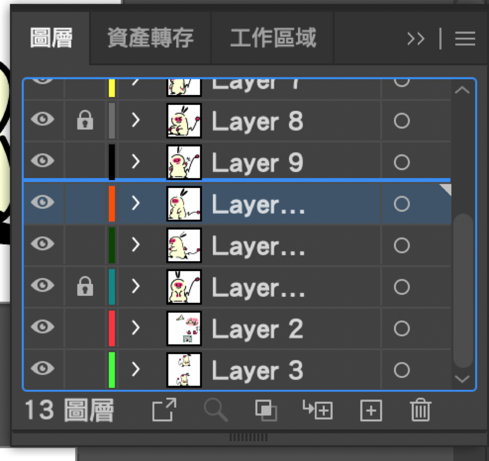
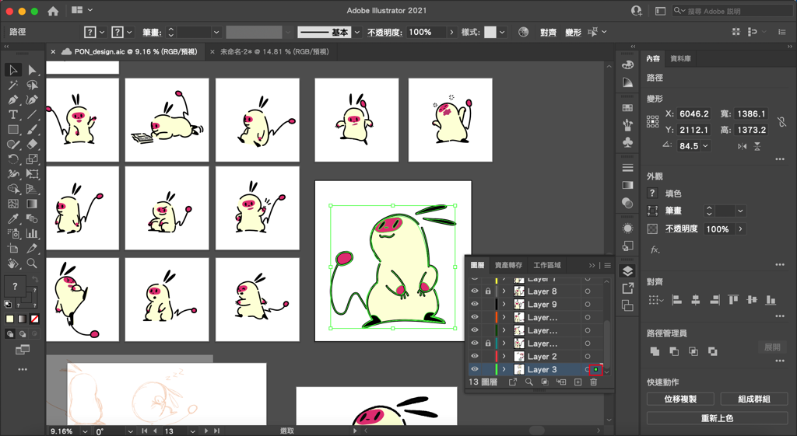
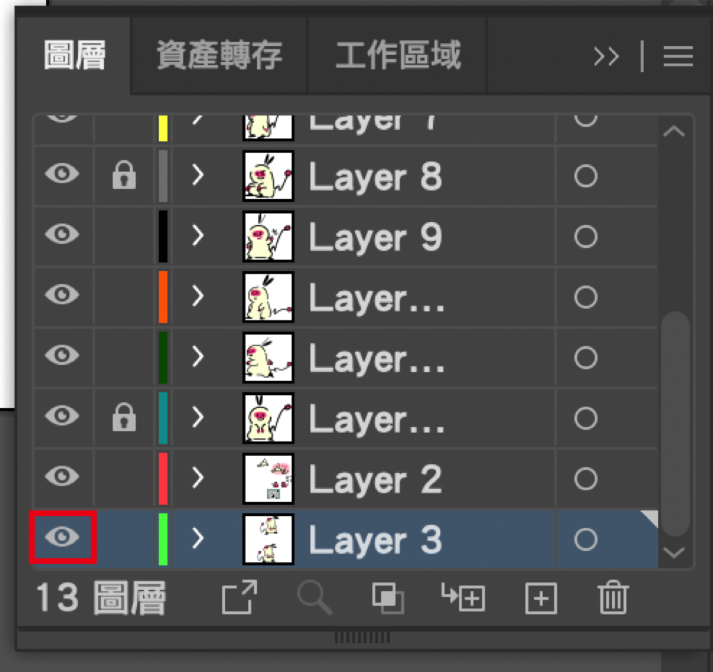
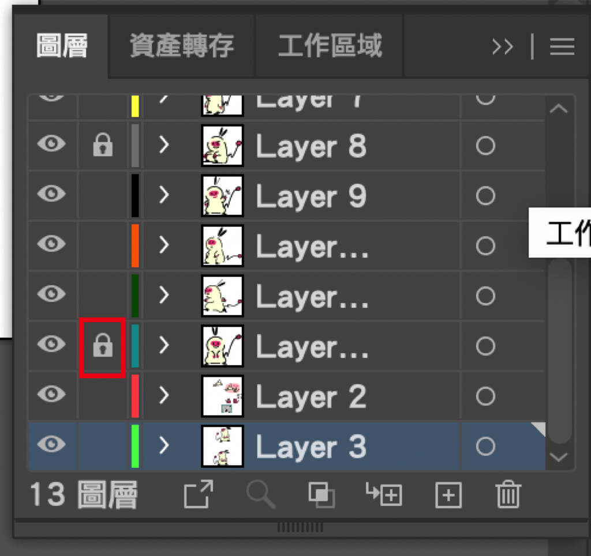

---

title: 如何使用illustrator的圖層？
categories:
    - illustrator
date: 2022-08-06 00:04:00
Description: 1. 圖層是什麼？2. Illustrator 也有圖層嗎？在哪裡？3. 如何更改圖層順序？4. 我想將圖層A的物件移動到圖層B，如何移動物件到指定圖層？5. 我想檢查特定圖層的圖形，如何暫時關閉某一層的圖形？6. 如何鎖定圖層讓我不會不小心修改到？
image: 如何使用illustrator的圖層？.png
slug: illustrator-layers
draft: false
tags:
    - illustrator
    - 教學
    - 技巧

---

# 問題
1. 圖層是什麼？
2. Illustrator 也有圖層嗎？在哪裡？
3. 如何更改圖層順序？
4. 我想將圖層A的物件移動到圖層B，如何移動物件到指定圖層？
5. 我想檢查特定圖層的圖形，如何暫時關閉某一層的圖形？
6. 如何鎖定圖層讓我不會不小心修改到？

# 解決方案

## 什麼是圖層？
可以想像成樓房，每一層有不同的圖形，一層一層疊上去，這就叫做圖層。

圖層可以為我們的設計分層，例如我可以背景一層，上面的人物一層，旁邊的樹也分一層，這個可以依據需求來自由分層。

圖層有上下關係，可以使用圖層視窗來調整位置，稍後會介紹。

這是一個非常好用，可以讓我們的設計不會難以整理的重要功能，一定要學起來喔！

## 如何找到圖層視窗？
點擊右方快捷工具的圖層圖示，若找不到可以在最上方的視窗選單開啟。

## 如何更改圖層順序？
如剛剛所說，圖層有上下順序，如果我們想要調整圖層順序，很簡單！

直接左鍵按住圖層並且拖曳到上下想要的位置就好了。

## 如何移動物件到指定圖層？
首先先選取想要移動到物件，此時會在物件在的圖層右邊顯示一個有顏色的小方形。

要移動很簡單，只要左鍵按住小方形，並且拖曳到指定的圖層就好了喔！

## 如何暫時關閉某一層的圖形？
我們可以使用「切換可見度」的功能，他在圖層視窗的左側，長得像一個小眼睛，只要左鍵點擊就可以把他關閉，再點擊一次就可以再度開啟。

## 如何鎖定圖層讓我不會不小心修改到？

點擊小眼睛右方的方形區域，會出現一個鎖頭，就代表該圖層被鎖起來了喔！

以上就是今天的教學，如果有什麼問題歡迎在下面留言，也歡迎留言給我鼓勵喔！

---

我們是 Peckystudios 。

擅長設計吉祥物與角色相關的設計，這裡是我推廣創作的部落格，希望大家能藉由我的內容從創作中找到樂趣。

如果您正在尋找設計師為您設計吉祥物，歡迎您到[服務項目](https://peckyhsieh.wixsite.com/peckystudiosservice)頁面瞭解相關資訊，也歡迎您寄信到 peckystudios@gmail.com 與我聯絡！

謝謝

---

如果喜歡我們的文章，歡迎到[我們的選物店](https://www.rakuten.com.tw/shop/peckystudio/)支持我們，讓我們更有動力創作喔！