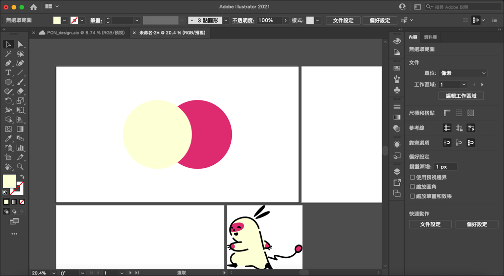
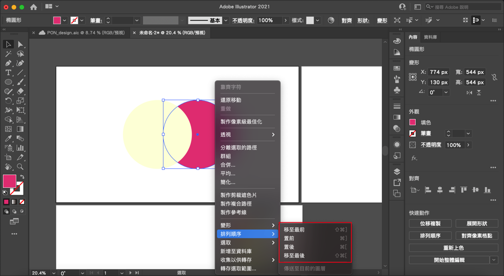
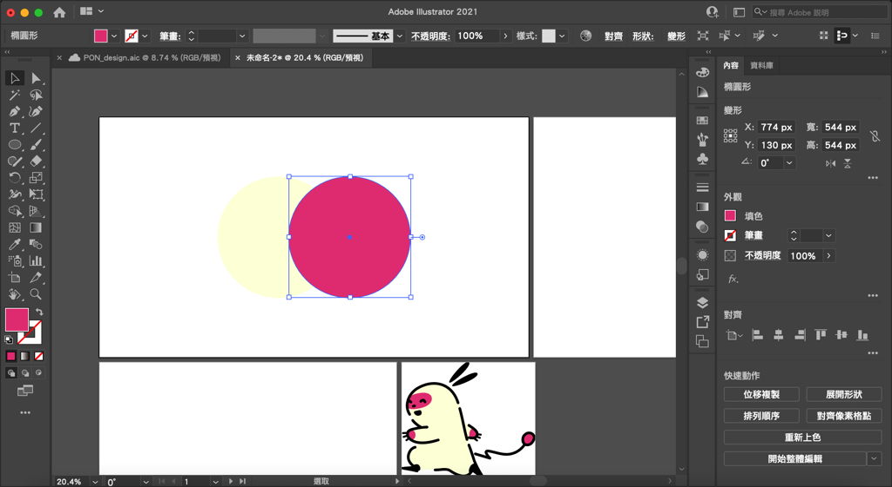

---

title: 如何調整illustrator圖形物件的排列順序（上下順序）？
categories:
    - illustrator
date: 2022-08-08 00:00:00
Description: 我畫出來的形狀壓到我前面畫出來的形狀了，我希望把他移到下面，我該怎麼做呢？
image: 如何調整illustrator圖形物件的排列順序（上下順序）？.png
slug: illustrator-order
draft: false
tags:
    - illustrator
    - 教學

---

# 問題

1. 我畫出來的形狀壓到我前面畫出來的形狀了，我希望把他移到下面，我該怎麼做呢？

# 解決方案
這個時候可以使用排序功能來修正順序。

## 右鍵調整排序
選取要改變順序的圖形，右鍵「排列順序」。

可以看到有4個選項：

### 移至最前
直接把選取的圖形移動到最上方。

### 置前
將圖形往上層移動一層。

### 置後
將圖形往上層移動一層。

### 移至最前
直接把選取的圖形移動到最下方。

我在這邊選擇「置前」，就可以看到原本在下面的圖形跑到上面囉！

## Bonus

這邊要注意到是「[圖層](https://peckystudios.com/p/illustrator-layers/)」的順序在illustrator裡面判定會優先於排列順序，也就是說如果一個圖形在圖層A，圖層A在圖層B的上方，如果一個圖形在圖層B，即使使用了移動到最上方的功能，仍然不會跑到比圖層A裡面的圖形還要上面，大家在使用這個功能的時候可以多應用這個邏輯來整理圖形。

以上就是今天的教學，如果有什麼問題歡迎在下面留言，也歡迎留言給我鼓勵喔！

---

我們是 Peckystudios 。

擅長設計吉祥物與角色相關的設計，這裡是我推廣創作的部落格，希望大家能藉由我的內容從創作中找到樂趣。

如果您正在尋找設計師為您設計吉祥物，歡迎您到[服務項目](https://peckyhsieh.wixsite.com/peckystudiosservice)頁面瞭解相關資訊，也歡迎您寄信到 peckystudios@gmail.com 與我聯絡！

謝謝

---

如果喜歡我們的文章，歡迎到[我們的選物店](https://www.rakuten.com.tw/shop/peckystudio/)支持我們，讓我們更有動力創作喔！

