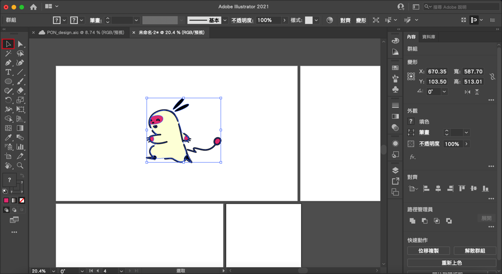
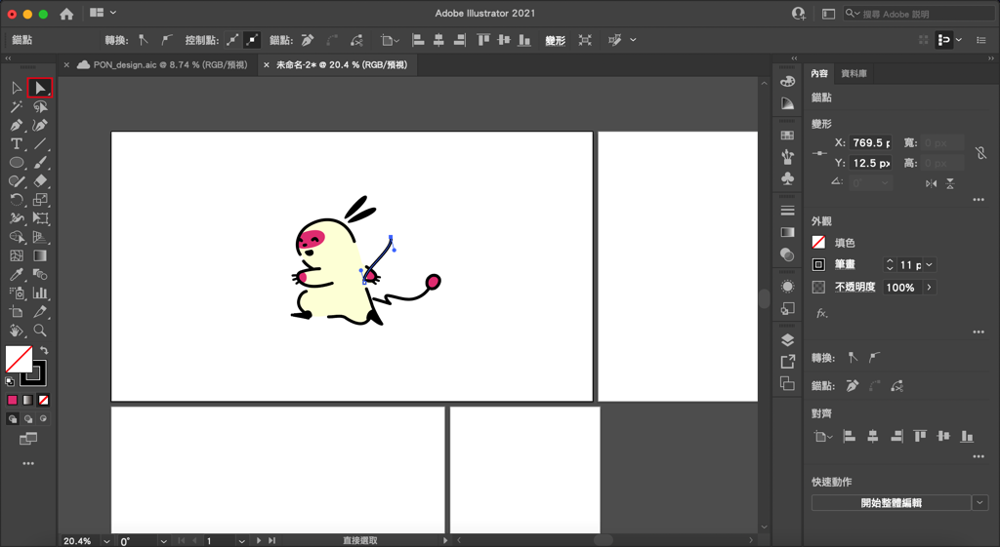

---

Title: illustrator的2種選取工具
categories:
    - illustrator
date: 2022-08-08 00:00:00
Description: 1. 什麼是選取工具？2. 2種選取工具的差異是什麼？
image: illustrator的2種選取工具.png
slug: illustrator-select
draft: false
tags:
    - illustrator
    - 教學

---

# 問題
1. 什麼是選取工具？
2. 2種選取工具的差異是什麼？

# 解決方案

## 什麼是選取工具？
illustrator 是一個設計向量圖形的軟體，向量由點、線、面組成，我們可以針對點、線、面進行編輯，而選取工具顧名思義，就是藉由鼠標選取我們要修改的物件的工具。

## 2種選取工具的差異是什麼？
illustrator 裡面有兩種選取工具，一個是「選取工具」，快捷鍵是V，另一個是「直接選取工具」，快捷鍵是A。

### 選取工具
選取工具是負責選取整個物件的，例如一個群組、一個形狀等等，通常是選擇一個完整的圖形使用。

例如我可以用選取工具選取一個我已經群組起來的吉祥物圖案。

### 直接選取工具
直接選取工具則是可以拿來選取形狀中的點或線的工具。

一樣用吉祥物舉例，例如我可以直接使用直接選取工具編輯吉祥物身上的點，而且不會破壞群組，再使用選取工具的時候選取還是會是一個完整的群組。

以上就是今天的教學，如果有什麼問題歡迎在下面留言，也歡迎留言給我鼓勵喔！

---

我們是 Peckystudios 。

擅長設計吉祥物與角色相關的設計，這裡是我推廣創作的部落格，希望大家能藉由我的內容從創作中找到樂趣。

如果您正在尋找設計師為您設計吉祥物，歡迎您到[服務項目](https://peckyhsieh.wixsite.com/peckystudiosservice)頁面瞭解相關資訊，也歡迎您寄信到 peckystudios@gmail.com 與我聯絡！

謝謝

---

如果喜歡我們的文章，歡迎到[我們的選物店](https://www.rakuten.com.tw/shop/peckystudio/)支持我們，讓我們更有動力創作喔！

