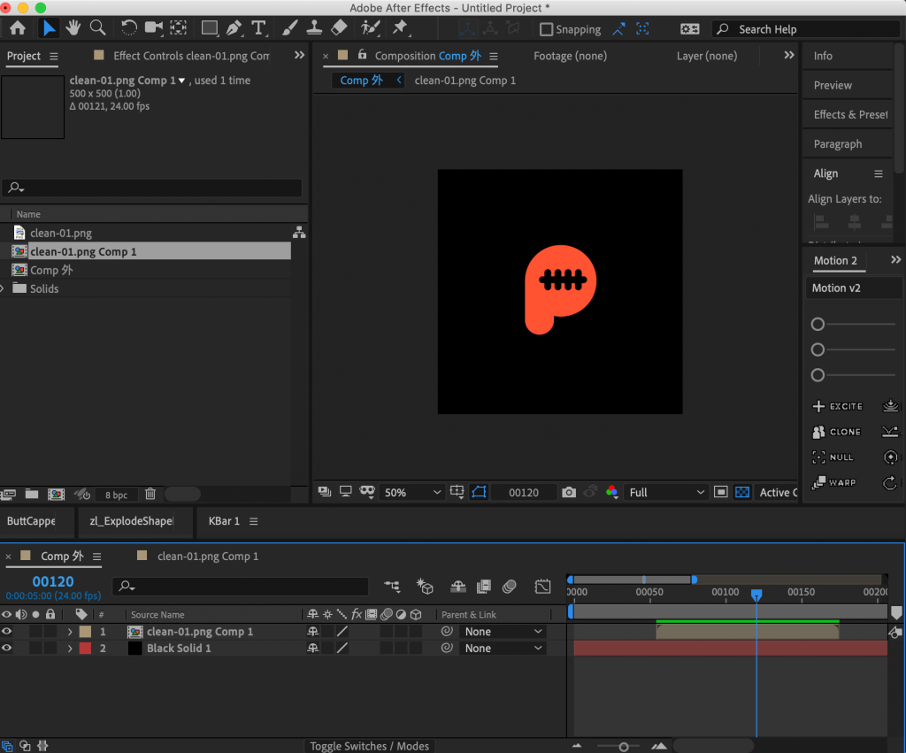
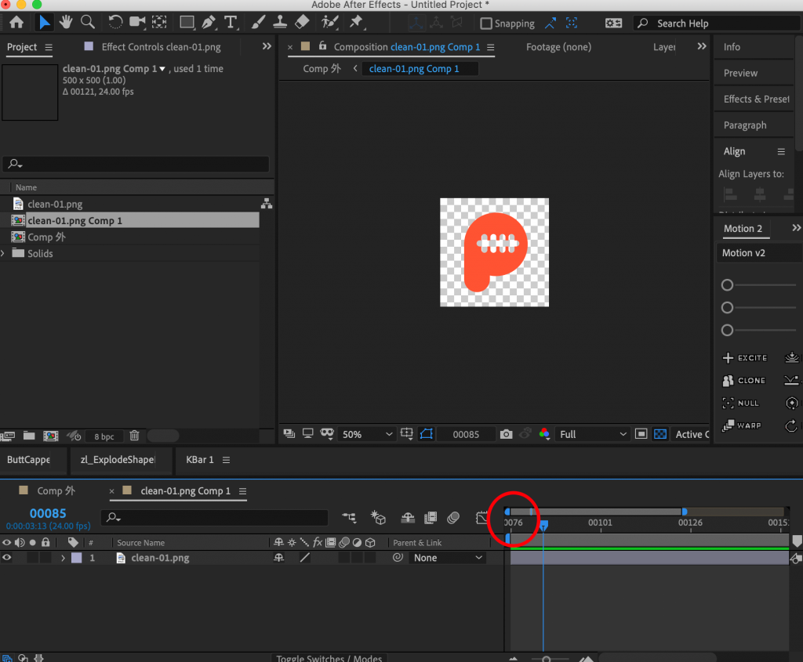
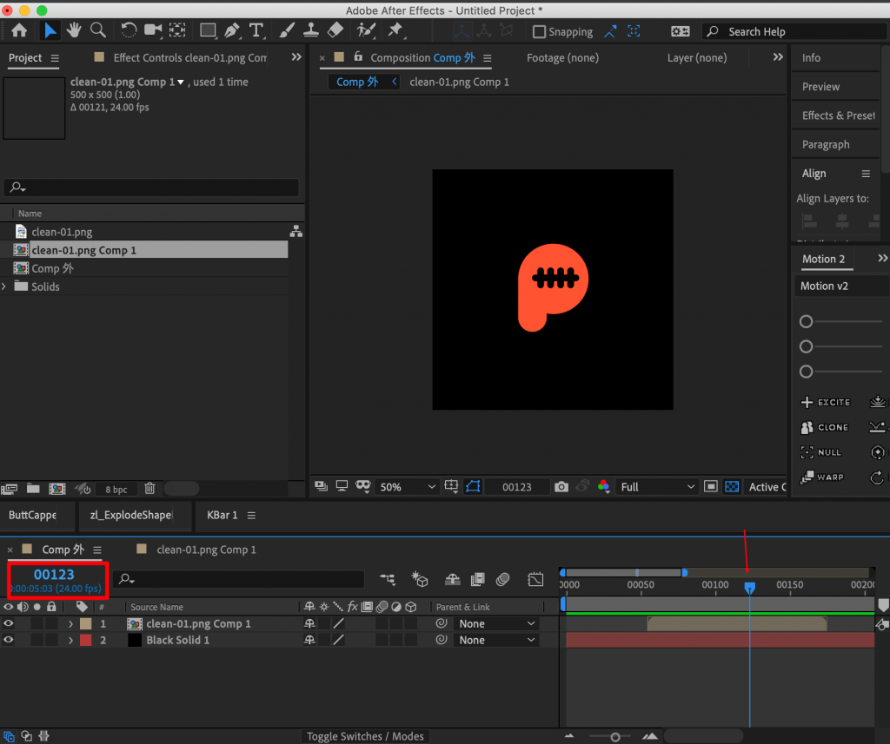
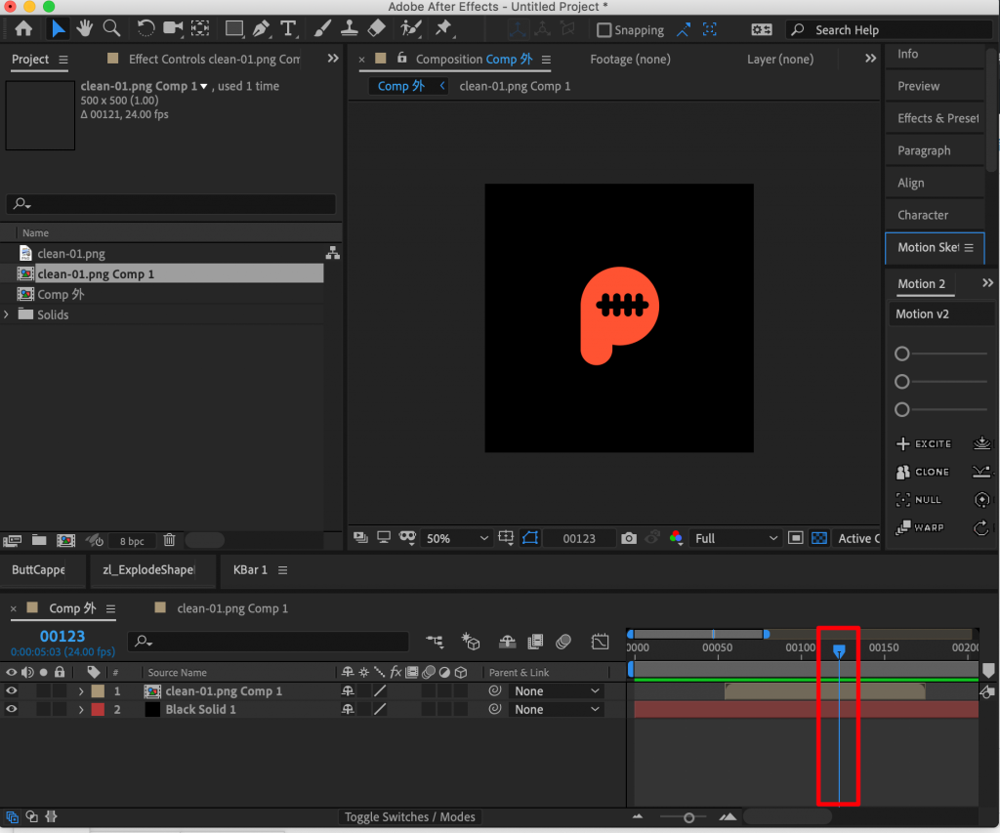
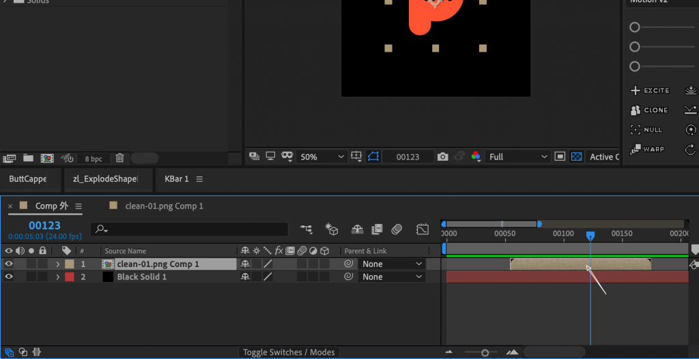
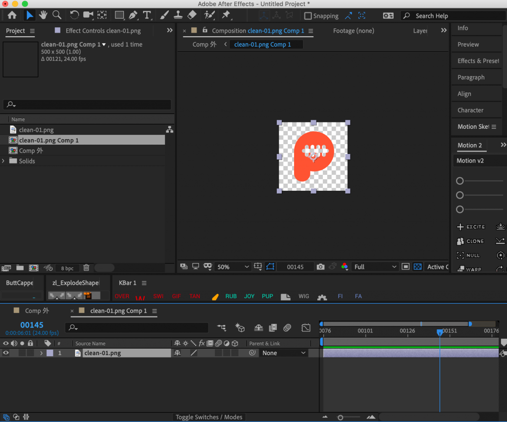
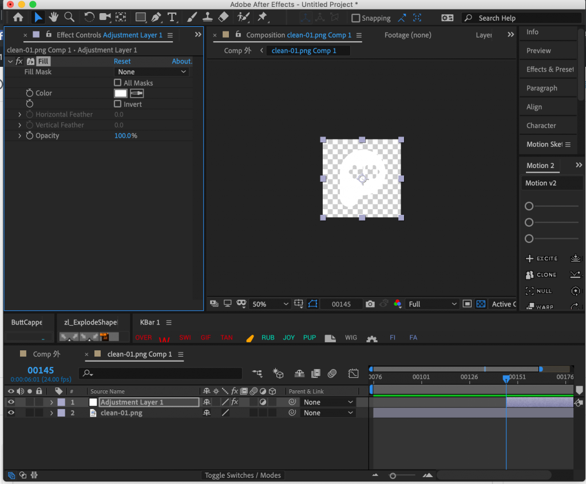
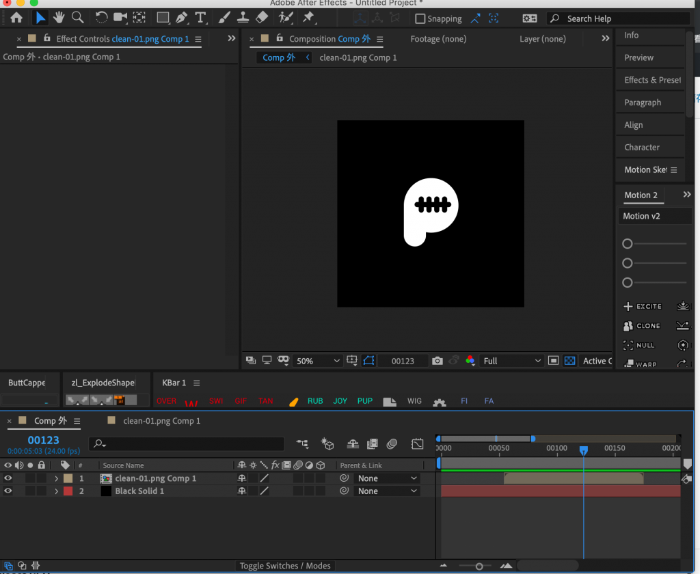

標題好難描述啊！XDD  
  
這幾天在公司後輩有遇到相關的問題，所以就把這個技巧教給她。  
當初也是前同事傳授給我的，這邊也寫成教學分享一下！  
  
**困擾點：**  
。為了做某些效果而把素材pre-comp起來，但不確定在裡層comp的某一時間點是外層comp的哪一個時間點？  
。某些狀況下，pre-comp裡的時間範圍可能和外層的不一樣，會不是從0開始，如何確定時間點？

這次分享的是AE內建的隱藏技巧，想加速製作的話一定要學起來！

首先，先模擬製作的狀況，comp裡面有comp。

這邊特別做了裡面comp開頭不是0的狀況，比較可以看得出這個技巧的好用！

我們先假設我想要在外部comp的第123張影格時，裡面comp的素材變成白色

將時間點遊標移動到剛剛提到想換色的時間點上

左鍵點擊兩下，進入comp

現在看到時間點遊標指的地方就會是外部comp剛剛123影格的地方啦！

馬上上個效果來試試！

成功啦！很簡單吧！

多嘗試運用各種技巧來製作動畫吧！

---

我們是 Peckystudios 。
擅長設計吉祥物與角色相關的動靜態設計，這裡是我推廣創作的部落格，希望大家能藉由我的內容從創作中找到樂趣。

如果您正在尋找設計師為您設計吉祥物，
歡迎您到[服務項目](https://peckyhsieh.wixsite.com/peckystudiosservice)頁面瞭解相關資訊
也歡迎您寄信到 peckystudios@gmail.com 與我聯絡！

謝謝