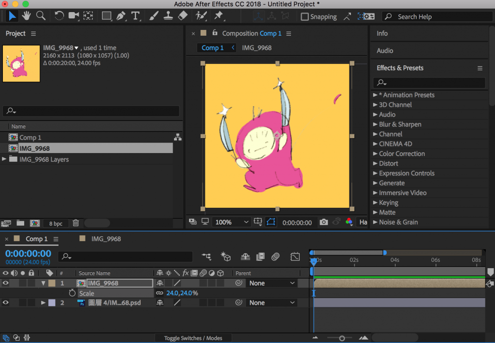
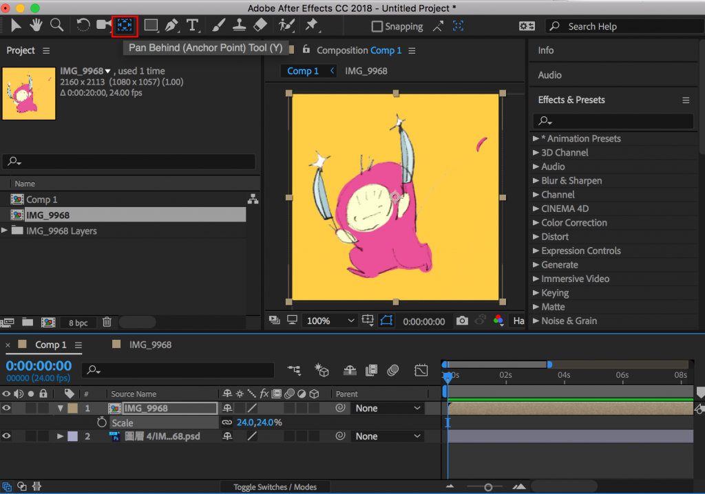
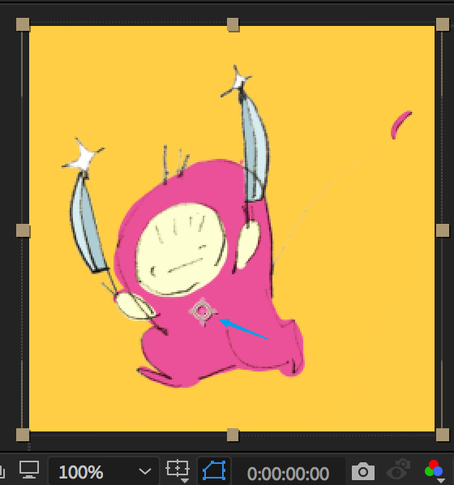
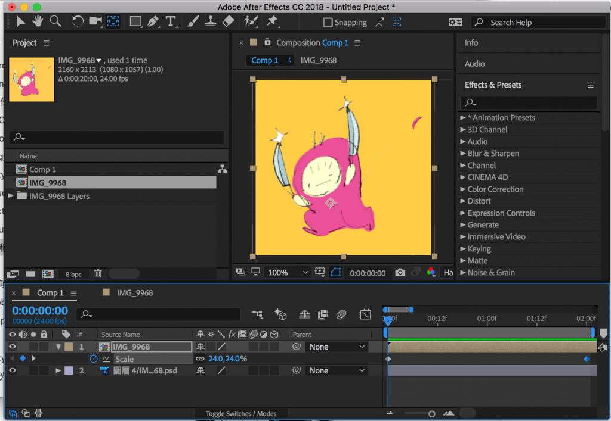
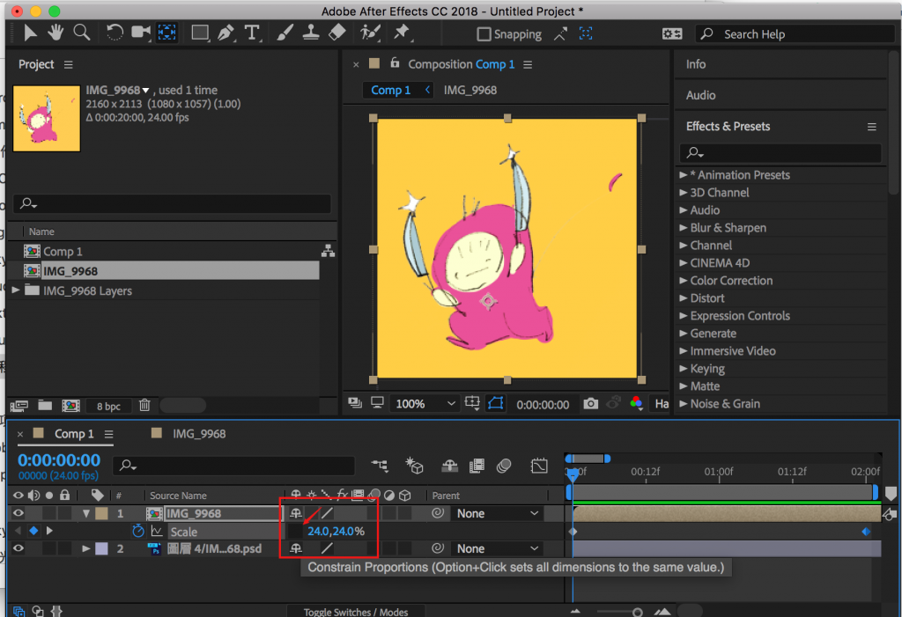
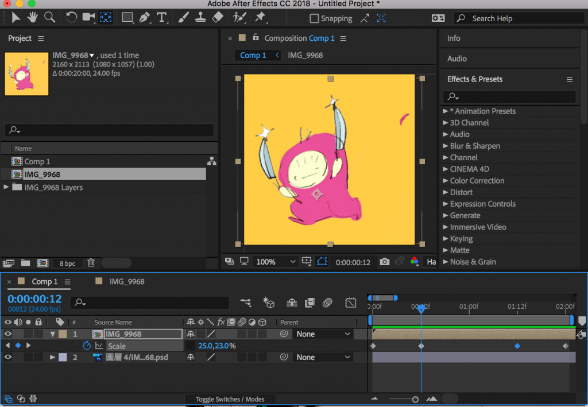
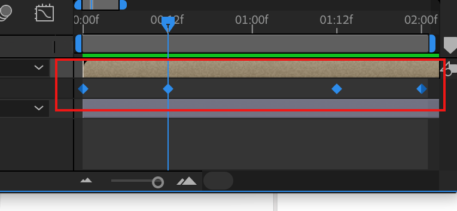
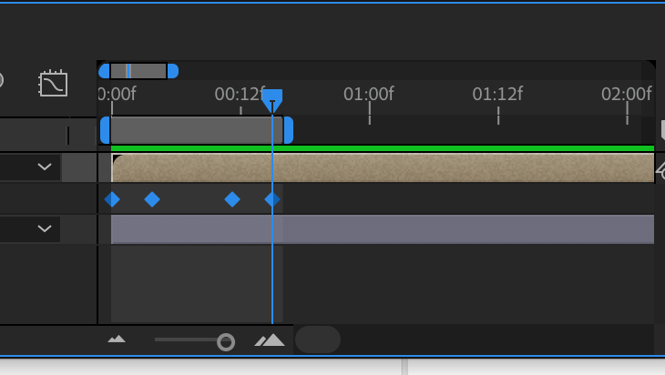
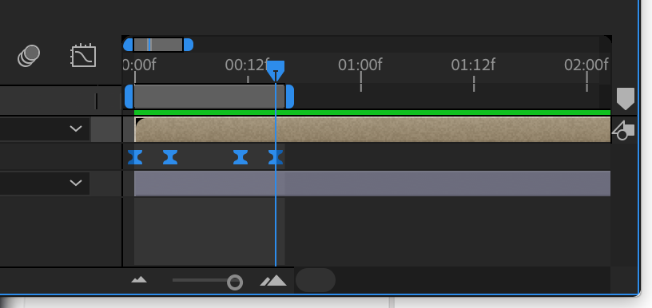
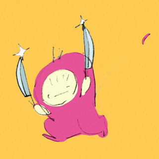

這次也是一個小小小技巧，但我在現在的公司超常用的XD  
想讓動畫更豐富，教學一定要仔細看喔！

**困擾點：**

。素材只有點陣圖片，無法做向量的變化  
。工作時程的時間太少，但又不想畫面太乾，想要快速製作有效果的動態

這時，就是果凍效果出場的時候啦！  
真的也是超級簡單的！

首先，還是一樣來模擬一下製作情境！  
這次置入的是一個透明背景的角色。(我直接使用有圖層的psd檔置入，和一般透明png作法是一樣的！）  

第一步，我的習慣是一定要調整中心點（牽涉到角色的一些原則，未來再提），點選紅色框圖標。  

將中心點移到角色腰的位置。  

要開始key囉！接下來找到角色圖層的scale,將這個果凍效果的前後各key一個原本的scale數值  
。這邊是24是因為我圖本身有縮放過，若素材與comp處於剛剛好的話，一般會是100/100  

取消scale x和y之間的連結關係。（x:我們分手吧～ y:QAQ）

在先前設key的前後兩個key中間抓約1/4的地方，3/4的地方，分別設定成一個變扁，一個變長的key。  
示範使用的數值分別是(25,23)，(23，25)  
若你剛剛原始數值是(100,100)，我平常習慣是使用95，105這個搭配  
可以依據各個狀況去調整～  

現在來看看效果，似乎太慢了！  

回來看key，把key全部選起來，按著alt，左鍵按著最後面的key,把整個key等比例縮小到適當時間上。  

F9加上easy ease  
讓效果更順  

最後就會變成這樣。  
很簡單吧，目前這樣還是最簡單的，  
這個還有很多組合技法，大家可以玩玩看。  
未來有看到什麼再跟大家分享！

---

我們是 Peckystudios 。
擅長設計吉祥物與角色相關的動靜態設計，這裡是我推廣創作的部落格，希望大家能藉由我的內容從創作中找到樂趣。

如果您正在尋找設計師為您設計吉祥物，
歡迎您到[服務項目](https://peckyhsieh.wixsite.com/peckystudiosservice)頁面瞭解相關資訊
也歡迎您寄信到 peckystudios@gmail.com 與我聯絡！

謝謝