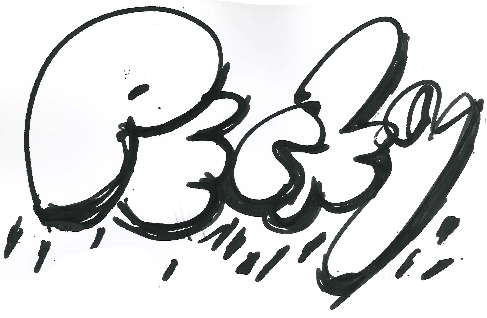
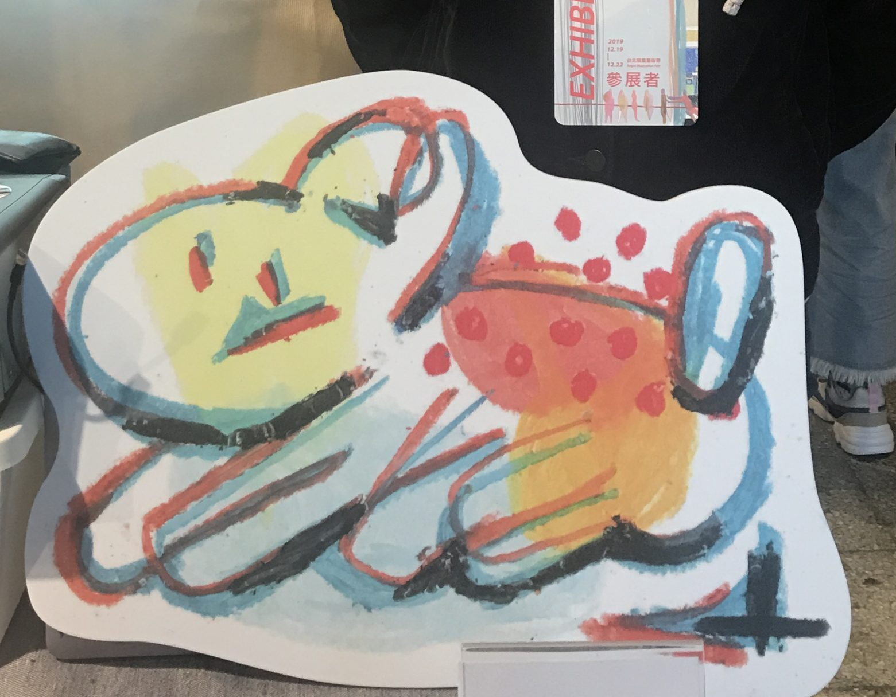

Hi 大家好，

一陣子不見，因為實在是太多事情了啊啊啊～～～  
年底干那笑欸（？）一個衝動報名了台北插畫藝術節！

當時公司手上有一個大案子在跑，幾乎是全公司在關注的那種，家裡貓咪還發生寄生蟲事件，每天都要清理消毒，家裡也要全部消毒，差點兒瘋掉～～（還不只這些咧，回憶起來真的覺得我到底是怎麼渡過這些時間的啊！？）

也很慶幸當初會報名就是因為我年中的時候創作的非常多的畫，即使是在極度爆炸的時期都還能用最低標順利通過。

這次參加其實也完全保持著反正沒參加過，那就來玩啊～  
報名費比我想像中貴QQ，但看在主題太適合我還是硬著頭皮付款。

一開始還以為A區是有背板的，一直在煩惱要怎麼辦，結果在做設計物的時候仔細一看，才發現是沒有背板的XDDDD

傻眼歸傻眼，倒覺得幸運，那陣子有點周轉不靈，剛好省一筆XD

既然是部落格，就簡單說說這次展位準備的思考方式吧！

之前應好朋友的邀請（非常台灣生活化的插畫家，身為台灣人一定會有共鳴[Ning Lo 黃鼠狼的鹽（@ningloart）• Instagram 相片與影片](https://www.instagram.com/ningloart/)），有湊熱鬧蹭草率祭的攤位，也趁機觀察大家的攤位。

先思考一下自己手上的畫作，我這次想主打的是生活化的創作，也展現我今年經過斷捨離把它從工作分出來而獲得的自由爆發力。再來就是想表現我都是拿生活周遭取得的媒材創作，我就直接帶著我平常創作，一般文具店買的繪圖本原稿到場，另外有帶的是今年稍微特別的，在文具展挖到的新玩具媒材。

首先還是要有一個比較好識別的標示，所以我就用立體裁切，拿自己在塗鴉本畫的pecky上色之後，簡單當作標準字。

也同時挑選幾張自己喜歡的圖做了大的立體印刷版，活動結束之後覺得是個正確的決定，很多朋友都是看到今年的人氣王狗狗而上前觀看。  

也是因為看到草率祭大家都有準備簡單的商品，我就想說好吧，那我也準備一點吧！（真的超隨便😂）一開始真的就只想把原稿帶去而已，這次準備的是就算買回家只要貼在某個地方就不佔位置的貼紙，和就算丟掉我也不會知道的酷卡明信片（喂）。

因為我都是用整本的塗鴉本創作，所以要讓路過的人可以看到比較多的圖有點難，我又不想破壞我的本子，於是就想到我自己很熟悉的影片與投影。也了解自己的作品已經很強烈了，根本不需要再做什麼加工處理，就簡單用快速跳接的方式呈現。展覽過程是有人會仔細看它的，令我感到欣慰。投影也是全展區唯一一攤在玩，有種明顯隔行如隔山的感覺XD如果是在Motion圈，這個根本不足為奇啊！

心得我在IG也寫了很多，這邊就不重複了，這幾天的經驗真的像是發光一樣，覺得好好玩也很滿足，謝謝所有共同參與的人事物！

我創作專用的IG：[Pecky（@pecky\_abc）• Instagram 相片與影片](https://www.instagram.com/pecky_abc/?fbclid=IwAR3qEeqGghbfb5xDzJsY66dEgQiHx31AjbPss9McVFvbyo47MNbuKNZBEnI)

---

我們是 Peckystudios 。
擅長設計吉祥物與角色相關的動靜態設計，這裡是我推廣創作的部落格，希望大家能藉由我的內容從創作中找到樂趣。

如果您正在尋找設計師為您設計吉祥物，
歡迎您到[服務項目](https://peckyhsieh.wixsite.com/peckystudiosservice)頁面瞭解相關資訊
也歡迎您寄信到 peckystudios@gmail.com 與我聯絡！

謝謝

---

如果喜歡我們的文章，歡迎到[我們的選物店](https://www.rakuten.com.tw/shop/peckystudio/)支持我們，讓我們更有動力創作喔！