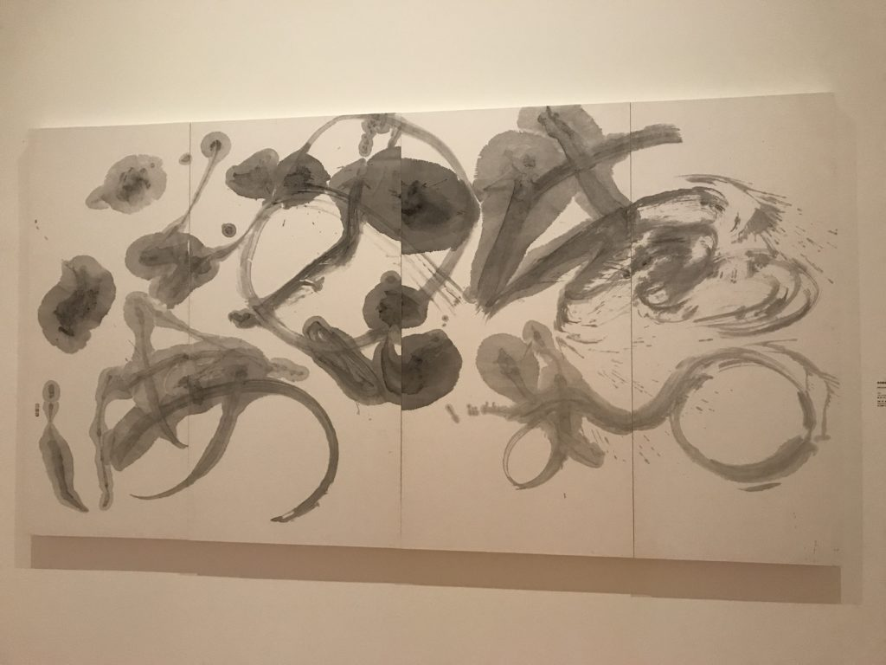

久仰董陽孜老師的大名，所以看到這個書法展覽資訊真的很開心，心心念念著。偏偏最近因為武漢病毒的關係，不是很敢出門到人多到地方。只好找了一個人少的時間去了！XD

我自己平常也很喜歡寫字，雖然不是經過專業訓練，都是自學居多（就是單純好玩啦XD）。  

   
    
   
    

最早是畫畫練習太兇，手開始吃不消，我找到[**布衣老師的部落格**](https://blog.xuite.net/nonepp/twblog)，那裡學到了正確的握姿，解決我長久以來手不舒服的問題。裡面有文章寫到該怎麼寫字、字的結構是如何等等，從此我就踏上了寫字的不歸路XDD（布衣老師近幾年因為文具風潮與寫字風潮崛起而有[**出書**](https://peckyhsieh.com/buyilaoshi)喔！有興趣的話可以買回家！）

一到北美館，門口先被保全攔下來量體溫、酒精消毒進場XD  
馬上到櫃檯買好票，很便宜啊！進場只要30元，我本來以為要一兩百。

門口的服務人員說建議從2樓開始看，上樓就看到大大的「行墨」兩個字。  

整個展覽就是以董陽孜老師這50年的創作生涯為主軸，從還是學生時期的作品，展到後面越顯熟練、游刃有餘的書藝作品。

    

    

早年的作品，可以看出字的結構已經很棒了，但還沒有後期那種狂放且收放自如的自在感。

 
    
 
    

    

老師學生時期有畫過油畫（展覽裡面也有展幾幅XD，我沒有拍），在這個階段老師嘗試加入西方油畫的構圖技巧。這個是很難的，因為書法講求一氣呵成，跟油畫那種隨時可以修改構圖的創作方式不一樣，要達到這兩點的平衡沒有經過大量練習是辦不到的！

尤其老師又是寫這種大幅的作品，一定會有人說這跟一般寫字應該沒什麼差吧？不就放大而已？

差多了！當你在寫小字的時候，你可以很輕鬆的看到字的全貌，隨時確認我整個字、或是構圖O不OK，但今天要把他放大的時候，第一個一定會遇到的問題就是不容易觀察全局，一定會遇到近看好像OK，但做完遠看發現差強人意。

從二樓要下來的第一眼  
怎麼這麼美！！好險有來看

在一樓的作品更可以看出創作的自在感，技術已經不是要被考量的事情了，重點只要放在我今天選了這句話，我要用什麼樣的字體、什麼樣的情緒來闡述他。

  
    
   
    
  
    

後面還有一區我覺得滿有趣的，是把過去寫過的字再拿出來寫一遍，大家看得時候可以試著猜猜看哪一幅是新的喔！  

展覽裡面也有幾個地方有放紀錄片，裡面有收錄了老師平常創作的空間、方式，1樓的那個紀錄片裡面比較多談到老師想要傳承這個書法的好到這個社會，所以有做了很多相關的商品，也有透過展覽或是裝置藝術等等來傳達正向的意涵，看完真的很感動。因為是影片就比較不方便拍照了XD很推薦大家去看喔！

相關商品也有在北美館裡面的商店販賣，如果看完展覽有興趣的話可以去看看！

展覽只到2020年3月8日喔！

* * *

**[「董陽孜：行墨」](https://www.tfam.museum/Exhibition/Exhibition_page.aspx?id=663&ddlLang=zh-tw)**

**時間  
**2019/12/14 - 2020/03/08  
**地點  
**臺北市立美術館 二樓2B、一樓1A~1B

---

我們是 Peckystudios 。
擅長設計吉祥物與角色相關的動靜態設計，這裡是我推廣創作的部落格，希望大家能藉由我的內容從創作中找到樂趣。

如果您正在尋找設計師為您設計吉祥物，
歡迎您到[服務項目](https://peckyhsieh.wixsite.com/peckystudiosservice)頁面瞭解相關資訊
也歡迎您寄信到 peckystudios@gmail.com 與我聯絡！

謝謝