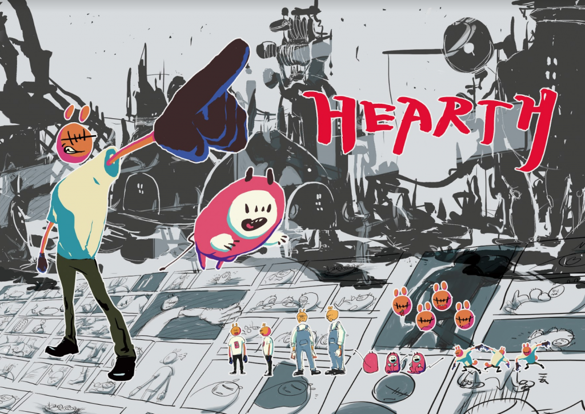
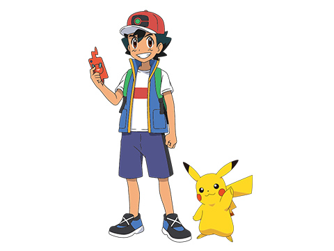
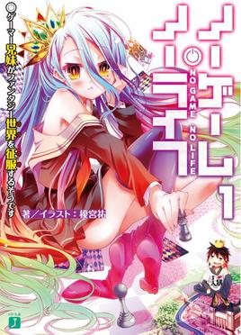
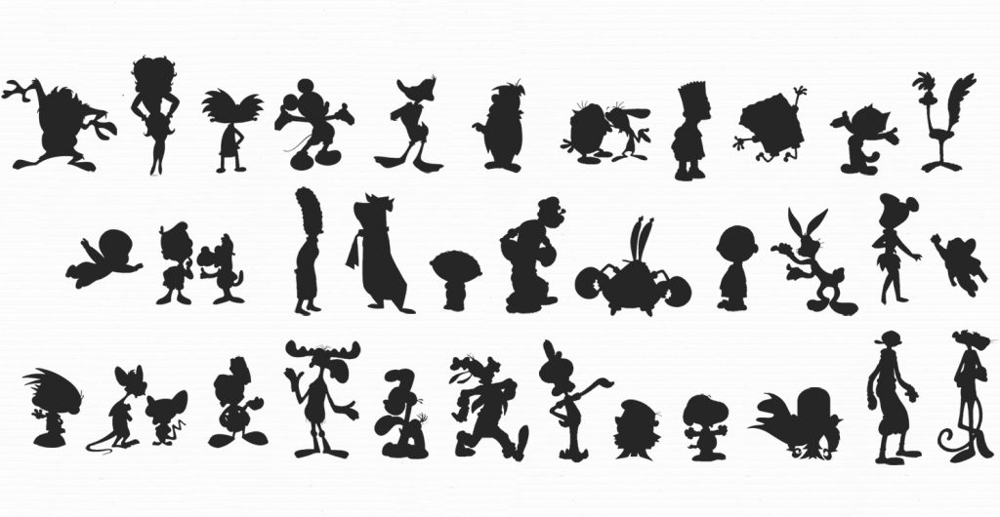
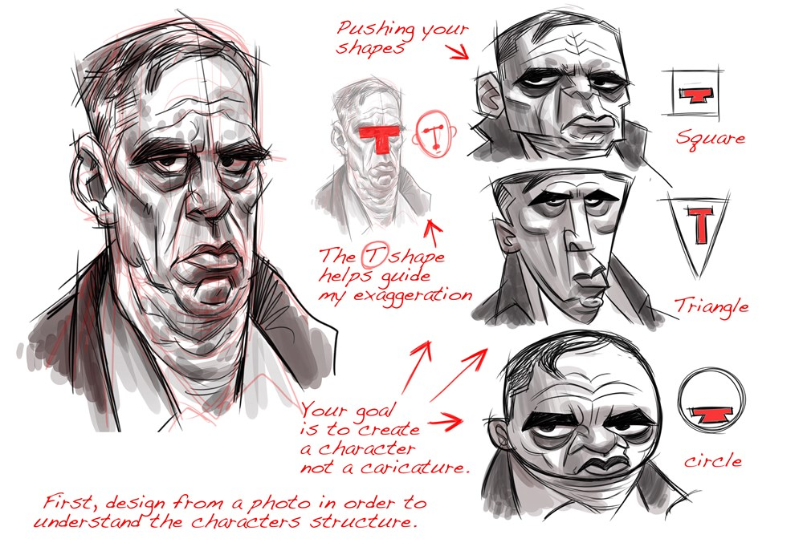
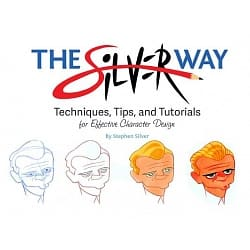
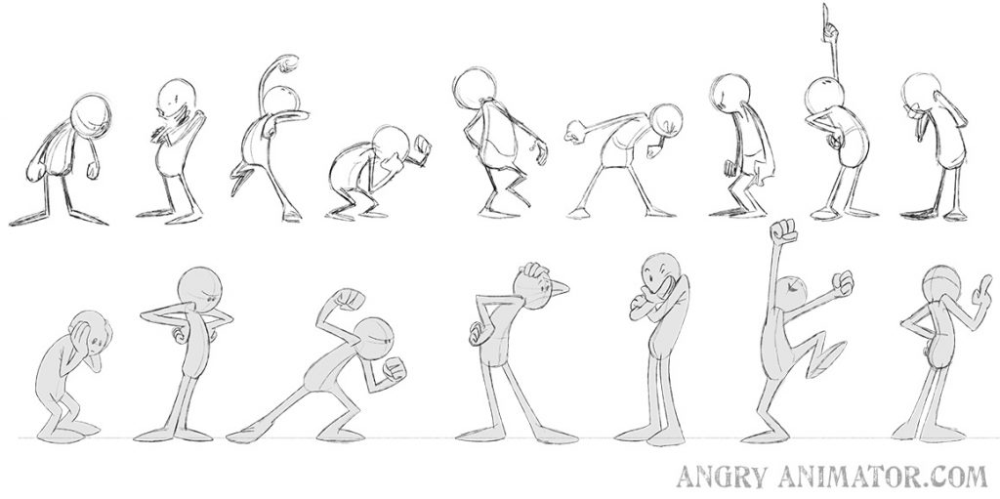
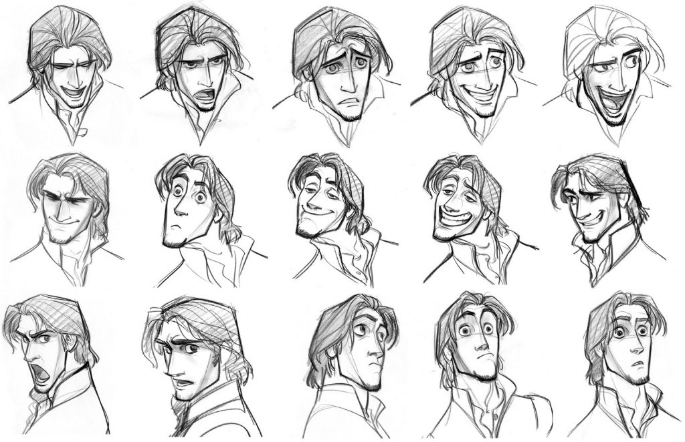
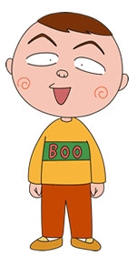
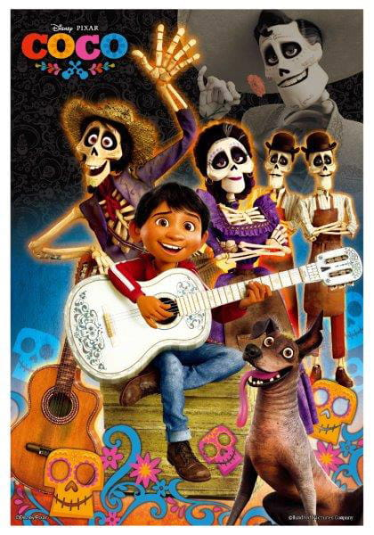

# 前言

Hi 大家好  
我是Pecky！

從剛開始自學畫畫就一直對於角色很有興趣，大學也在動畫系學習了相關的知識，甚至連畢製都是角色設計最完整XD。

我的黑歷史

畢業後更是到處參加相關的講座（很感謝台灣角色論壇辦了很多很多很棒的講座，受益良多）和閱讀相關的書籍。說真的當初也沒有想過為什麼要拼命去上課，明明那時候我工作方面主要還是在做動態設計XD，就是直覺的很想參加。

在學習美術、設計、動畫的過程中，其實遇過非常多的人都很喜歡「角色」，但不知道為什麼台灣討論的熱度和資料都非常少，連之前的好萊塢動畫大師系列講座我都覺得是我運氣好才可以參加到的。

希望藉由我的分享可以再度拉起台灣討論角色的熱度！

# 學習角色設計時遇到的問題…

在學習的過程中，常常會遇到同學有跟我一樣類似的問題：

* 總是覺得自己的角色不有趣、不夠吸引人？
* 不知道為什麼知名角色可以設計得那麼生動可愛？（我也想要讓我的角色受到大家喜愛啊～～😢）
* 為什麼自己的角色總是看起來死板板？

# 角色設計的12個技巧

我的這些技巧裡面揉合了各家的說法，不管你是在設計動畫、漫畫、小說、電影的角色，幾乎都會有以下這幾點。可以試著把這幾點套入自己的角色看看還差了什麼喔！

## 1. 了解你的目標客群

所有的設計領域都一樣，_我們不可能設計一個符合所有人喜好的角色_，所以了解自己現在要為了誰而設計是非常重要的。當你有辦法想像出自己的觀眾是誰，你就可以開始知道自己的角色該怎麼設計。

例如：

如果仔細觀察日本動漫的主角的話，小孩向（子供向）動畫（例如寶可夢系列）的主角頭身比例一定是和小學生相近的。

輕小說主角（例如No Game No Life的主角）常常設定為不喜歡社交，對於社會生活比較吃力等等，也是為了能讓御宅族有共鳴才如此（雖然我個人不是很喜歡一直使用這樣的手法，明明喜歡輕小說的人還是有很多種的！）

[テレビアニメ | ポケットモンスターオフィシャルサイト](https://www.pokemon.co.jp/anime/tv/)

[NO GAME NO LIFE 遊戲人生 - 維基百科，自由的百科全書](https://zh.wikipedia.org/wiki/NO_GAME_NO_LIFE_%E9%81%8A%E6%88%B2%E4%BA%BA%E7%94%9F)

## 2. 少即是多Less is More

在塑造角色時，一定要注意的是千萬不要想到什麼就全部塞到角色身上，最終這個角色反而會變得誰也不是。

建議新手可以先試著給自己的角色3個關鍵字，不要超過。

比方說如果是寶可夢的小智，他的3個關鍵字可能是：

**_熱血、勇氣、努力_**

角色設計師就可以從這3個關鍵字去延伸出屬於這個角色身上有的元素。

## 3. 辨識度高的剪影

剪影是非常重要的元素。

建議新手可以找出各國知名角色的圖回來，把他們都畫成黑色的剪影，再將自己的角色與其他角色的剪影放在一起對照，就可以馬上看出自己的角色辨識度夠不夠高了！

[Character Design | Silhouettes](https://characterdesignreferences.com/visual-library-2/character-design-silhouette)

## 4. 誇張的比例

這一點在真人電影或影集的時候就相對比較少，但在動畫與漫畫就應用的非常多！  
誇張的比例和前面的剪影其實也有互相呼應，角色設計師可以嘗試，比方說誇飾某個部位、縮小某個部位來強調或是弱化這個角色的特徵。

至於該怎麼決定哪邊要大哪邊要小，就是回到前面第一點，思考自己的目標客群是誰，要帶給這些人什麼樣的感受，再回來設計。

本圖來自The Silver Way這本書  
[The Silver Way, Techniques, Tips, and Tutorials for Effective Character Design by Stephen Silver | 9781624650345 | Booktopia](https://www.booktopia.com.au/the-silver-way-stephen-silver/book/9781624650345.html)

[台灣哪裡買到這本書：The Silver Way](https://greenmall.info/2eTfl?uid1=silver&uid2=10skill)

[點我購買](https://greenmall.info/2eTfl?uid1=silver&uid2=10skill)

## 5.顏色

在前面知道自己角色的關鍵字之後，我們就可以依據關鍵字去設定角色的配色。你可以使用近似色、對比色、互補色、同色系等等方式來營造你的角色個性。

我自己平常的方法會是設定一個主要顏色，這個角色身上會有很大比例是這個顏色，再用2\~3種顏色在身上的小地方去做點綴。我的這個方法也來自一般衣服穿搭的技巧，顏色可以不用多，但主題明確。

顏色其實是非常有趣的，會很推薦大家可以學習顏色的基礎規則，學會規則再嘗試打破他！

[圖解設計師的色彩法則：好的色彩布局是這樣構思的，95項你需要瞭解的事！](https://iorange.biz/2eTmC?uid1=color)

這本書是我自己也有買，裡面顏色的基本規則整理得很清楚，可以在家裡放一本，平常遇到需要查詢的時候隨時拿出來翻閱的書。

[點我購買](https://iorange.biz/2eTmC?uid1=color)

## 6.姿態展現個性

角色的肢體語言可以呈現出他內心的狀態，這個算是很常見的技巧了XD

例如：

* 一個很有自信的人，他會是微微挺胸，且整體而言肌肉放鬆不緊張的。
* 感到害怕與擔憂的時候，他會是畏縮成一小角的狀態

我覺得很有趣的一點是，這個和Ted演講：Amy Cuddy: 姿勢決定你是誰!  
裡面提到的東西不謀而合

https://www.ted.com/talks/amy_cuddy_your_body_language_may_shape_who_you_are?language=zh-tw

所以說角色設計師不可以只學習角色設計而已喔～  
多多涉獵其他知識也是很重要的！

[點我購買](https://igamepark.biz/2eToN?uid1=pose)

## 7.表情展現情緒、眼神

表情對於角色來說也是非常重要的！除了觀眾一定大部分時間都會盯著看角色的可愛臉龐之外，表情也是一個很好展現角色個性的地方！

角色在什麼情境下表現情緒、如何表現情緒等等，這些都可以依據不一樣的安排來展現個性。

有時候一樣的表情放在不一樣的情境，或是一樣的表情出現的頻率不一樣，展現出來的個性也很不同，非常有趣！

[Different Facial Expressions Drawing at PaintingValley.com | Explore collection of Different Facial Expressions Drawing](https://paintingvalley.com/different-facial-expressions-drawing)

## 8.特徵重複出現

這裡的特徵不一定指外觀，他還可以是一種行為、一種符號。

例如：

* 《櫻桃小丸子》的豬太郎，每次說完話結尾都有口頭禪「噗」。
* 《火影忍者》的漩渦鳴人喜歡到一樂拉麵吃拉麵。
* 我很喜歡在發文開頭的時候說「Hi 大家好」（自肥！？）

適度的使用特徵可以增加觀眾對於你的角色的記憶點！  
也是一個很常使用的技巧喔！

## 9.身上穿戴的東西需與角色背景有關

請讓角色身上的物品都有意義！  
人類是個很懶的生物，通常不會把對自己沒什麼用的東西放在身上。

角色身上的物品都可以仔細去探討「為什麼他會有這個東西？」  
例如：

* 大嬸虔誠的信奉天主教，沒有每天禱告會心靈不平靜，於是每天都會攜帶著十字架在身上。
* 皮克斯《可可夜總會》的主角腳上踩著一雙皮鞋，因為他們家是做鞋子的。

當初看到宣傳海報的時候（現在都不敢看預告片，怕雷），我就覺得很奇怪，為什麼鞋子做得那麼精緻XD  
一看電影才知道，喔～原來是家裡做鞋子啊！

所以說光是身上的物品，就可以告訴我們很多事情了！  
好好探討一下自己角色的衣服配飾吧！

[博客來-Coco可可夜總會(1)拼圖300片](https://igrape.net/2eToT?uid1=coco)

## 10.角色的故事

試著去問你的角色問題：

* 你的目標是什麼？為什麼？
* 為什麼你喜歡做這件事？
* 你會怎麼描述你的家人？  
  …等等，可以依據需求增減問題

經過這些問答就可以慢慢拼湊出角色的背景故事

這個技巧是為了讓你的角色能更有深度，而不是單純就是「喔，我就喜歡這樣啊！不可以嗎？」

**_Find Your Character’s Why!_**

## 11.衝突

這一點比較常看到的地方會是故事、編劇等等的知識體系裡。  
在角色設計的時候怎麼用呢？

其實不難，簡單舉幾個例子：

* 世界第一健美先生，卻有著刺繡的愛好，家裡擺滿了自己的作品
* 《麻辣賤諜》裡面的特務，竟然是一個冒冒失失的普通大嬸  
  （無意冒犯，但打破大家刻板印象的作法真的很常見。適度的應用刻板印象也是一個實用的技巧。）

衝突的用處就是激發觀眾對於接下來的發展感到好奇的手法，這是一個幾乎任何商業娛樂媒體都會使用的技巧，務必要好好學起來！

## 12.把角色當作一個真實的生命

第12點是我覺得最重要的一點！

在創作角色的時候，千千萬萬要記得這個角色也是一個_完整的人_！當你把他當成一個完整的人、完整的生命的時候，你就可以用他的角度換位思考去思考、感受他當下的情緒，讓他表現出來。

我自己平常在跟別人合作的時候比較常碰到的問題是，有些人在跟真的人應對的時候都會記得要尊重對方，可是換到今天要面對一個創造出來的角色時，就會變成一個上對下的姿態，好像我就是覺得這個角色該如何該如何，他就該是那個樣子。

這個其實也和近期很多影視作品反思的教養小孩方式一樣，如果我們一直去限制孩子、給予不適當的期待與過多的干涉，最後孩子都會垮的。

同理，當我們給予角色不恰當的期待時，角色最後也活不出他的生命力。

## Bonus！如果以上都做到了，卻還是覺得少了什麼…

前述12點都是很基本的原則技巧，如果你今天覺得自己明明有照著上面的規則走，卻還是覺得缺少了生命力。

> **我會建議你先暫時停筆，離開你的桌子，重新去感受生活。**

為什麼呢？

我聽過那麼多講座、看過那麼多課程，我可以告訴你/妳：

> **所有偉大的創作都來自於生活！**

試著去觀察身邊的環境、身邊的人，你會發現你從來沒有好好仔細的「看」這個世界。

創作與設計雖然都有他基本的規則，但要達到頂尖，一切都差在角色設計師能不能精準的抓到那些生活的小細節，並且把他們放進作品裡。

> **角色設計師是一個創造生命的職業，如果不好好感受生命，又該如何創造生命呢？**

如果你在找尋設計師幫您設計角色和吉祥物，歡迎到以下連結了解我的服務項目與洽詢喔！

[點擊此了解詳細](https://mmm.page/peckystudios.main "點擊此了解詳細")