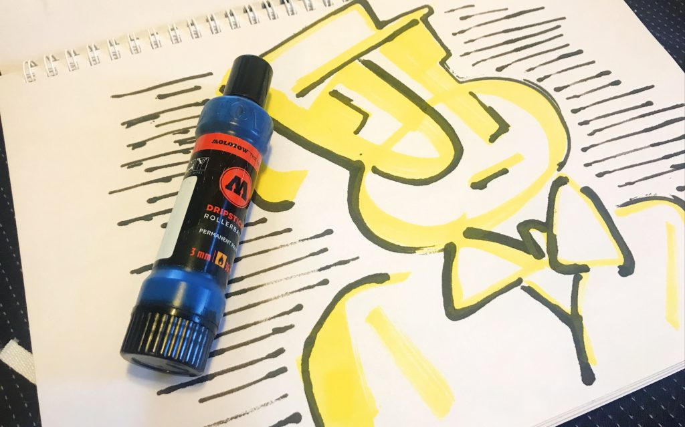
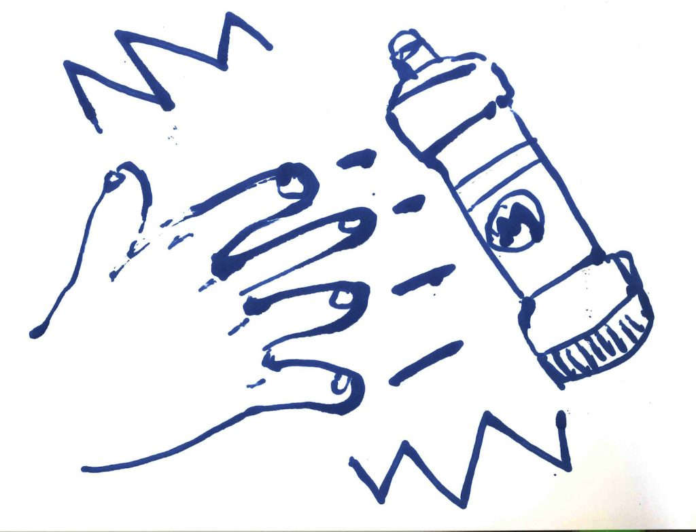
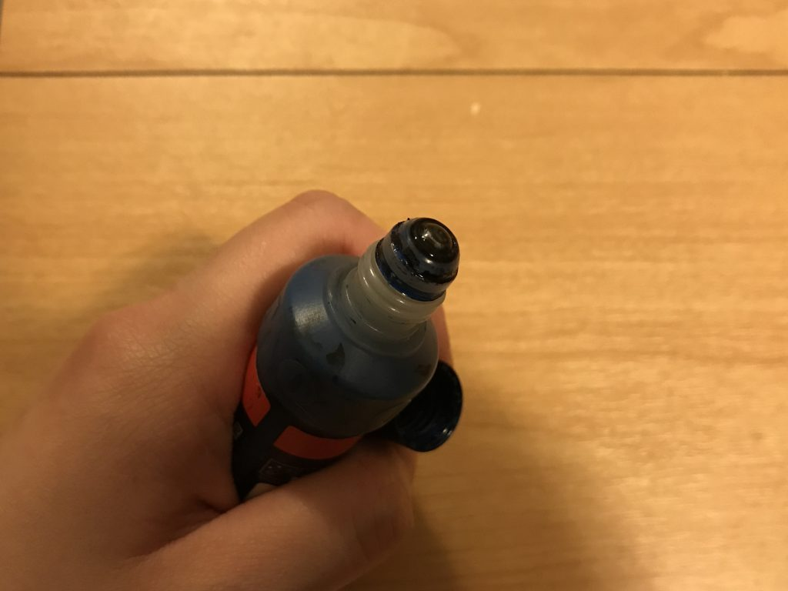
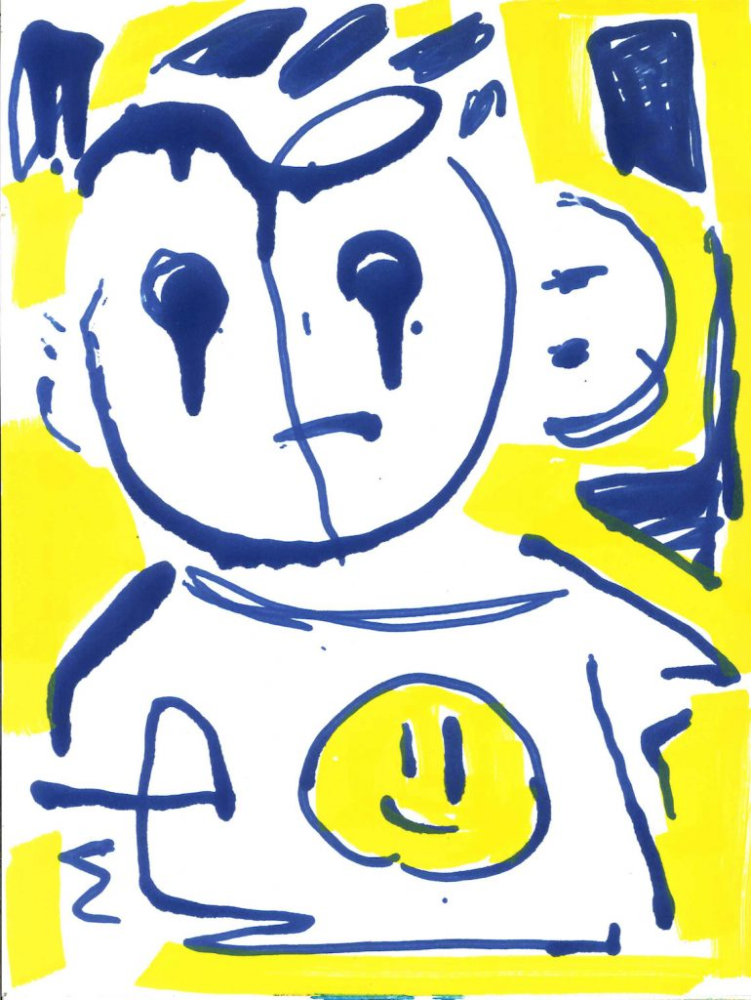
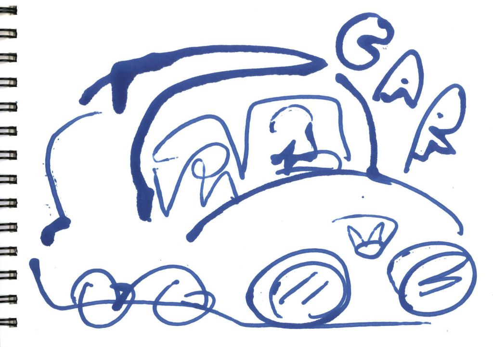
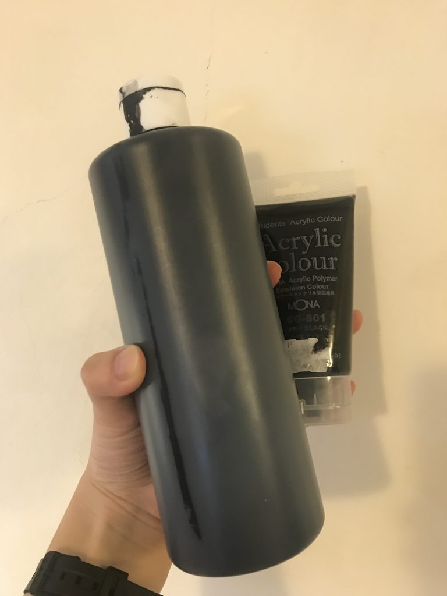
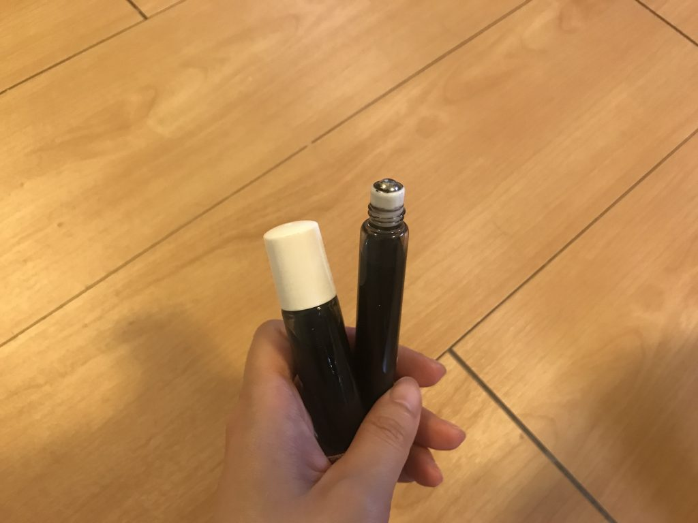

前言
--

HI 大家好

今天想來分享一下我在2019年遇到最有趣的筆[MOLOTOW DRIPSTICK ROLLERBALL 滾珠筆](https://amzn.to/2wv7Lrx)（台灣要購買的話可以到總代理商[思勃銳肯](https://shopee.tw/kevin200e200)的蝦皮購買喔！）

如果有來參加[2019台北插畫藝術節](http://tif.freedom-men.com/)和[0101 Art Fair](https://www.artzdeal.com/news/9171?fbclid=IwAR08lbiUp4NddEyimavmR6oUjoeJ34btwd6srOZLZ-QFMboXYZnpYNiIHAk)的話，就會聽到我一直說這支筆很好玩XD

相遇
--

從小就是文具的愛好者，小時候看著[文具病](http://www.stationeria.net/)、[小慶的雜七雜八](https://blog.xuite.net/q10021232/twblog1)等等經營許久的文具部落格長大（我連PTT帳號都是為了文具版辦的呢！），也沾染上了到處找老文具店挖掘老文具的習性。

直到近幾年因文具風潮興起，大家可能因為對於手機、電腦等等數位的產品感到疲憊，才開始尋找類比的體驗來讓自己從這個世界脫離，喘口氣。愛好者增多之後，要找老文具更難了，於是我慢慢轉向「佛系」的方式愛著文具XD，有遇到喜歡的就有遇到，沒遇到就算了吧！

2019年，在社群看到文具展的資訊，還是很開心的去參觀了！

裡面還是往常的那幾間大品牌，但今年我看到一間店裡面擺滿了很多塗鴉用品，名字叫思勃銳肯！雖然一直很喜歡塗鴉藝術，但我從來沒有用過這些東西，就很新奇的到處看看。店員也很熱情的介紹他們的產品給我，我自己對他們的產品有一個特別感興趣的特質就是——可以自己灌墨水！現場就有放很多直接販售沒有墨水的筆身，連一般大家使用的[立可白](https://greenmall.info/2ePiW)空筆身都有在販售！！

我在一個展示台上看到了MOLOTOW滾珠筆，因為我有偷偷打開來看筆頭（喂！），我就發現，哇！這個筆頭根本就是[原子筆](https://zh.wikipedia.org/wiki/%E5%8E%9F%E5%AD%90%E7%AD%86)的放大版！真是太有趣了！我想要帶回家！

好奇心驅使，我還是問了店員平常他們塗鴉是怎麼使用的呢？  
他才跟我介紹了，一般他們在使用的時候，都是在玩他的流湯效果，墨水畫完的話，後面蓋子轉開直接灌入新的墨水即可，相當簡單！

二話不說直接帶回家！也從這天開始給我帶來了各種意想不到的冒險😂

創作
--

如果有看[這則報導](https://www.artzdeal.com/news/9171?fbclid=IwAR08lbiUp4NddEyimavmR6oUjoeJ34btwd6srOZLZ-QFMboXYZnpYNiIHAk)的話，裡面也提到了我在2019年初有執行過斷捨離，丟掉了大量的東西，最後發現自己真的還是喜歡畫畫！畫具真的無法丟棄，即使我的手已經因為過去大量練習受傷而無法久畫了。（被自己玩壞的手手QQ）

過去也學過很多不一樣的美術技法，經過這次斷捨離，我也在創作的時候丟棄很多過去學到的技法，例如：要先打底色、用黑色廣告顏料整理畫面、要打草稿等等。

除非有限定主題，現在畫圖幾乎是不打草稿的，在那個當下我想到了什麼，或是我直覺想畫什麼，我就會讓他在畫上呈現。畫起來很開心喔～請大家務必嘗試看看！

筆的特性
----

前面也提到這支筆的結構很像原子筆，以下是我自己覺得這支筆很令我欣賞的幾個特點。

### 筆身是軟的，可以擠壓

就如店員說的，為了達到這支筆流湯的效果，筆身是用塑料製成，手是可以擠壓的。我自己都會故意把畫板立起來，一邊畫出線條，一邊在適合的線條或是頓點用力擠，創作出不同的效果。  

### 墨水可以自己調製與更換

MOLOTOW本身也有出自己的[墨水](https://amzn.to/2VQmNTp)，但真的不便宜…  
以我的畫法和用量，買原廠的我應該是會破產😂

該怎麼辦呢？

我看他們原廠也有販售壓克力墨水，我就想說那不如我就試著自己調製看看吧！一個奔去文具店，買了一般大家常見的壓克力顏料，自己加水存放在罐子裡，目前使用起來是沒什麼問題的！

### 筆蓋密封性不錯

為什麼會發現這個呢？是因為我去年真的有一陣子因為展覽和家裡的關係，口袋沒錢XD，但又好想畫圖！想玩一些不一樣的東西！所以我就把歪腦筋動到一般拿來放精油的滾珠罐了。想說這個也是像滾珠一樣的東西，應該沒問題吧！？

於是乎，我就二話不說跑去弄了一個滾珠瓶，咻嚕嚕的把自己調製的壓克力墨水灌進去。

灌好之後我馬上試畫看看，是可以畫得出來，但有一個很大的問題，就是出水狀態不如MOLOTOW滾珠筆順暢。而且！筆身因為是玻璃的，完全無法擠壓，我就只能看著自己畫出來的線條都是乾巴巴的了…

後來又要回去忙工作的事情就暫時收起來一陣子，沒想到某天要再拿出來玩的時候，發現滾珠完全被壓克力黏住XDDD，完全解不開。同樣放了很久的MOLOTOW滾珠筆，裡面一樣灌我自己調製的墨水，打開來只有少數壓克力乾涸的痕跡，但稍微畫一下，又是一尾活龍！看來為了畫畫設計的筆桿還是有差的！

後記
--

那一天礙於預算所以只有買這支滾珠筆，沒想到我可以因為這個機緣開啟我另外一塊創作的冒險，人生很多事情真的說不準呢！我後來上 [思勃銳肯的蝦皮](https://shopee.tw/kevin200e200) 還有看到其他的空筆管，都讓我好想嘗試啊！尤其有一個長得很像膠水瓶（我沒看過實物XD），看起來好好玩的樣子，想用那種筆畫很大張的圖！（好想要有大空間可以創作～）

---

我們是 Peckystudios 。
擅長設計吉祥物與角色相關的動靜態設計，這裡是我推廣創作的部落格，希望大家能藉由我的內容從創作中找到樂趣。

如果您正在尋找設計師為您設計吉祥物，
歡迎您到[服務項目](https://peckyhsieh.wixsite.com/peckystudiosservice)頁面瞭解相關資訊
也歡迎您寄信到 peckystudios@gmail.com 與我聯絡！

謝謝