最近因為有想要做的創作，把該準備的東西攤開來看之後發現除了研究時間之外，還需要很多錢（omg~~~）。去年的[展覽經驗](https://peckyhsieh.com/140/2019tiff/)也讓我感受到，有時候雖然都只是準備小東西，買一買加起來也蠻多錢的XDD（錢不是萬能，但沒有錢真的萬萬不能啊～～）

於是我就打算重新開始記帳，紀錄到底現在能讓自己過得舒服的基本消費是多少，可以撥多少錢來研究我想做的東西。最早在剛出社會的時候有為了了解自己的使用習慣而測試過幾個月，後來稍微穩定一點就沒有繼續記帳了。

今年試了幾款以前有使用過的一秒記帳App，不知道為什麼今年的我就是會一直遺忘去使用他XD 可能已經很擅長直接無視手機的通知了吧！

所以這次試著使用Notion來記帳！剛好我最近也有使用Notion自己設計自己的首頁（之後再來介紹），那就一起整合吧！

Notion記帳表格
==========

表格的部分我是參考[這篇文章](https://blog.prototypr.io/how-i-built-a-finance-tracker-tool-in-notion-with-template-3431464cf396)修改成我自己需要的樣子。

使用Notion的database來實現：

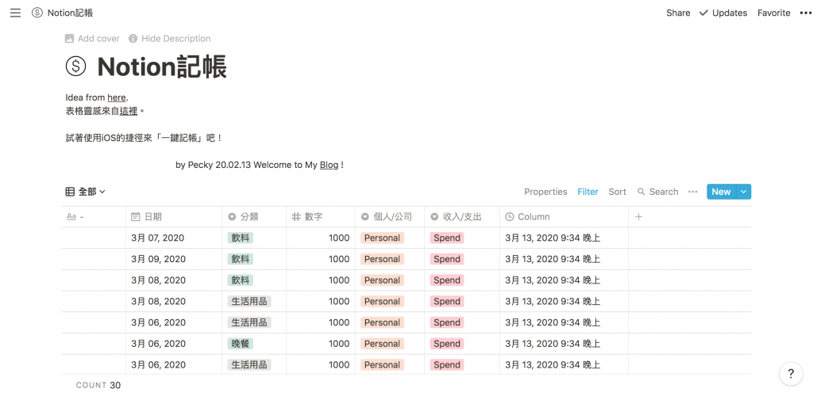

歡迎直接複製[Notion記帳模板](https://www.notion.so/peckyhsieh/8e2cd4e41e3e471b9e102dcba2ec8f2e?v=600a5053f68649f9bca1beb0dae0cbd8)回去使用喔 :)

如何製作Database
------------

很簡單，只要在隨意空格打上/page開啟一個新的page就會出現下圖的畫面

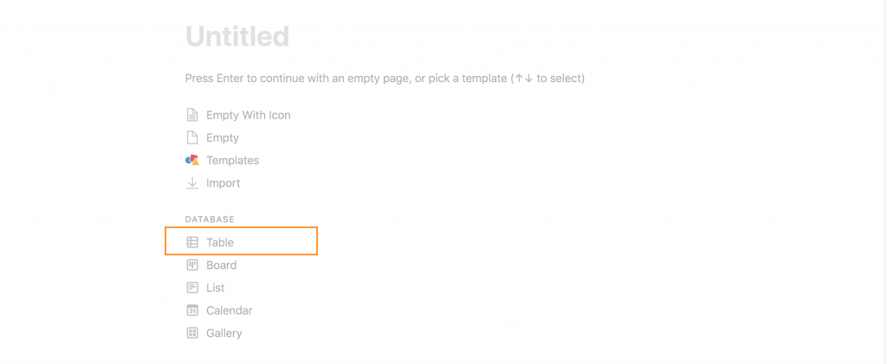

點選Table就可以開啟像首圖一樣的模式。

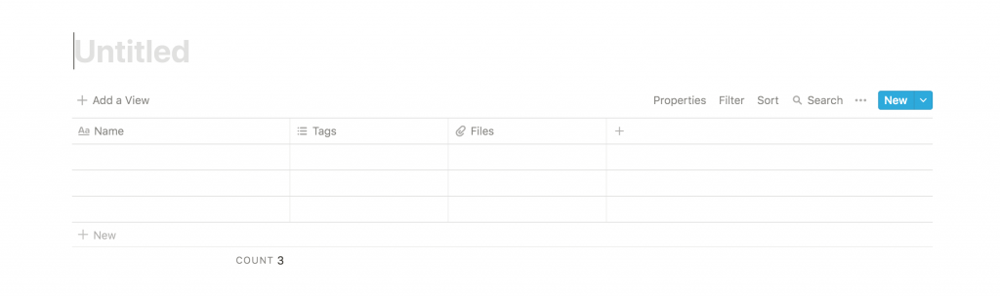

標題可以隨意命名！

表格欄位
----

我自己需求不多所以只有開啟以下欄位：

*   第一格一定要有（他是database每個項目的Title），所以可以自己隨意命名，使用時可以不填寫，看需求。
*   日期：選擇表格屬性（Configure Options）到 date，紀錄花費時間用
*   分類：選擇表格屬性到Select（單選），紀錄花費分類使用
*   數字：選擇表格屬性到Number（數字），紀錄花費金額使用
*   個人/公司：選擇表格屬性到Select（單選），紀錄這個款項是用在哪裡使用
*   收入/支出：選擇表格屬性到Select（單選），紀錄款項是支出還是收入使用
*   Column：這個可有可無，他是表格屬性Created Time，功能是顯示增加這個項目的時間，我個人是拿來避免我沒填到時間用的。

這部分就是看個人習慣自己去設計表格。

使用的時候只要按右上角的藍色New按鈕

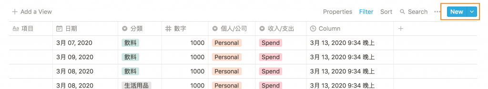

就會直接開啟新的一個項目Page，就可以開始填寫囉！

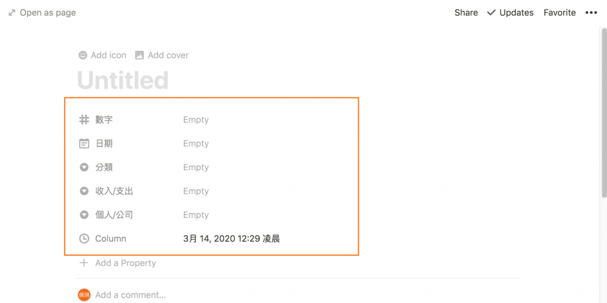

欄位功能特點
------

### Title：

Database裡面的每一個項目都可以是一個Page，所以才會要求一定要有這個Title（就是Page的標題名稱），他代表了那一個項目裡面所有的資料。  

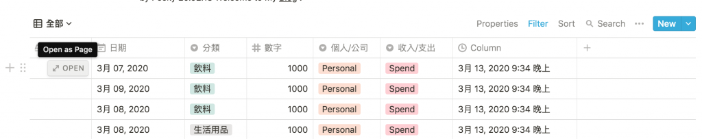

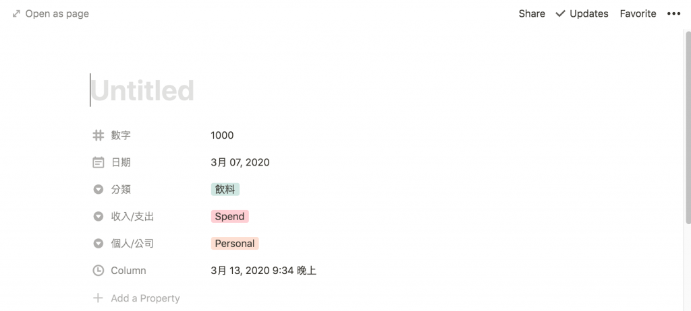

### Date：

屬性設定完成之後，只要點擊可以填寫資料的地方，他就會跳出一個月曆讓你填寫日期。

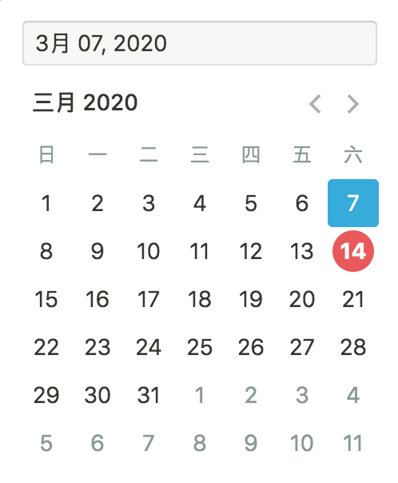

### Select：

這個是單選，我們可以自由設定裡面的選項，一個欄位只能從這個選項裡面選擇一個屬性。

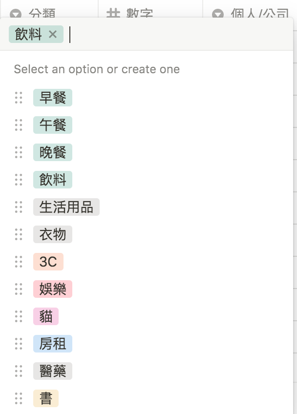

顏色也可以自由更換喔！

### Number：

這個就是字面上的意思，可以輸入數字。裡面也有內建的可以顯示幣值，或是小數點等等的功能。  

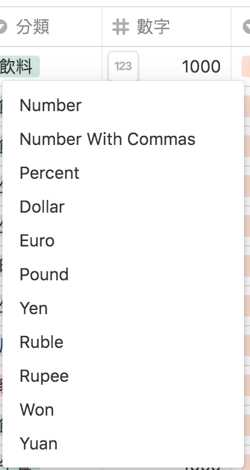

### Created Time

會自動出現我們創建這個項目的時間。

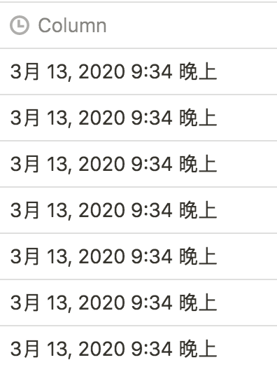

如何可以更快速填寫這個表格？
--------------

單用以上表格的話有個問題非常困擾我：

_每次新增項目都要一個一個欄位選項去選擇，Notion又不會AI演算我們這個時間通常會選什麼選項，不是很方便！_

後來誤打誤撞發現了一個技巧可以省略這個麻煩！而且非常簡單！

我們點選表格左上角的「+ Add a View」

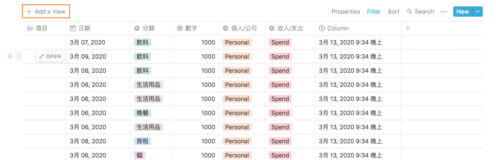

一樣選擇 Table，命名為當日消費（這個可以隨意），之後點選create。

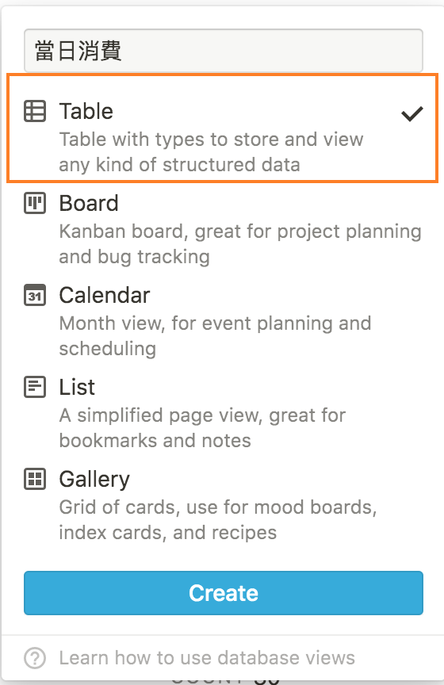

確認左上角這邊出現剛剛命名的名字  
這樣我們就有一個新的View了

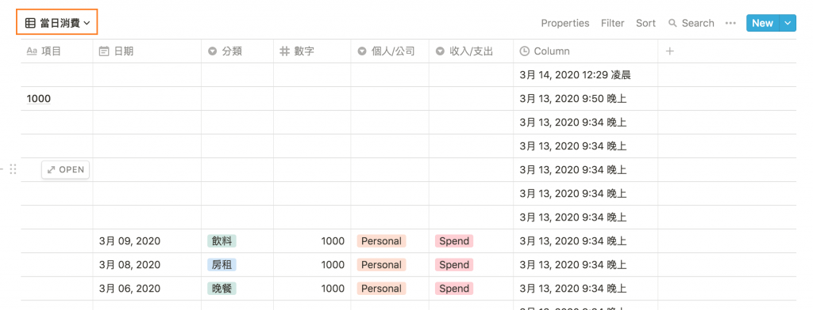

> View的用途是，假設我們在這個database裡面擁有100個項目（Page），他們身上各有不一樣的標籤。  
> 我們有時候對於這些資料會有不一樣的需求去觀看他，比方說我每天都要確認自己在吃東西上花了多少錢，我就可以使用View去設定Filter：當日/分類包含早餐、午餐、晚餐。  
> 表格就會只顯示今天我花在正餐的費用會是多少，View會記住你在這裡的觀看方式。我們也可以直接點選左上角自由的更換不同的View，用不同的角度來看這一整個資料庫的內容。

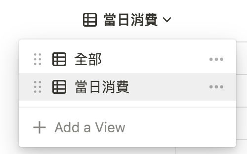

那就開啟「當日消費」的View來設定囉！

點選Filter再點選+Add a Filter

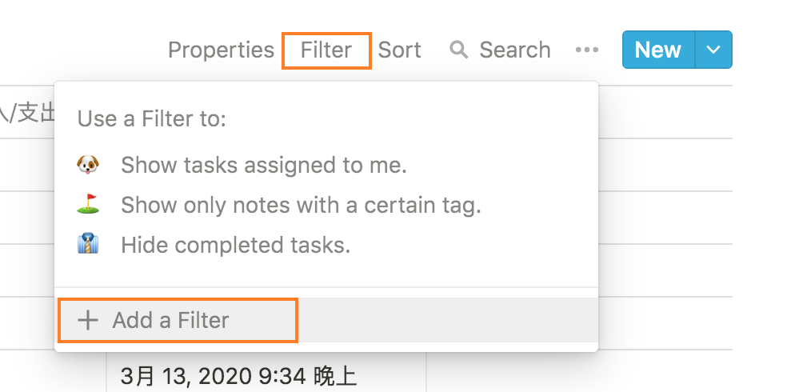

選擇日期欄位/Is/Today：這個的意思就是篩選「日期」欄位「是」「今天」的項目。


馬上就可以看到表格有了變化

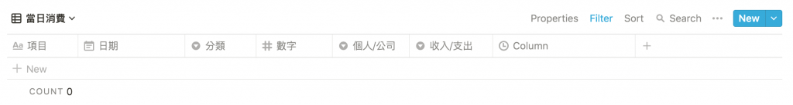

空的是因為我今天還沒有輸入任何東西XD  
我們馬上來試試看吧！

點選右上角的New！

就會發現哇！他幫我自動填寫今天的日期了！

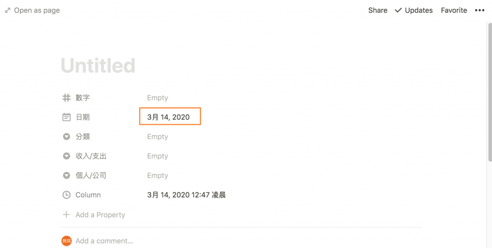

大家可以比較一下如果沒有這樣設定這個輸入的時間會差多少，我個人是覺得選日期在手機上是有點痛苦XD 很難點選

同樣的道理，我們還可以依據需求在Filter加入更多屬性讓他自動填寫

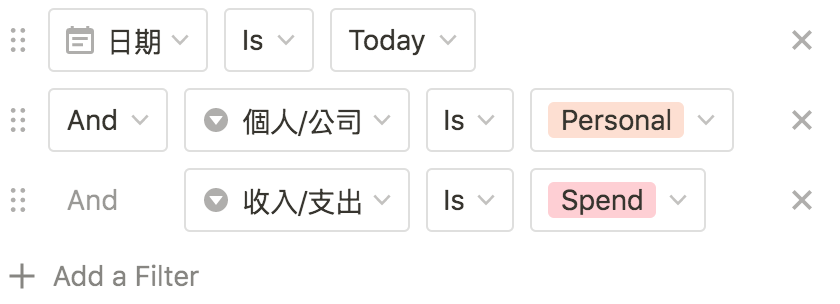

這是我平常使用的，我只有留數字和分類給我自己填寫，其他都自動。

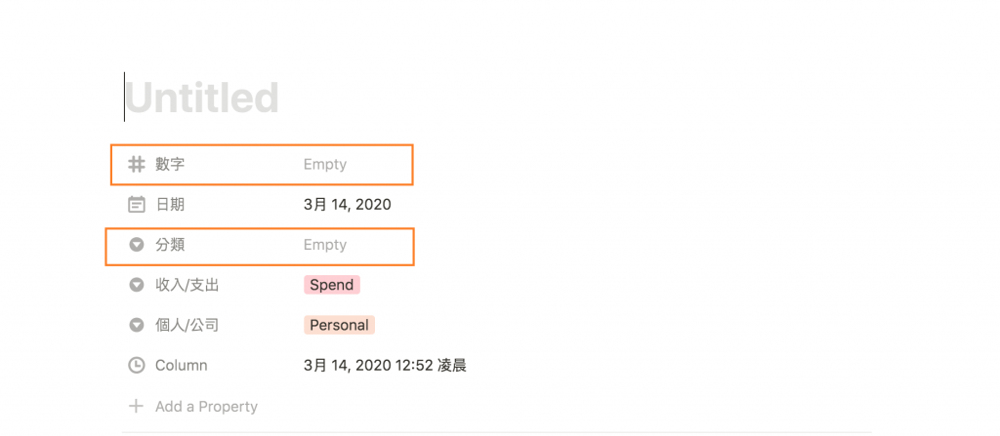

這樣每次輸入就只要填寫2欄就可以了！真的很方便！懶人必備技巧！

使用iOS手機的捷徑App來達成一鍵記帳
====================

這個部分也是我突（懶）發（癌）奇（發）想（作），生出來的XDD

這一個part需要使用到 iOS 特有的[URL Schemes](https://www.appcoda.com/working-url-schemes-ios/)來呼叫出 Notion 的特定頁面，稍微有點複雜，但照著以下步驟做就可以實現囉！

1.  請務必確認自己的記帳 Page 要放置在哪裡，這個會影響到 URL Schemes 寫的 Code，不想改來改去的話就先放定位吧！
2.  打開記帳 Page（要以 Page 的方式打開），將 notion.so/ 後面的文字都先存下來（請注意每個人 Page 的碼都不一樣，不要傻傻的複製我的了）

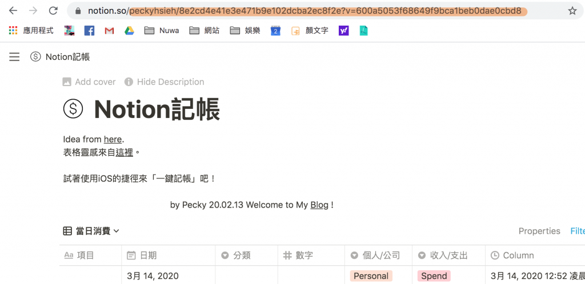

3\. 雖然 Notion 官方還沒有正式公布 URL Schemes ，但我在 [reddit](https://www.reddit.com/r/NotionSo/comments/ddppgl/callback_url_and_ios_shortcut_integration/) 找到了：

```
There is no official supports but I found Notion on iOS does support this.

If you note URL is: https://www.notion.so/<namespace>\`/``<note_id>, you can create a custom scheme asnotion://<namespace>/<note_id>`.

Then you do something like this in Siri Shortcut

Edited:

- notion://... is a custom scheme, not a callback URL.

- notion://notion.so/<namespace>/<note_id> works better.
```

如果看不懂也沒關係，我們只要把我們剛剛複製下來的東西直接貼到以下文字後面即可：

`notion://notion.so/`

好了之後先保存備用。

4\. 開啟iPhone，打開捷徑，點選製作捷徑

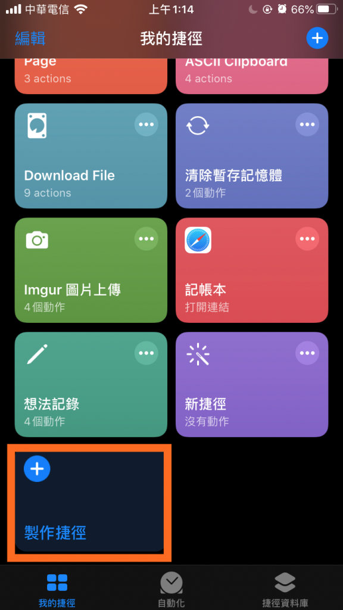

5\. 點選加入動作，選擇網頁，再點選Safari分類下面的打開URL

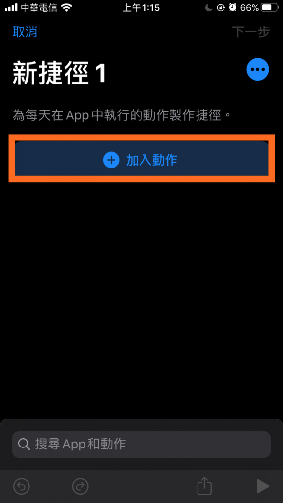


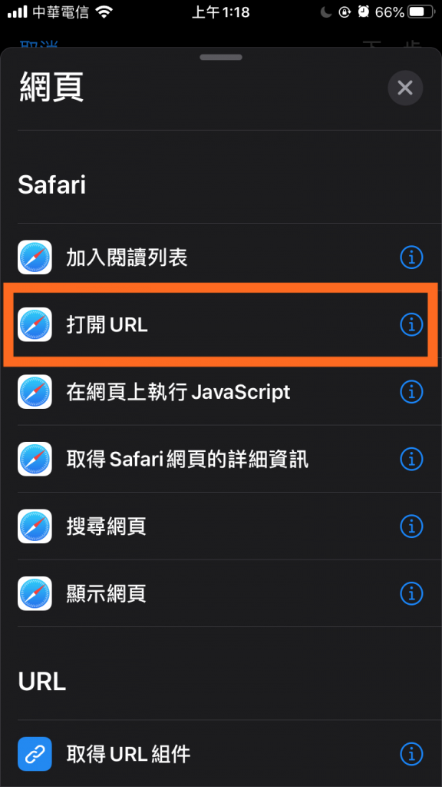

6\. 點擊半透明的URL，貼上剛剛已經保存好的那串文字 ，按下一步

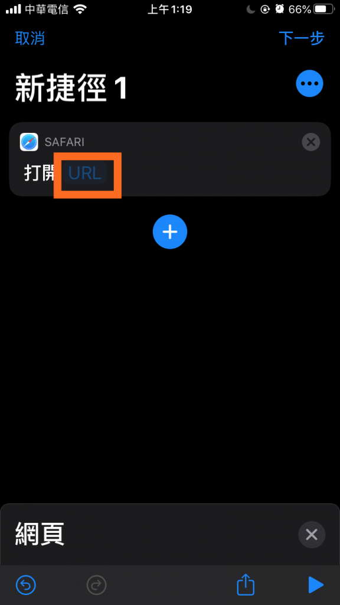

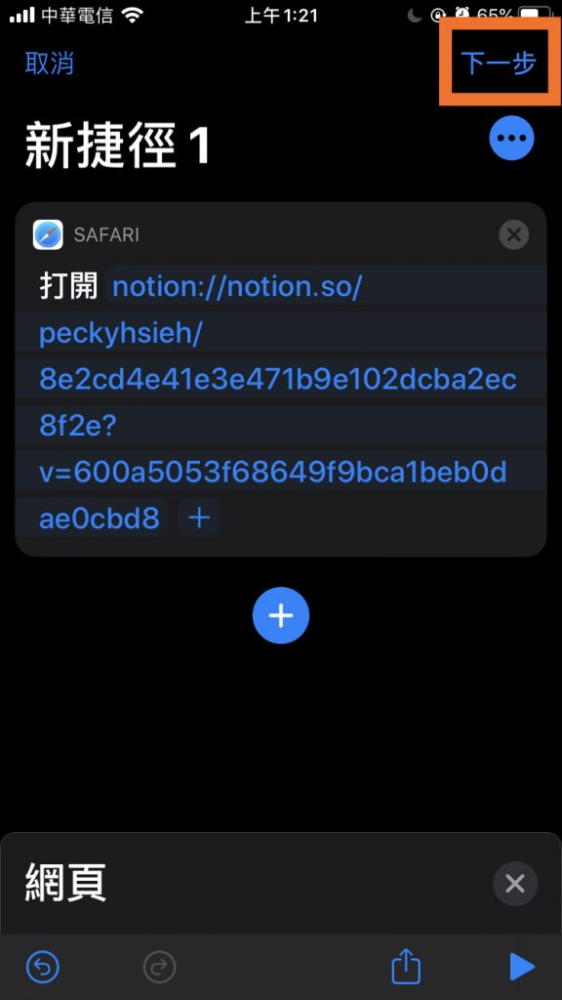

7\. 輸入一個自己喜歡的名字，點選左邊icon可以自己選擇喜歡的顏色和icon ，按完成！

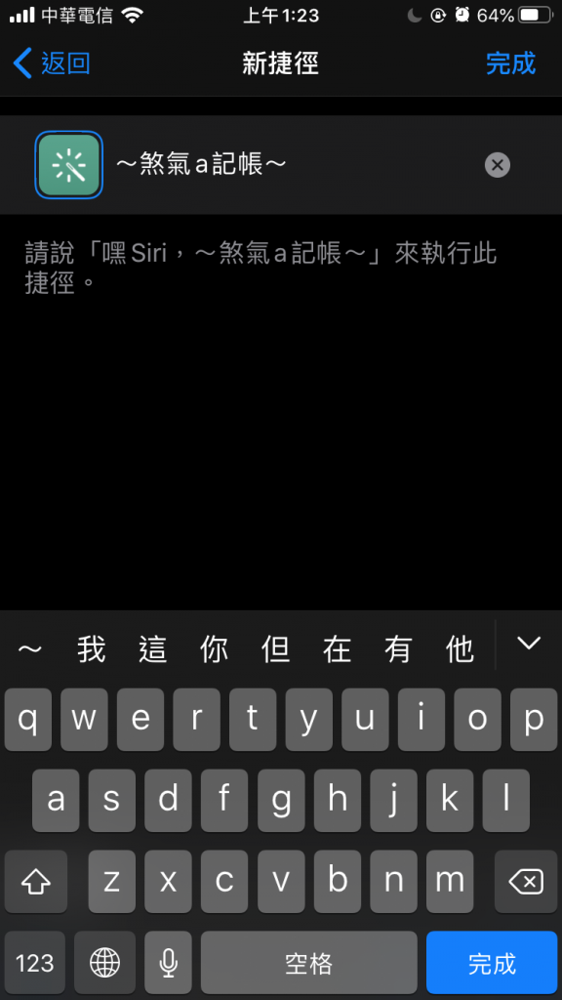

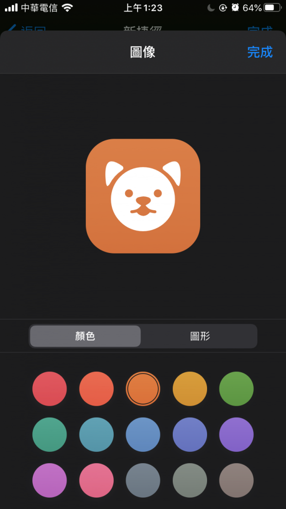

8\. 燈等～現在就可以按按看這個捷徑，是不是馬上就連到記帳頁面了呢？這樣就完成了喔！

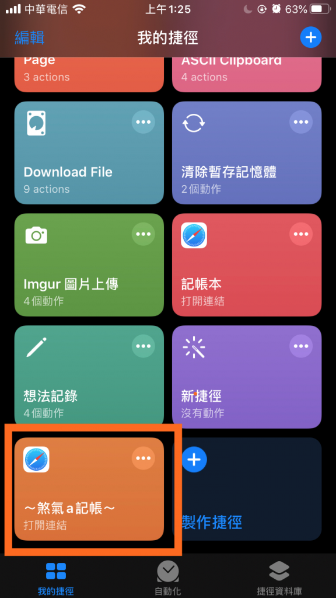

Bonus！我想要直接從桌面飛～到記帳頁面可以嗎？
-------------------------

可以！捷徑App真的很方便！

我們再進入一次剛剛那個捷徑的編輯頁面，點選捷徑右上角的「…」

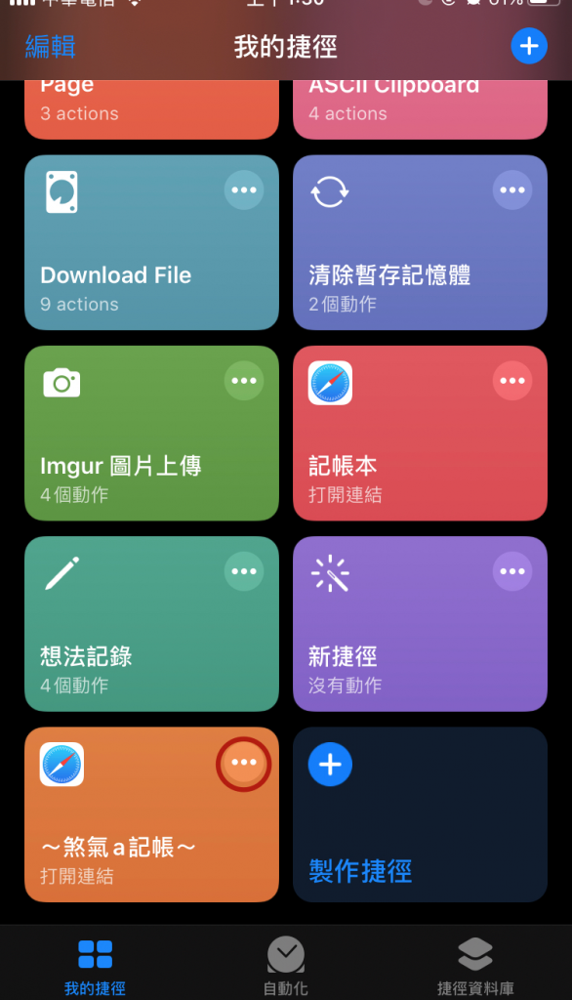

再點選編輯頁面右上角的「…」

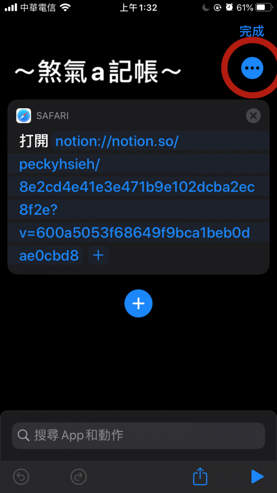

點擊「加入主畫面」

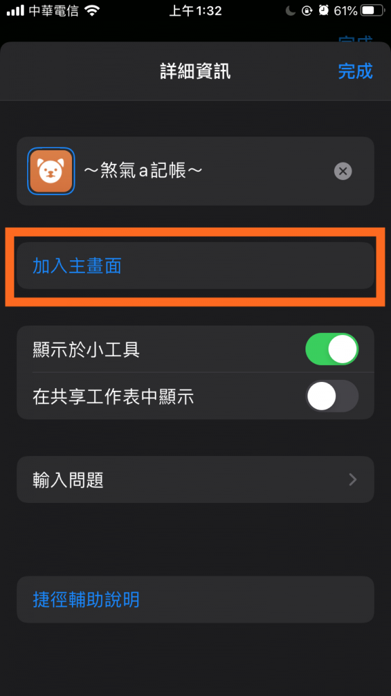

再依照個人喜好編輯icon和名稱，修改後按加入

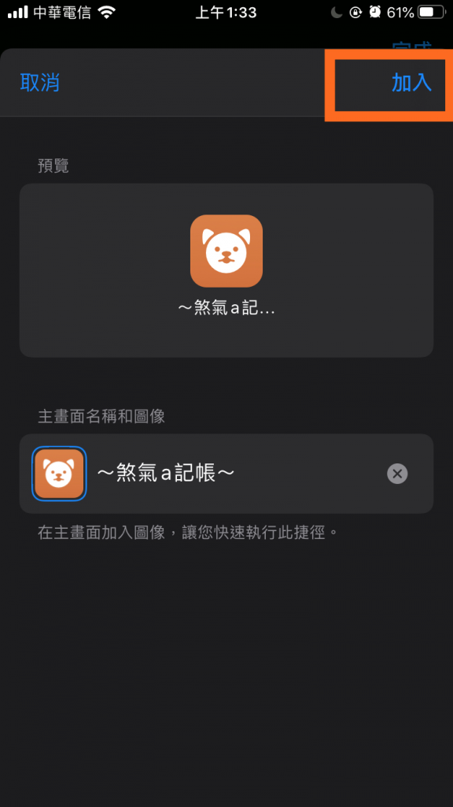

就可以在桌面看到icon囉！

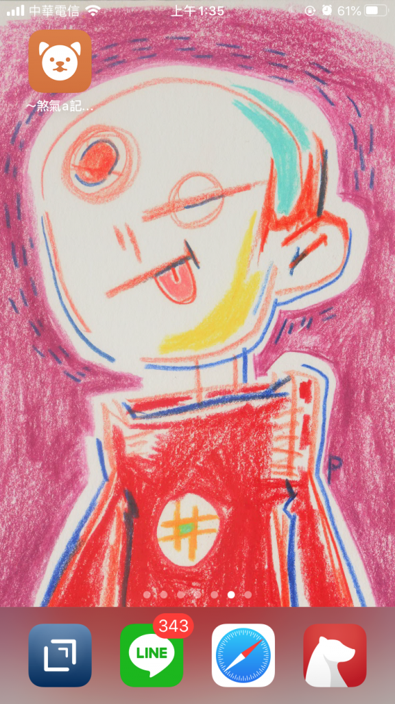

點選之後就會執行捷徑並且連結到 Notion 記帳的頁面，是不是很方便呢～！

結語
==

目前大約使用了半個月，覺得還不錯，不用分散各種資料在不同App是最吸引我的一點。

可以開發各種讓自己懶散的工具的過程對我來說也是一個很有趣的點XDD

很希望這件事能幫助自己在應用錢的時候比較好規劃！

