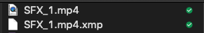
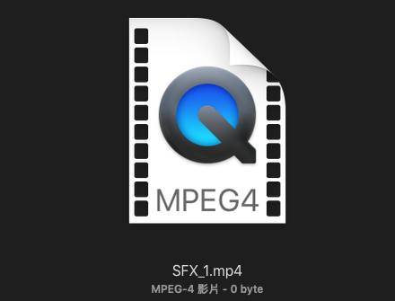
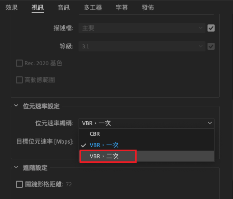
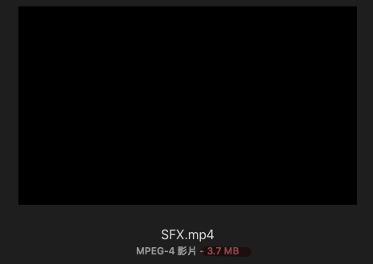

Bug
===

今天使用AE製作動畫遇到一個小問題，  
不知道為什麼輸出影片時雖然顯示完成但只有出現「xxx.mp4」「xxx.xmp」2個檔案

mp4檔本身還是空的，檔案大小 0 kb  
完全不能播放

研究
==

搜尋了一下英文看看有沒有類似的問題找到這一篇Adobe官方社群的提問  
[Media Encoder Exports empty MP4 and XMP file? - Adobe Support Community - 8854984](https://community.adobe.com/t5/media-encoder/media-encoder-exports-empty-mp4-and-xmp-file/td-p/8854984?page=1)

裡面就有提到需要設定「2-pass」

但我根本不知道什麼是2-pass？？  
按來按去也沒看到相關的設定@@

於是又再找一下關鍵字  
找到這篇  
[VBR一次編碼 v.s 二次編碼 | 杰客森林-單機攝影情報](https://www.jacksonlin.net/20170304-vbr-cbr/)

原來是壓縮的選項

解決問題
====

回頭找Media Encoder裡面的轉存設定  

找到位元速率編碼設定為「VBR，二次」

再按render

問題就解決囉！

---

我們是 Peckystudios 。
擅長設計吉祥物與角色相關的動靜態設計，這裡是我推廣創作的部落格，希望大家能藉由我的內容從創作中找到樂趣。

如果您正在尋找設計師為您設計吉祥物，
歡迎您到[服務項目](https://peckyhsieh.wixsite.com/peckystudiosservice)頁面瞭解相關資訊
也歡迎您寄信到 peckystudios@gmail.com 與我聯絡！

謝謝

---

如果喜歡我們的文章，歡迎到[我們的選物店](https://www.rakuten.com.tw/shop/peckystudio/)支持我們，讓我們更有動力創作喔！