如[8個開始子彈筆記的心法](https://peckystudios.com/p/8tipsforbeginningbujo/)所說。最近疫情嚴重，雖然公司離家裡很近，但只要出門就還是會有染疫風險。

為了避免在攜帶筆記本過程不小心污染，而且筆記本表面積很大，也難以消毒，現在暫時換到數位端來記錄我的子彈筆記，這樣我出門和回家都只要帶手機，也比較好消毒。

很幸運的找到現在正在使用的[NotePlan 3](https://noteplan.co)，他在Mac、iPad、iOS版本可以同步使用，而且可以使用自己的iCloud或Cloudkit，並且編寫的檔案就是直接生成TXT或MD的純文字檔（可自行設定）。

最近在調整自己的筆記系統時，就一直很在意不想要自己的筆記被任何一種APP或是服務器綁住，而且很在意自己的資料放在別人的服務器上，總覺得資料被看光光，不太舒服，像 Evernote 和 Notion 就會有這個問題。

# 我目前的數位子彈筆記需求是：

1. DailyNote：可以快速專注在今天這一頁，讓我把所有想法紀錄到當天的筆記內。
2. 提醒功能：有時候任務可能一個月後才發生，我自己用原版子彈筆記法的搬移過程中很常忘記去看Monthly Log，所以會希望有些任務可以在我該想起的時候出現讓我看到。
3. 想嘗試最近常被討論的 Zettelkasten 卡片盒筆記法。

# 工具比較

最近Obsidian很夯，他可以使用wikilink的方式來雙向連結文件，而 NotePlan 也有這個功能。這也是 Noteplan 最吸引我的點，因為如果我為了 Zettelkasten 法而直接把我原先習慣的筆記方法全部換掉，我會很困擾。

快速回到今天頁面對我來說很重要，因為我很容易轉頭就忘記要做什麼和剛剛在想什麼，不用多一步思考資訊放哪裡，對於資訊和想法的快速蒐集很有幫助。

最近Craft 也推出了同步iOS內建提醒事項與行事曆的功能，可惜我不喜歡Craft的雙向連結是用軟體內部的連結，這樣未來如果想要換軟體會不太方便。而且目前暫時只有 Apple 自己的行事曆，沒有串連 Google 日曆，對我來說不是很方便。

而目前NotePlan使用的連結方式就是WikiLink，這個和就我所知的工具與TiddlyWiki和Obsidian一樣，這樣如果以後不想用NotePlan 3，取消訂閱之後，我還是可以用可以讀取Markdown與WikiLink的工具來讀取檔案，例如Obsidian。

# 介面
NotePlan 3 電腦版、iPad、手機版介面不太一樣，功能也因此稍微不一樣，我們就簡單的來比較一下。

## 電腦版
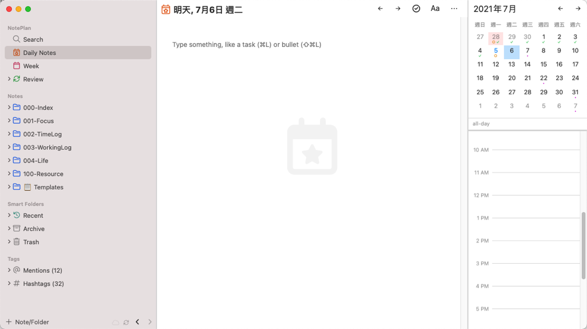

## iPad 版
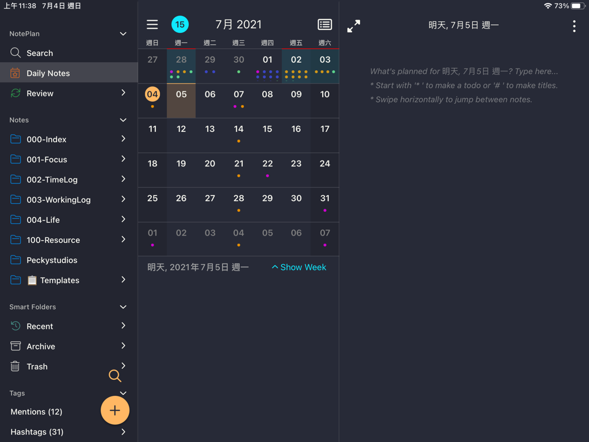

## 手機版
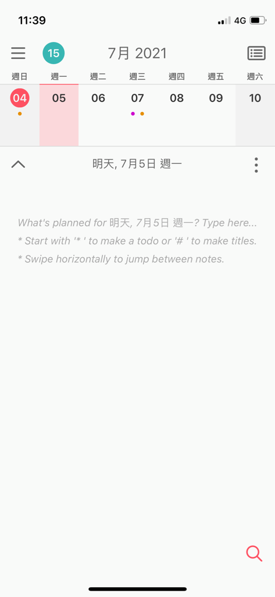
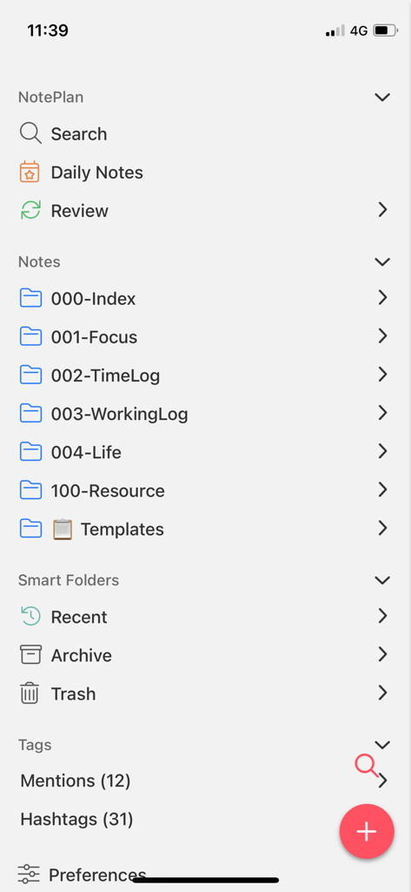
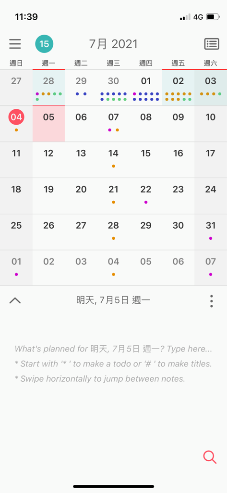

其實可以很容易看出幾點差異：

### 三個都有月曆的界面
畢竟他們是以這個為主打，一定要有。點擊日期可以跳到當天的筆記，月曆上也會顯示當天有多少待辦事項和已完成的事項。

### 只有 Mac 版本有時間塊的區塊
時間塊是當你在待辦事項輸入例如 9:00-11:00 ，他會在 Mac 電腦版右下角的時間塊區顯示你的待辦事項。
這一點我有在他們的 Feedback 網站提出，希望能在iPad版上新增這個功能，也有很多其他用戶響應，也許未來會新增這個功能。

# Daily Notes
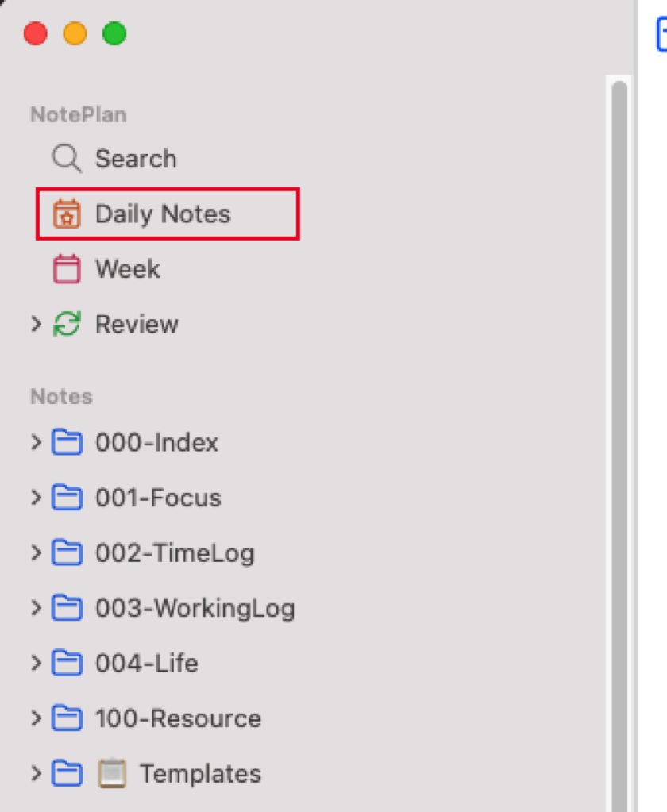
我最喜歡的功能！
使用快捷鍵 Command + T ，可以馬上跳到今天這個筆記，很方便。

手機版則是貼心的在你瀏覽 Notes 裡面筆記的時候，上方會出現「 view today 」的按鈕，可以快速回到今天的頁面。
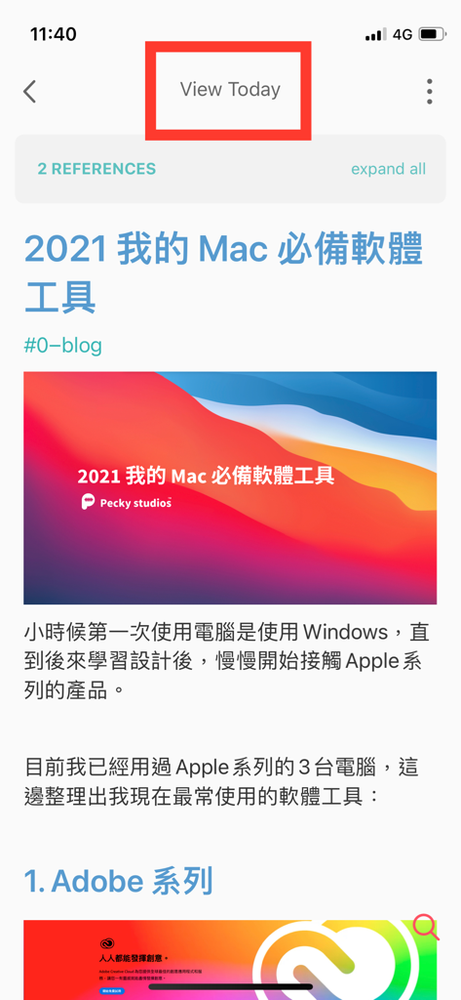

搭配 Command Line （Command + J）工具和 Plugin 可以快速的導入每一天的日記模板，也可以隨時修改自己的模板，非常方便，我也將自己的子彈筆記稍微修改成4個區塊：
- Tasks ：放我的任務項目
- Media：放當天的照片記錄
- Journal：放當天發生的事情與相關記錄
- Reference：放當天我在網路上瀏覽到覺得有用的資料
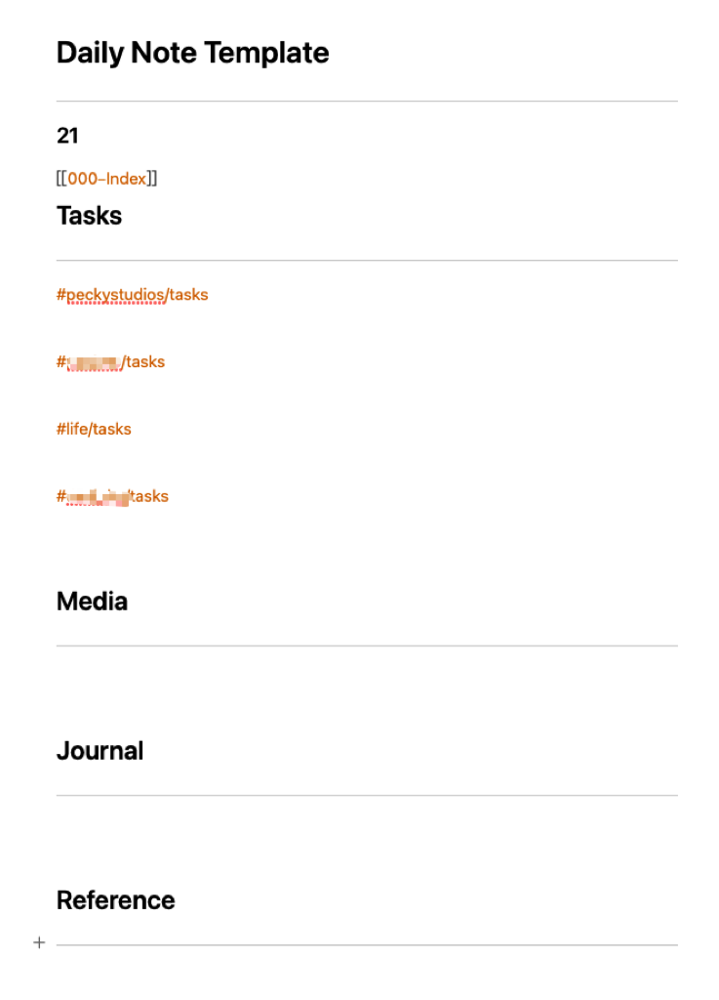

# 任務管理
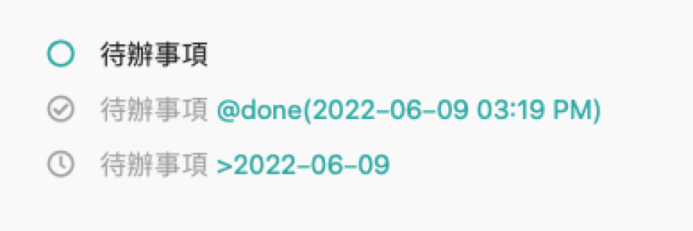
因為 NotePlan 的檔案基礎是文字檔，所以我覺得他在判斷任務的設計蠻有意思的。
他可以設定是輸入 * 被判定成任務項目還是其他符號，* 是他們原始的設定，我考量到未來可能跳轉到其他工具，所以改成讓任務項目是 - [ ] 這樣的寫法，這個在 Github 和 obsidian 都可以讀到，而且就算不經過軟體讀寫 Markdown 格式，直接看文字檔也是一個很容易辨識的寫法。

任務可以移動到未來的某一天，完全符合子彈筆記裡的搬移步驟，相當方便，點擊筆記右上角的三個點，也可以直接點選 Move all open task to 來把所有沒有完成的任務搬到適當的日期，節省很多時間。

設定裡面可以也可以開啟勾選完成時記錄是什麼時候完成的，我自己蠻喜歡這個功能，我在實踐實體筆記本的子彈筆記時，最喜歡的就是回頭看以前的記錄，我會知道自己當時都在做什麼，手寫時大概只能知道我是那一天完成的，NotePlan 則可以直接記錄到時間，比較精準，缺點就是，整個記錄可能會因為字太多有點亂。

# 檔案管理
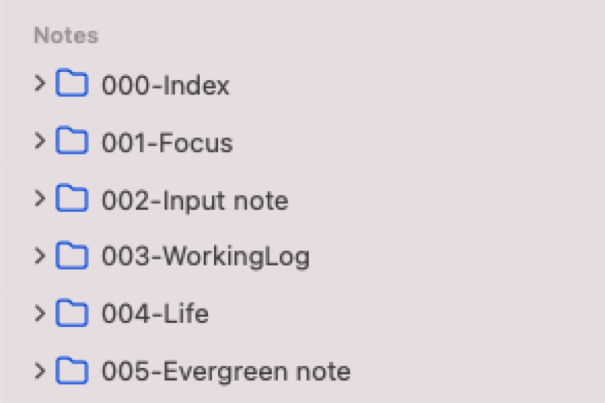
界面左側是檔案的整理區，他是依照文件的資料夾擺放來顯示，所以也可以直接用電腦 Finder 開啓他的資料夾進行整理，這邊會同步更新。

# 文字編輯
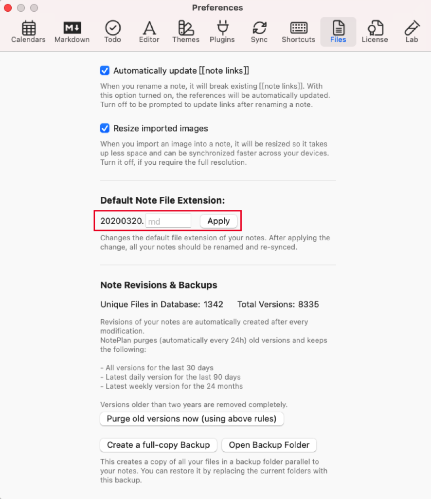

在設定裏面可以設定我們輸入的文檔要存成什麼格式，有 txt 和 md 兩種，我建議剛開始使用就要設定完成。每一台裝置都要分開設定，要記得設定成一樣的以免出錯。

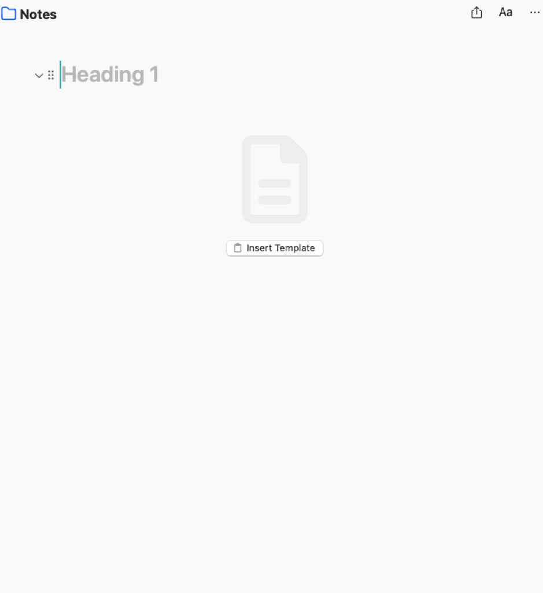

NotePlan 的文字編輯區非常簡潔，在打字的體驗上並不輸給其他文字編輯軟體。

在處理圖片的時候想當方便，可以直接複製圖片並且直接在文字編輯區貼上，圖片就會自動以 Markdown 格式安插在文章中。複製網站網址進來也會自動抓取網站的 title ，想當方便。

缺點是在 NotePlan 裡面並不能使用表格。

# 事件與提醒事項
這邊最棒的是他是直接與 Apple 內建的事件與提醒事項聯動，他非常好用，我最喜歡的地方是提醒事項會一直停留在通知中心直到我們完成他。

# 人物標籤（Mentions）和文字標籤（Hashtags）
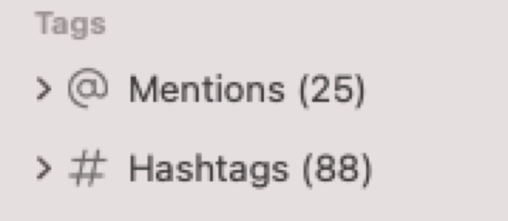
在界面的左下角，有人物標籤和文字標籤，我們可以自由的在文章內插入，之後回到左下角點擊該標籤，NotePlan就會自動過濾出有那個標籤的內容了。

# 雙向連結
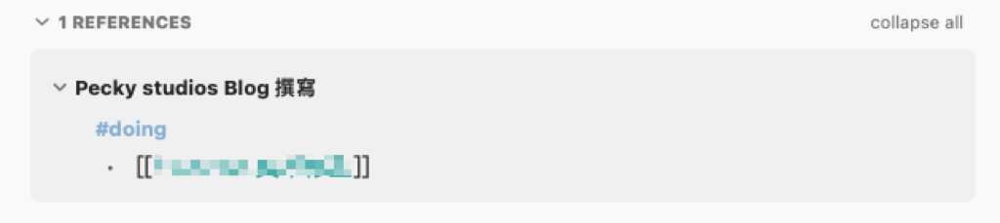
如前所述，NotePlan是使用 Wikilinks來建立連結，最棒的是他也有反向連結的功能，我可以很自由的在筆記和文章之間跳轉。這也對於執行卡片盒筆記法有很大的幫助。

# 價格
## 直接訂閱
可以直接在 App 內訂閱，一個月240元，年繳含稅要1980，訂閱之後所有裝置 都可以使用，我就有用在一台 Mac 、三台 iPad和一支手機上。

# Setapp
[Setapp](https://setapp.sjv.io/c/3483807/344537/5114)是一個訂閱之後可以一次使用多種付費 app 的服務，裡面就包含了 [NotePlan](https://setapp.sjv.io/jWA9n6) ，如果你在這裡的[ app 名單](https://setapp.sjv.io/LP3Mxo)裡有找到自己平常在使用的 app ，那麼購買 Setapp 的服務就會比較划算，也可以考慮看看喔！

# 總結

### 優點

- 完全貼合子彈筆記系統的功能。
- 文件儲存在 Local 檔案系統內，使用者可以完全掌控自己的檔案，不用放在別人的服務器內。
- 開放式的文件儲存系統，可以直接儲存 Markdown 文件檔。
- 可以在電腦端直接使用 obsidian 開啟，一次可以享受到兩個 App 的優點。
- 像 Bear App 的 Nested Tags 機制，可以為 Tags 分層。
- 可以快速進入每日的筆記裡面。
- 有月曆的介面可以預覽整個月的筆記。
- 電腦版有時間塊的功能，只要在任務項目裡面輸入時間就可以自動出現在當日的排程介面裡。
- 最近的更新新增了 Javascript ，在 Plugin 的部分預期將會讓筆記功能有更多的自訂功能。

### 缺點

- 昂貴的訂閱制，比起 Evernote 真的貴很多！
- 同步功能可能在網路不穩定時產生檔案覆蓋的問題（如果選擇 Cloud Kit 會有偵測版本衝突的功能，如果是選用 iCloud ，則會只要發生覆蓋檔案就真的不見了，我自己發生過幾次就果斷換成 CloudKit 了。），可搭配 working copy 和 github 經常進行備份，以防萬一。
	- 我遇到的情況是真的網路最快不到6M，斷斷續續，極度不穩才會遇到，如果你確定你的網路一直都是非常順暢的就不用擔心，如果使用 CloudKit ，有抓到版本衝突，他也會提示現在有2個版本的檔案，請問你要選擇哪一個版本。

使用到目前差不多半年，除了價格和同步問題真的要多小心之外，其他功能都還算滿意，使用上有問題在開發者的論壇直接提問，回應速度非常快，在 Discord 裡 Beta 版的更新也很頻繁，如果預算足夠的真的可以訂閱來試試看。

---

我們是 Peckystudios 。
擅長設計吉祥物與角色相關的動靜態設計，這裡是我推廣創作的部落格，希望大家能藉由我的內容從創作中找到樂趣。

如果您正在尋找設計師為您設計吉祥物，
歡迎您到[服務項目](https://peckyhsieh.wixsite.com/peckystudiosservice)頁面瞭解相關資訊
也歡迎您寄信到 peckystudios@gmail.com 與我聯絡！

謝謝

---

如果喜歡我們的文章，歡迎到[我們的選物店](https://www.rakuten.com.tw/shop/peckystudio/)支持我們，讓我們更有動力創作喔！