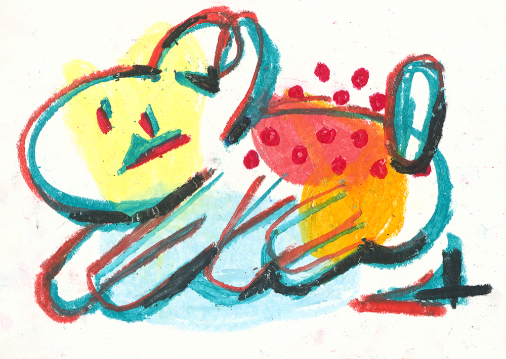

---
categories:
    - 藝術創作
date: 2021-08-03T09:09:00Z
description: 雖說我是不限制媒材的人，但是粉蠟筆對我來說是一個有特殊意義的存在。
image: 躍動狗狗.png
slug: whyoilpastelismylove
tags:
    - 認識自己
    - 藝術
    - 畫畫
    - 創作
title: 為什麼我要選擇使用粉蠟筆來創作？

---

雖說我是不限制媒材的人，但是粉蠟筆對我來說是一個有特殊意義的存在。

這個可以回想到以前去畫社學習畫畫的時候，當時我們的畫材都是由畫社規定我們購買的，裡面就有一項是粉蠟筆。

因為我是參加考衝班，我們的課程內容就是按照考試的項目來分，有素描、水彩和創意表現。那創意表現算是我自己覺得比較有趣的一個項目。

他就是給你一個主題和幾張圖讓你去畫，你從這些元素去創作一張圖。我原本在那間畫社裡面算是一個畫畫很差的人，後來不知道為什麼哪一天突然開竅了，有抓到畫畫的規則，就是用不透明水彩和蠟筆混合使用然後可以疊出比較厚的效果，我學會藉由這一點來做出畫面的層次。

所以粉蠟筆在這裡對我來說變成是提升我畫畫信心的一個象徵。

而且在我小時候研究CG電腦繪圖的時候，我就很喜歡厚塗的效果，所以粉蠟筆他可以疊出來的那個厚厚的感覺我也非常喜歡。後來我考完試離開那個畫社之後，我還是會把粉蠟筆拿出來畫一些塗鴉。

去上班之後就變得很少畫畫，直到某一年我被工作壓得喘不過氣來，於是決定在家裡試著自己開直播，然後拍攝自己畫畫過程。那時剛好手邊有粉蠟筆，我就把它拿出來，隨著音樂喝點小酒就開始隨心所欲的畫。

我最後也意外畫出很有趣的效果，而且參加展覽時也獲得非常多的好評（[【創作】2019 台北插畫藝術節 Taipei Illustration Fair]([https://peckystudios.com/p/2019tiff/](https://peckystudios.com/p/2019tiff/ "https://peckystudios.com/p/2019tiff/"))），還有因為粉蠟筆的顏色就只有固定的幾十個，所以我可以藉由這些單純顏色配上有趣的造型來拼湊出高對比而且很有趣的圖。

粉蠟筆另一個優點是非常好取得，而且很便宜（雖然我後來才知道也有很高價的粉蠟筆XD）。我可以不用擔心畫材昂貴（水彩顏料就非常貴😭️），盡情的畫。我在推廣大家一起加入創作的行列時，也會希望創作是一件非常容易入門，沒什麼門檻的事。這個時候便宜又有豐富顏色的粉蠟筆就派上用場了！

希望看到這篇文章，很想嘗試創作的你/妳，可以試著拿出身邊現有的媒材來創作喔！

---

我們是 Peckystudios 。
擅長設計吉祥物與角色相關的動靜態設計，這裡是我推廣創作的部落格，希望大家能藉由我的內容從創作中找到樂趣。

如果您正在尋找設計師為您設計吉祥物，
歡迎您到[服務項目](https://peckyhsieh.wixsite.com/peckystudiosservice)頁面瞭解相關資訊
也歡迎您寄信到 peckystudios@gmail.com 與我聯絡！

謝謝