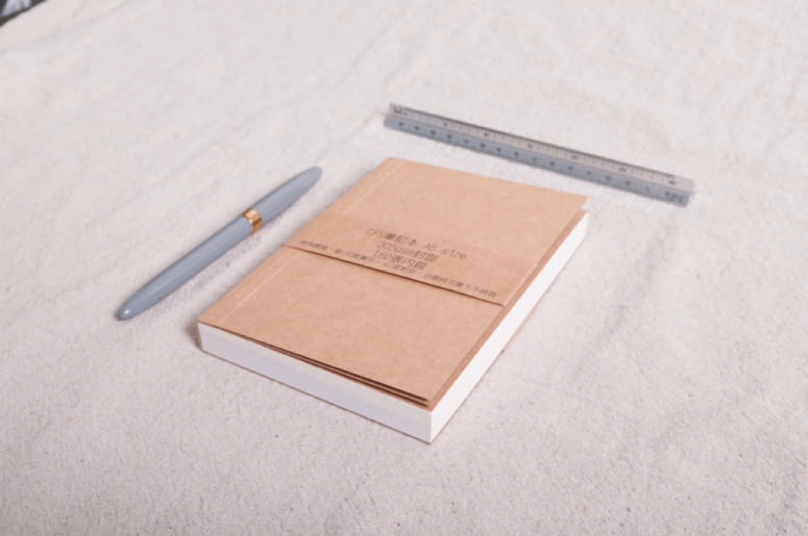
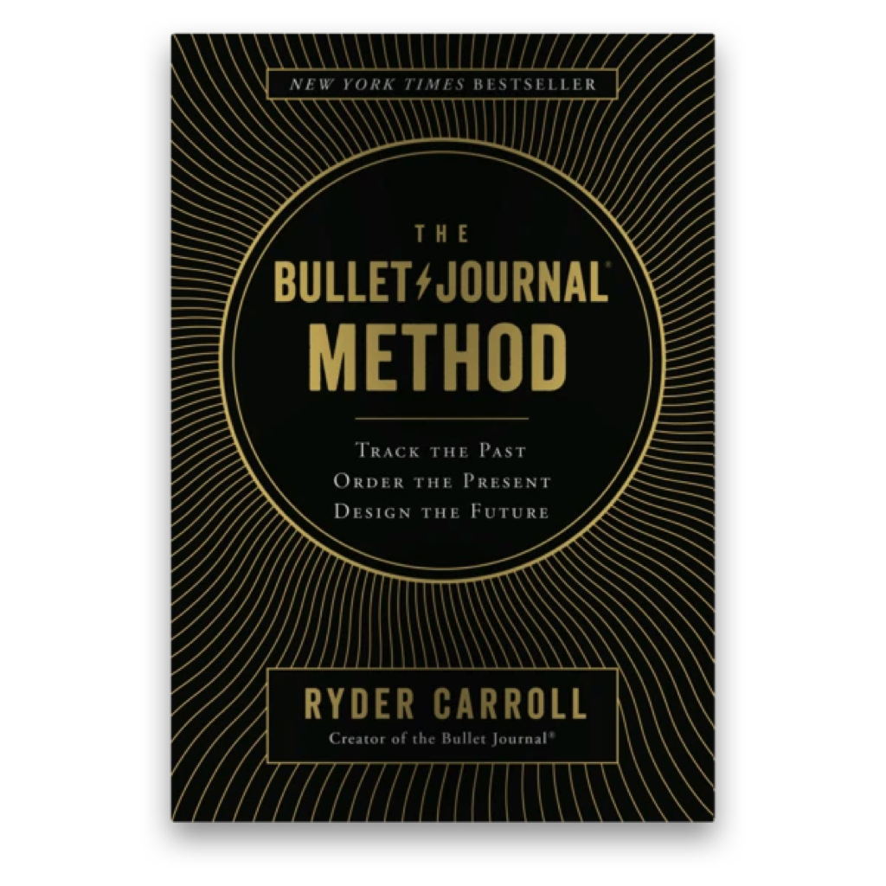

---

title: 筆記系統如何影響我的人生

categories:
    - 筆記系統
date: 2021-08-06 00:00:00 
description: 以設計師、藝術家、插畫家等職業維生的人，不知道大家都是用什麼方式做筆記的呢？
image: 筆記系統如何影響我的人生.png
slug: notesystemandmylife
draft: false
tags:
    - 筆記系統
    - 子彈筆記
    - bujo
    - bulletjournal

---

以設計師、藝術家、插畫家等職業維生的人，不知道大家都是用什麼方式做筆記的呢？

我從高中就有隨身攜帶紙本筆記本隨時可以拿起來寫寫畫畫的習慣。

後續隨著3C科技越來越蓬勃，出現了智慧型手機等等隨身裝置，我也因進入設計系而接觸到Apple電腦（不誇張，在那之前完全不知道這個東西！），慢慢的也有研究數位筆記工具，例如Evernote、Wonderlist、Things 等等。

剛出社會的時候，因為想要快點完成自己的工作，所以也一直有在研究如何改善自己的工作術。

當時有追蹤[電腦玩物](https://www.playpcesor.com/)的BLOG，說真的非常感謝Esor的分享，我也才可以接觸到子彈筆記，這個系統對於我這個沒有紙本筆記會很痛苦的人來說真的太棒了！

子彈筆記的官網連結： https://bulletjournal.com/

我還記得當時子彈筆記的書都還沒有出，子彈筆記系統也只有最基礎的版本，沒有現在的群組，只有Index、Future Log、Monthly Log、Daily Log和每日轉移而已，但在每天的抄寫之下，默默的能幫助我去思考每一天的任務該如何執行，從哪個任務優先。

我自己最喜歡的部分是能紀錄那天做了什麼，而我也有參考Esor的作法，會在完成任務的項目下面紀錄每一次行動的結論與下一步行動。

這些紀錄可以幫助我每天都清空我的大腦，在我離開工作時間與空間的時候不再去想這些事。

我很感謝我可以在出社會初期就有這麼好的網站和筆記系統可以幫助我，所以當子彈筆記的書出的時候，我也不停的與其他人分享，如果可以因此改變一個人的人生，並且讓他活得更好，那就太好了！

後來因為看到卡片盒筆記法，加上反向連結的流行，我也開始用有反向連結的 NotePlan 3 ([NotePlan 3 最完美的數位子彈筆記！疫情危機中轉換數位筆記](https://peckystudios.com/p/noteplan3perfectbulletjournaltool/))，可以針對每天的子彈筆記與蒐集到的資料做連結，讓我可以快速的在筆記間移動，真的非常方便！

現在因為有在構思自己的世界觀故事，所以每天看到的資料都會存起來，未來如果世界觀會用到的時候就很方便，只要從我每天蒐集的資料庫搜尋出來使用就可以了。

筆記系統幫助我可以輕鬆面對我的生活，可以幫助我記得每件事，我只要知道在資料庫中就可以找得到就好了，覺得很安心。

後續再來介紹我現在使用的筆記系統😄️，希望可以和大家交流，繼續改善我的系統。
