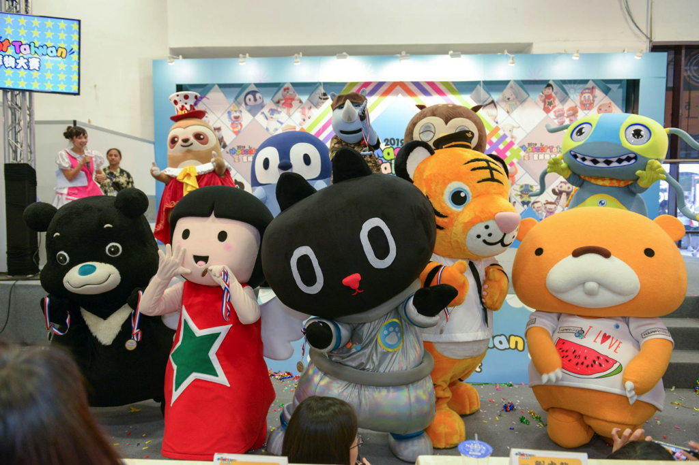
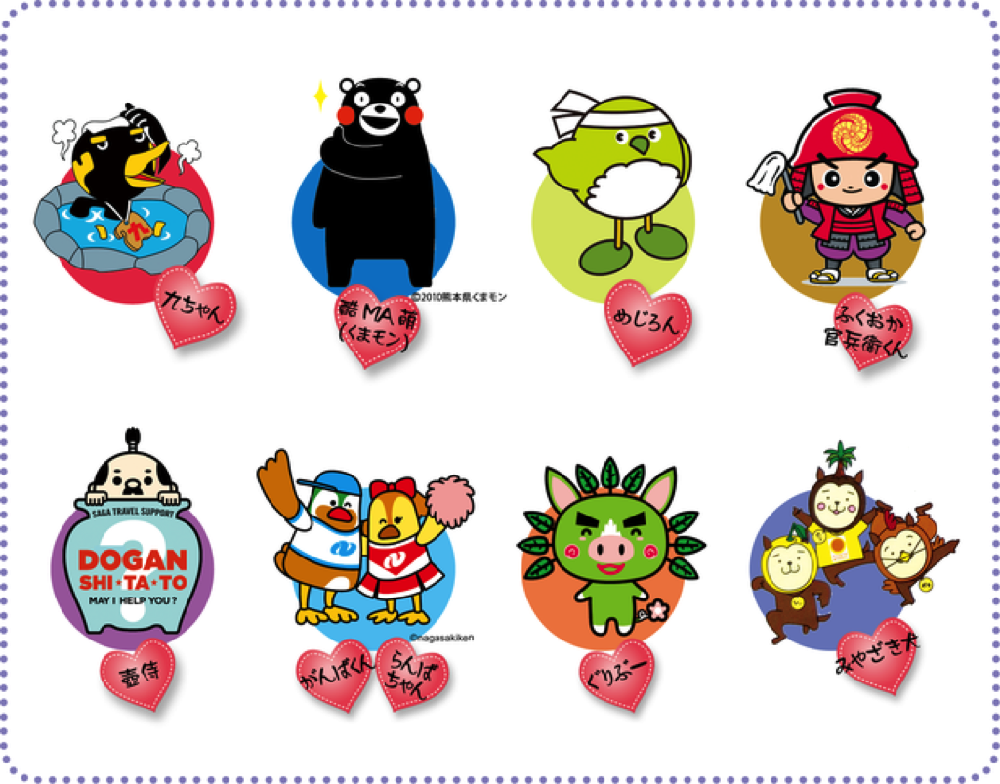
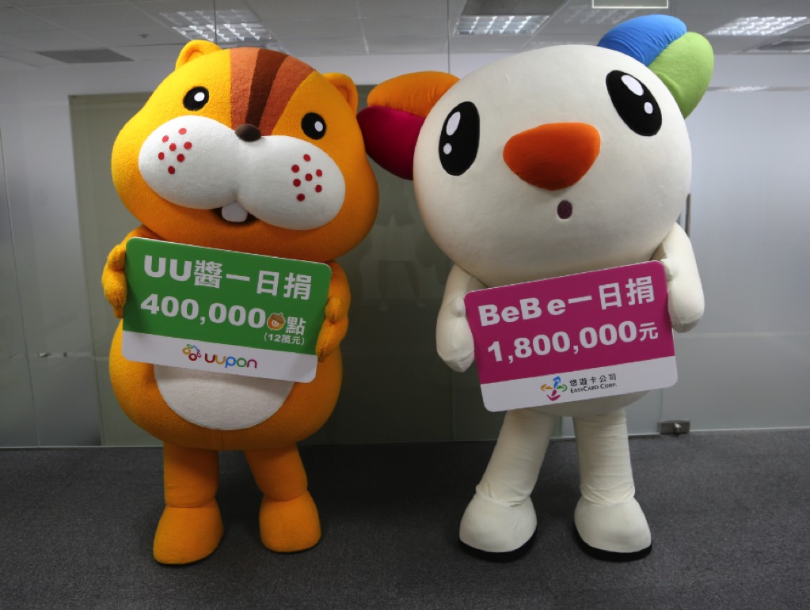
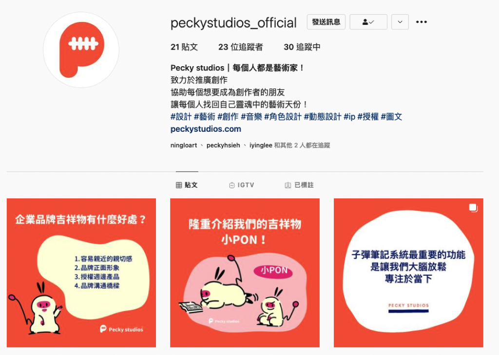
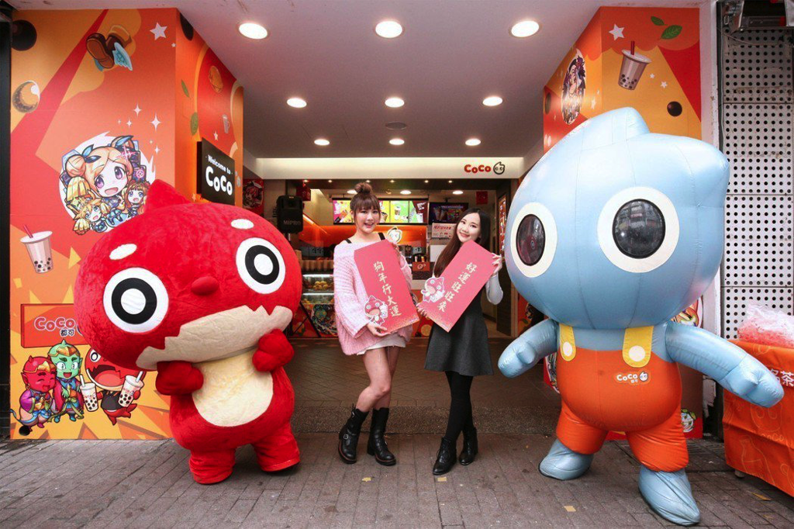
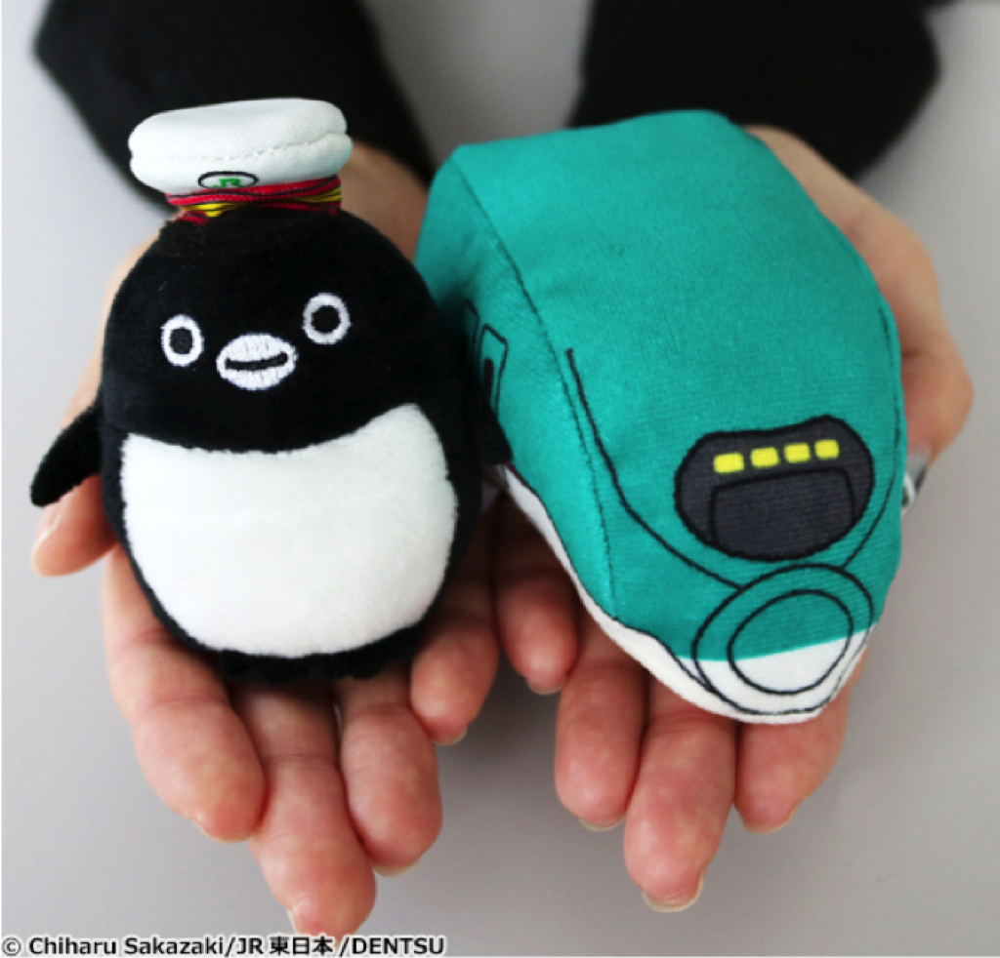
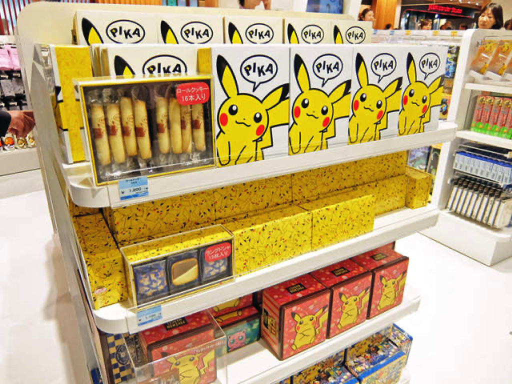

---

title: 7個吉祥物設計可以帶來的好處

categories:
    - 吉祥物
date: 2021-08-11 00:00:00
description: 經營品牌吉祥物究竟有什麼好處？

image: 7個吉祥物設計可以帶來的好處.png
slug: 7mascotdesigngoodpoint
draft: false
tags:
    - 吉祥物
    - 品牌
    - 角色設計
    - 圖文IP

---

經營品牌吉祥物究竟有什麼好處？

**我們可以藉由吉祥物來提升品牌正面形象，也可以藉由吉祥物來作為自己品牌的代言人。吉祥物可以增進與顧客的情感連結，也可以變成與顧客溝通的橋樑。長期經營之後，當觀衆已經愛上這個角色，我們甚至可以藉由販售週邊產品產生收入。**

# 角色親切感
大部分的吉祥物通常都會設計的比較可愛，就像貓狗之類的，會讓人本能的覺得比較親切與好親近，可以減少品牌與顧客之間的距離。

# 品牌正面形象
由吉祥物來傳遞正面價值，間接顯示品牌正面形象。吉祥物角色的一舉一動都是故事，經由設計之後，我們可以利用角色情緒表現和故事的特性來幫助故事的傳播。如果這個故事能夠打動人心，這個品牌和角色也越容易被記住，讓人只要一想到與這個故事有關的事情時，可以馬上想起你。

# 品牌溝通橋樑
每個做老闆或是員工的朋友們心中永遠的痛就是如何與顧客溝通，希望能告訴顧客自己的產品非常好，但現在的消費者一個比一個還要聰明，究竟如何說服消費者購買我們的產品？

我們可以藉由吉祥物來行銷自己品牌的正面價值，消費者可以藉由認識品牌吉祥物來更認識我們的品牌，且吉祥物本身也不再是傳統生硬的強迫式行銷，而是藉由吉祥物的角色設計來吸引適合品牌價值的受眾。

不管是在外部銷售可以賣得好，內部人員面對的顧客也會是適合品牌價值的，可以減少不好服務的顧客。

# 與顧客的情感連結
在吉祥物設計與行銷中，我們會為吉祥物角色設計一個專屬於他的故事。我們人腦最喜歡聽故事，如果這個故事內容能夠與觀衆的人生產生共鳴，就能夠感動到觀衆。創造出這種感受體驗會激起觀衆對於角色的情感，例如已經陪伴我們很久的哆啦A夢就有非常多的死忠粉絲，哆啦A夢的故事陪伴著每一個人成長，每一篇故事對每一個人都有著不同的意義，這就是故事的神奇之處。

# 授權合作
現在網路時代，每一個公司與品牌都會在網路經營社群行銷，這個時候就很適合與其他公司提出合作，如果有吉祥物時，在合作內容的設計與產出也會比較輕鬆，因為角色和故事已經有了，後續只要稍作變化就可以和其他品牌行銷合在一起。

例如，假設全聯的福利熊要和Dyson吸塵器合作，在設計時最簡單的方式就是直接請吉祥物拿著Dyson吸塵器清潔，不需要再煩惱兩個品牌沒什麼關聯，很難在行銷合作案件中想出內容。

# 週邊商品收入
吉祥物甚至可以有其他附加價值，例如可以做成周邊商品販售，或是與其他廠商合作，可謂是一個各個方向都贏的策略。

吉祥物行銷在日本已經行之有年，但在臺灣才剛開始而已，目前臺灣比較常見的是圖文故事創作，較少看到企業品牌經營吉祥物。

# 商業擴張媒介
如果企業最近想新增一個與原本產品八竿子打不著關係的產品，沒有吉祥物時如果突然推出，會讓觀衆覺得很奇怪，例如如果是賣泡麵的品牌，突然販售電子雞就會很奇怪。

這個時候如果我們有一個吉祥物，且長久以來一直有在經營，觀衆也知道這個角色，我們就可以讓這個角色來作為銜接故事之用，承上例子，如果有吉祥物，我們可以讓吉祥物直接變成電子雞裡面被養育的角色，這樣就說得通了！

# 總結
經營吉祥物角色的好處可謂是超越三贏，如果經營的好甚至可以像迪士尼這樣經營長達數十年。

像寶可夢也是以皮卡丘為主要吉祥物，辨識度可以達到即使沒有玩過寶可夢遊戲，大家也都對於皮卡丘有印象。

我想這就是各大品牌最想要達到的成果了吧？

---

我們是 Peckystudios 。
擅長設計吉祥物與角色相關的動靜態設計，這裡是我推廣創作的部落格，希望大家能藉由我的內容從創作中找到樂趣。

如果您正在尋找設計師為您設計吉祥物，
歡迎您到[服務項目](https://peckyhsieh.wixsite.com/peckystudiosservice)頁面瞭解相關資訊
也歡迎您寄信到 peckystudios@gmail.com 與我聯絡！

謝謝