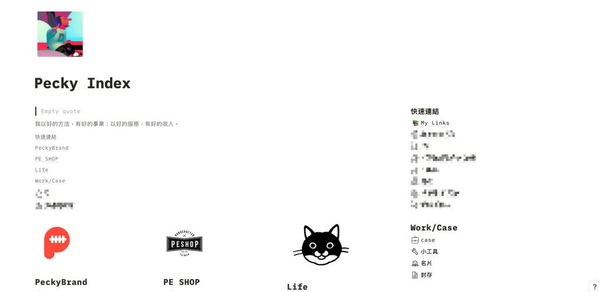

---

title: 9個為什麼我不使用Notion改使用Noteplan替代的理由

categories:
    - 筆記系統
date: 2021-08-20 00:00:00
description: 雖然現在 Notion 還是很流行，曬 Notion 的主頁甚至變成是現在生產力圈子的潮流，但我還是因為以下原因忍痛搬家到了 Noteplan 3
image: 9個為什麼我不使用Notion改使用Noteplan替代的理由.png
slug: 9whyichangefromnotiontonoteplan3
draft: false
tags:
    - 筆記系統
    - Notion
    - obsidian
    - noteplan

---

雖然現在 [Notion](notion.so) 還是很流行，曬 Notion 的主頁甚至變成是現在生產力圈子的潮流，但我還是因為以下原因忍痛搬家到了 [Noteplan 3](noteplan.co) 。

# 1. Notion的文章連結綁定app
自從我知道 [obsidian](obsidian.md) 這個筆記軟體之後，我就越來越在意我的筆記會不會被任何中心化的工具綁住，像 Evernote 、 Notion 在使用內部連結的時候，都是使用自己格式的連結，這樣等於未來我要更換使用工具的時候，我一定要經過一個轉檔的手續，當資料量大的時候非常不方便。

Noteplan 採用的是 WikiLink 的格式，這個格式算是比較通用的，在 obsidian 、 Tiddlywiki 等等都可以使用。這樣未來也許10年20年，我可以減少很多需要花在轉檔或搬家的力氣。

# 2. 標籤功能限定database
Notion 我其實覺得好用，只是我在實作 電腦玩物的子彈筆記系統時 ，發現在標籤功能方面，沒辦法針對每一個 block 進行標籤，只有在 database 頁面可以針對每個 page 加上 tag 。

在 Noteplan 則沒有這個困擾，他的最小單位是每一行文字，所以我可以針對每一行進行標籤，而這也符合我在使用子彈筆記系統的習慣。

# 3. iPad iOS版文字輸入困難
Notion 在 iPad 上的中文輸入體驗很差。

這算是 iOS 的奇怪 Bug ，隨著生活方式的變化，我現在打文章的場景通常會在 iPad 上，所以我會很在意打字的體驗，但在 iOS 上，輸入中文時，會有突然不能換行的 Bug 。我不清楚這個在系統上是哪個層級的問題，部分 app 並沒有這個問題，但偏偏 Notion 就是會，這個對我來說很致命，也是我放棄 Notion 的主因之一。我猜想可能是因為 Notion 是 Web base 的 App，但細節可能要問專家。

Noteplan 則沒有這個問題，我在 iPhone、iPad、Mac 上都可以順利輸入。雖然目前他的 Markdown Render 功能還沒有很完整，但基本該有的都有了。

# 4. 速度慢
如前面所說，Notion 是 Web base 開發的 App，在讀取的速度上就是比 Native 原生 App 慢了一節。雖然慢了一點，但我自己是勉強還可以接受。

Noteplan 開啟時比 Notion 快一點，會稍微要等他同步一下下資料，整體速度比 Notion 快。

# 5. Markdown開放性
Markdown 現在在筆記工具中已經是一個主流的文字格式，得益於他可以快速排版，對於寫筆記和寫文章都很有幫助，讓我們寫內容時不會被排版干擾效率或打斷想法而導致忘記要打什麼。

這一點在 Notion 和 Noteplan 中都有，只是相比之下 Noteplan 開放性更高，像前面說的 Notion 的內部連結格式只有 Notion 可以使用。另一點是 Notion 在輸出 Markdown 時，檔名會加上網頁 ID 編號，在轉換到 obsidian 等等筆記工具時還需要將這些 ID 去除，非常麻煩。

# 6. 不用轉檔
像前面所說，如果我使用的筆記工具有太多專屬的功能或格式，會讓使用者有種被綁住的感覺，且在轉換工具搬家時就必須耗費很大的力氣，也要考量很多問題，比方說轉出去之後會不會格式全部跑掉，圖片會不會不見等等，導致每次搬家都很像在決定人生大事一般，非常不方便。

如果我今天使用的工具是直接讀取開放的純 Markdown 檔，這樣在後續要轉移或是讀取時都會省略很多功夫，而且 Markdown 格式也不只是筆記工具會用到，像我在使用的部落格工具 Hugo 就是直接讀取 Markdown 檔案來生成部落格網頁，在通用性上非常方便。

Noteplan 本身就是直接存成 Markdown 檔案，所以完全符合我的要求。Notion 則是儲存在 Notion 官方的服務器內，要轉成 MD，需要另外儲存，比較不方便。

# 7. 自己擁有自己的資料
最近越來越介意自己的資料隱私，像 Notion 這種使用服務器儲存資料的服務會讓我非常在意，畢竟在我待過科技公司的經驗中，其實用戶的資料都是看得到的，如果有心人想盜取資料，還真的是有管道可以獲取，這讓我很不安，畢竟我也會寫私人日記，很多內容不想給別人看到。

Noteplan 是 App 直接讀取 Markdown 的方式，這也意味著檔案是存在我自己的空間，我可以自己管理這些資料，在隱私上比起 Notion 是略勝一籌。

# 8. iPad iOS mac支援
這算是我個人的使用情境喜好，因近期經常在固定幾個情境下移動，會使用 Mac mini 、 iPhone 、 iPad 三種 Apple 的裝置，所以我就在找可以符合我需求的工具。

Notion 雖然在 3 個裝置都可以使用，但如前面所述，在 iOS 上使用中文輸入法真的是很痛苦，我在 Noteplan 上的 3 個平台版本測試過，打字輸入是舒服很多的。

# 9. 對子彈筆記法的完美配合
如果你有看過我其他文章，可能知道我是子彈筆記系統的粉絲，每天都在實行這個系統。Noteplan 裡面針對子彈筆記的優化讓我可以輕鬆的轉移任務，甚至加入行事曆、提醒事項、Time block 等等在數位筆記上特別吃香的功能，讓我在筆記體驗上可以還原手寫筆記 85% 的體驗，我自己用了幾個月是蠻習慣的。

# 總結
每個人的需求都不一樣，我從 Notion 中搬家不等於你就要和我一樣，可以多多考慮自己的使用情境再決定。分享這些是提供大家我自己發現的特點，也希望你能從中獲益。

---

我們是 Peckystudios 。
擅長設計吉祥物與角色相關的動靜態設計，這裡是我推廣創作的部落格，希望大家能藉由我的內容從創作中找到樂趣。

如果您正在尋找設計師為您設計吉祥物，
歡迎您到[服務項目](https://peckyhsieh.wixsite.com/peckystudiosservice)頁面瞭解相關資訊
也歡迎您寄信到 peckystudios@gmail.com 與我聯絡！

謝謝