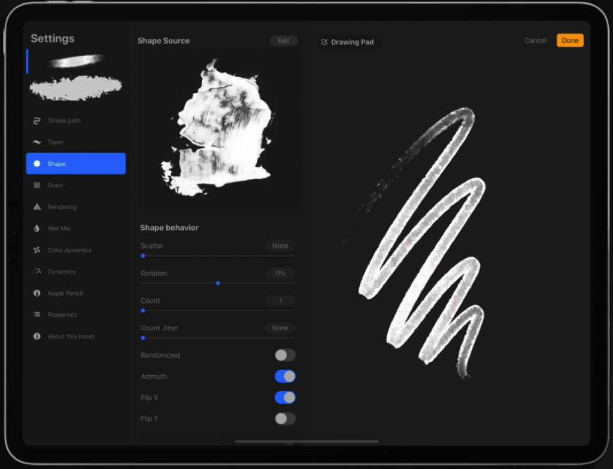
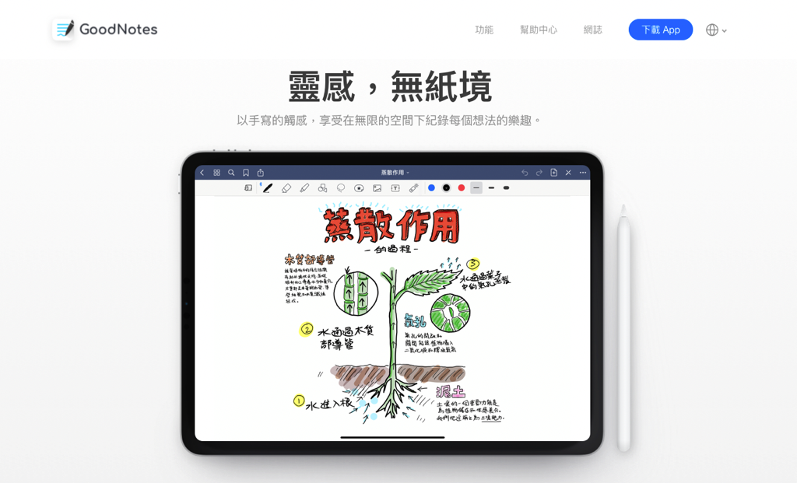
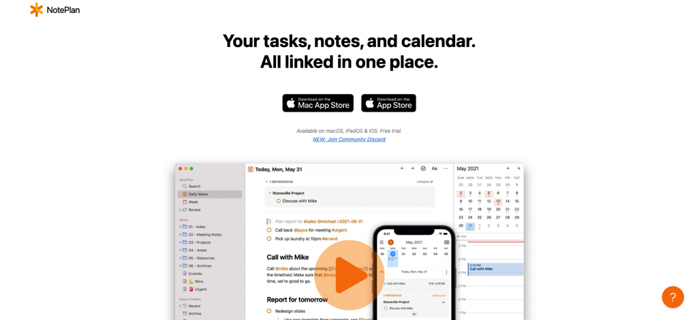
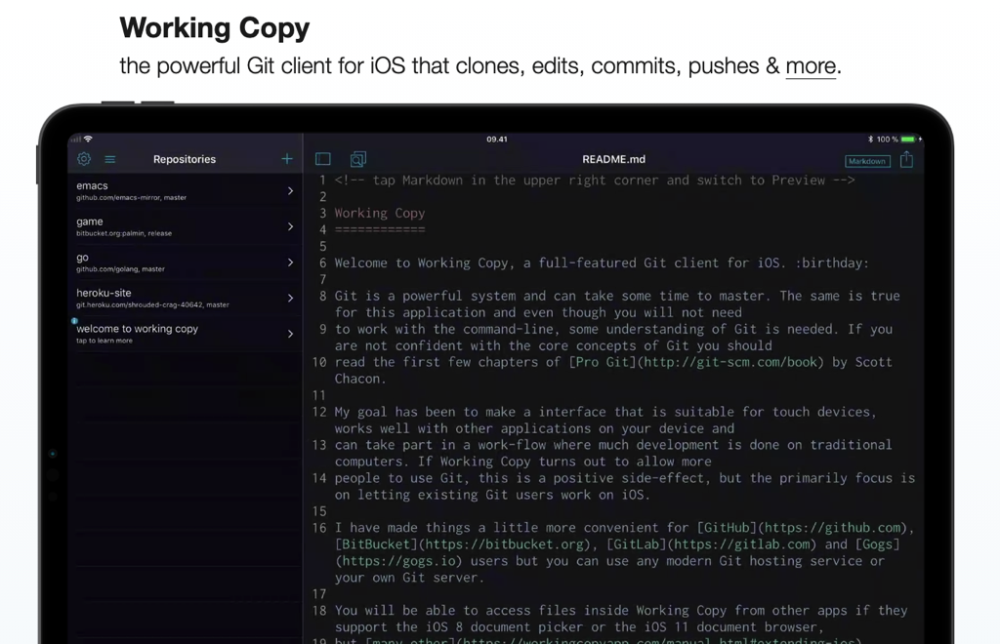
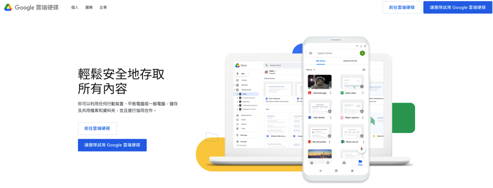
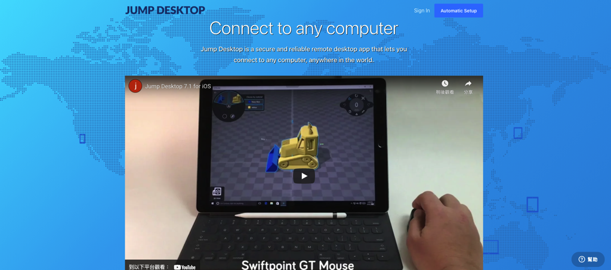
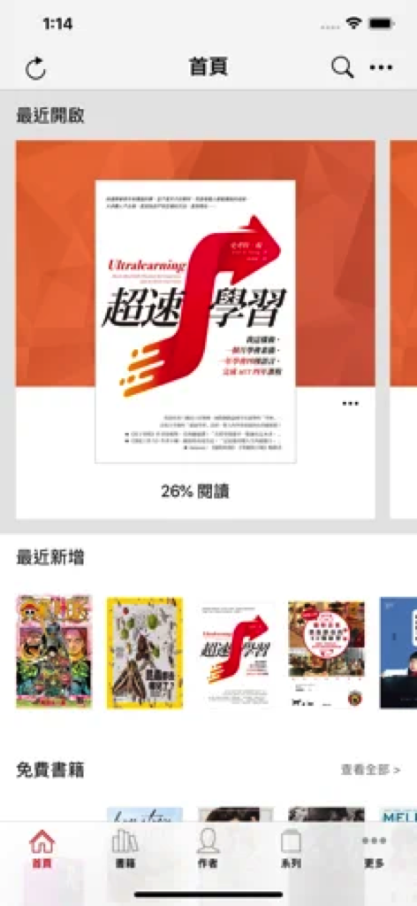
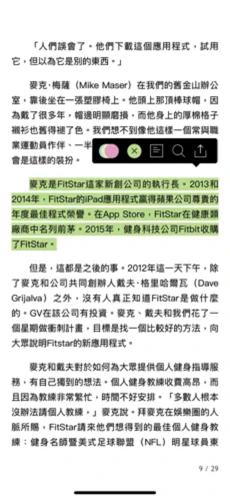
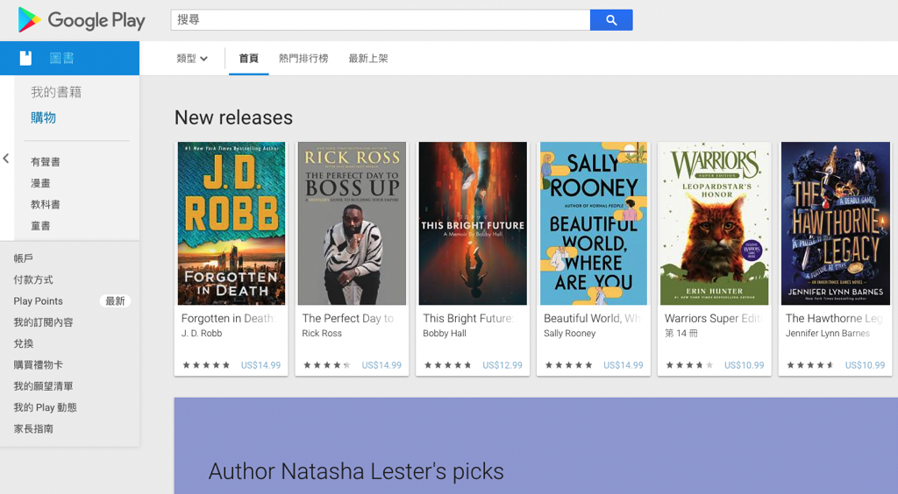
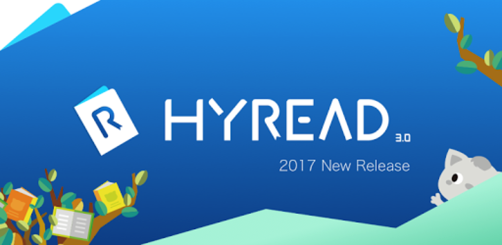

---

title: 2021 10個設計師必備的 iPad App

categories:
    - 軟體工具
date: 2021-09-15 00:00:00
description: iPad 對於影像創作者是一個很方便的工具，可以快速的將草圖呈現出來，並且方便的傳送到電腦上，在整個工作流程扮演重要角色。
image: myipadgreatapp.png
slug: myipadgreatapp
draft: false
tags:
    - ipad
    - app
    - apple

---

iPad 對於影像創作者是一個很方便的工具，可以快速的將草圖呈現出來，並且方便的傳送到電腦上，在整個工作流程扮演重要角色。

我目前擁有的 iPad 是 iPad 2018 ，算是入門級機型，最近預期要更換至 iPad pro 2021 ，未來再和大家分享心得。

其實 iPad 2018 就可以完成我大部分的需求，可以說 Apple 真的很厲害，可以將軟體優化的那麼好，會想要更換是因為無法開大圖畫畫和螢幕不夠大，不過就算換新，我還是會繼續使用 iPad 2018，也可以分享給家人使用。

以下來分享我使用 iPad 最常使用的 App：

# 繪圖設計

## Procreate

[Procreate® 官網](https://procreate.art/)

我使用 iPad 的 80% 時間都是用 Procreate 在畫畫，他最棒的地方就是開起來馬上就可以畫，且 UI 也針對 iPad 使用體驗進行優化，可以大幅降低我從有空到開始練習之間的障礙，呼應《原子習慣》這本書裡面提到的養成習慣的方法。

# 筆記工具

## Goodnotes
[GoodNotes 官網 ](https://www.goodnotes.com/zh-hk/)

很有知名度的 App ，與Notability齊名。其實我也不記得當初是為什麼買，不過他在處理 PDF 上非常方便，匯入之後直接打開就可以馬上筆記，很方便！也可以藉由這個特性自己設計內頁，變成客製化的筆記本，像我就是把我原本習慣使用的 Midori MD paper 直接掃描製作成 Goodnotes 內頁，讓我在 Ipad 上也可以有貼近實體手寫的體驗。

## NotePlan 3
[NotePlan 官網 ](https://noteplan.co/)

最近因疫情轉而使用的主力子彈筆記 App，可同時在 MacOS、iPadOS、iOS內同步使用，除了對於子彈筆記法的各種方便的功能，還有雙向連結的功能，可以像 obsidian 一樣連結多個筆記，還可以自由開放的搬運儲存自己的筆記檔案，是近幾個月必備的軟體！

## Working Copy
[Working Copy, Git on iOS](https://workingcopyapp.com/)

一般是給寫程式的人使用來記錄自己程式碼的版本控制工具，有些文字工作者也會使用這個搭配 Ulysses。我是購買來搭配 Noteplan3 的，因為我的筆記實際上是由很多 Markdown 檔案組成，在各個筆記間跳來跳去修改並不像我們使用 Photoshop 或是 illustrator 是單個檔案儲存一個版本，比較常發生是可能修改3個檔案才是一個版本，當修改次數一多就難以管理，後來才有人發明了 Git 這種管理程式碼的工具，Working Copy 就是在 iOS 上的 Git 工具。他可以記錄每一次版本修改了哪些檔案、檔案中哪一行字被修改等等，對於大量文字的檔案管理很有幫助。

# iPad 工具

## Google 雲端硬碟
[工作和家用雲端儲存空間 - Google 雲端硬碟](https://www.google.com.tw/intl/zh-TW/drive/)

這個應該大家都知道是什麼，會在這邊介紹是因為雲端硬碟在我的平台協作扮演重要角色。我目前有 Mac mini 、 iphone12 mini 、 ipad 2018 3種裝置（Apple全家桶😂），之前在工作時就覺得一直看電腦很煩，也不想一直把電腦帶在身邊，好重！這也是我買 Mac Mini 的原因之一。但我偶爾出門或是在iPad上會臨時想要使用電腦裡的某個檔案，什麼時候會想要用實在難以預測，所以想出使用雲端硬碟直接備份我的工作資料夾（我有購買 2 TB），並且利用iOS和iPadOS的檔案app連結到雲端硬碟中，這樣我就可以在網路狀況OK的時候隨時取用電腦中最新的檔案，非常方便，且現在也有許多 App 可以讀取雲端硬碟的檔案，雖然不是每一個都可以，但對於我的使用場景已經足夠。

## Jump Desktop
[Jump Desktop | Remote Desktop | iPad iPhone Android Mac Windows | Collaborative Screen Sharing](https://www.jumpdesktop.com/)

超級必備！！不想帶電腦出門一定要買這個 app。尤其我又是使用 Mac mini，只要電腦放在一個網路環境佳的位置，我就可以在其他地方使用 iPad 方便的連回自己的 Mac mini，之前測試過，即使在網路速度只有6M的地方，也還是可以使用，只是有點小卡。

這個 app 脫穎而出的關鍵就是他對鍵盤和滑鼠的支援度，幾乎可以還原電腦的90%體驗，只有小部分快捷功能沒辦法從 iPad 這端交出來，是有點可惜的地方。

# 娛樂

## Youtube
[YouTube](https://www.youtube.com/)

既然有大螢幕那當然要有 Youtube ，我平常除了看會讓自己放鬆的節目之外，也常常看網路教學，大螢幕可以讓我看細節看得更清楚，尤其是寫程式或是軟體的教學都會有電腦畫面，用手機看就會很吃力。

# 閱讀
 

## 樂天KOBO
[Kobo.com 台灣 商店 - 電子書、有聲書、eReader 和 Reading 應用程式](https://www.kobo.com/tw/zh#)

KOBO 是樂天旗下的電子書商城品牌，也有推出自己的電子閱讀器，我自己已經在這邊買了幾十本書籍了，近幾年為了方便都是隨身直接使用在 iPhone和 iPad 上的KOBO app 閱讀，很方便，想看什麼書，馬上買馬上看，很棒。如果介意螢幕藍光的話，KOBO 的電子閱讀器也算不錯，可以購買來使用。

## Play圖書
[Google Play 圖書](https://play.google.com/store/books?hl=zh_TW&gl=US)

Play 圖書是 Google 商城內販售電子書的 App。這邊的好處是有時候書會有大折扣，所以幸運的話也會在這裡撈到好書，因為我也都用 iPhone、iPad 看，所以沒有什麼平臺衝突的問題，對我來說可以看到裡面的內容比較重要。

## Hyread 3
[HyRead ebook 電子書店](https://greenmall.info/2tdHJ?uid1=hyreadinblog)

Hyread 裡面的書來源都是圖書館，只要用圖書館的會員登入，每個月可以免費借三本，相當優質！我自己到現在還有跑實體圖書館借書的習慣，現在隨著科技發達，有了更方便的借書管道，很推薦給大家，如果沒有預算購買書籍充實自己，可以應用這個資源。

---

我們是 Peckystudios 。
擅長設計吉祥物與角色相關的動靜態設計，這裡是我推廣創作的部落格，希望大家能藉由我的內容從創作中找到樂趣。

如果您正在尋找設計師為您設計吉祥物，
歡迎您到[服務項目](https://peckyhsieh.wixsite.com/peckystudiosservice)頁面瞭解相關資訊
也歡迎您寄信到 peckystudios@gmail.com 與我聯絡！

謝謝

---

如果喜歡我們的文章，歡迎到[我們的選物店](https://www.rakuten.com.tw/shop/peckystudio/)支持我們，讓我們更有動力創作喔！