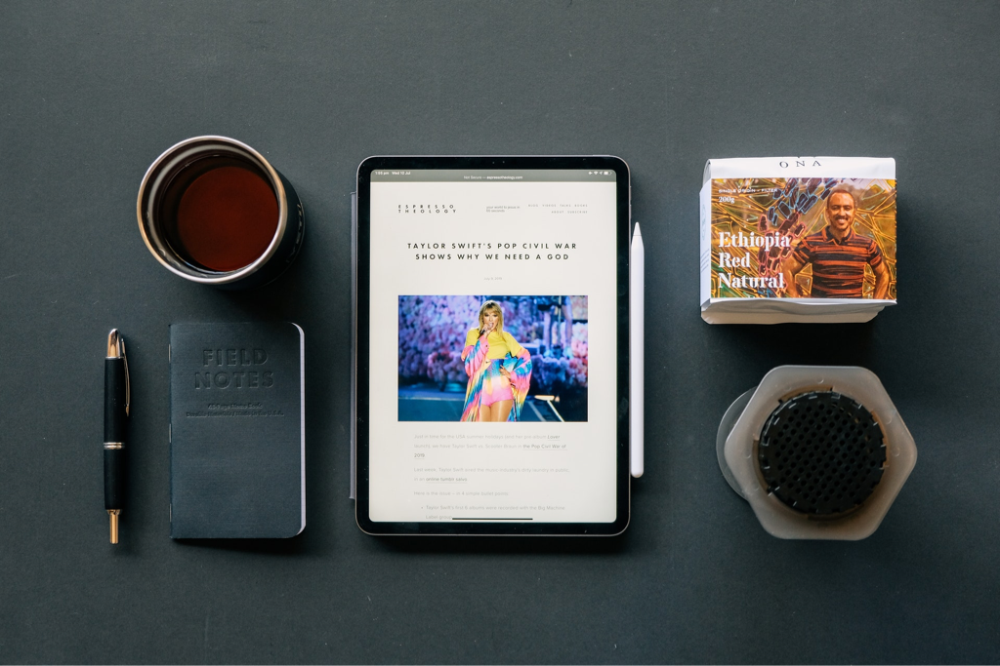
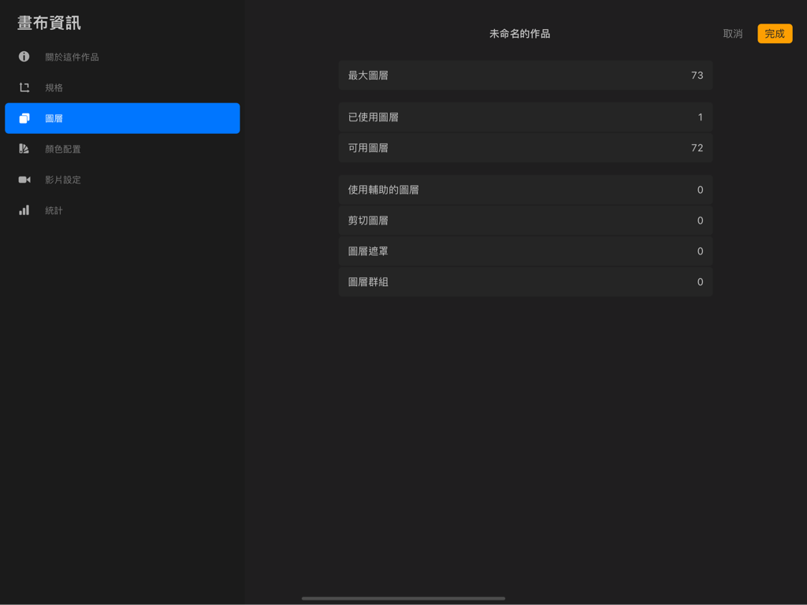
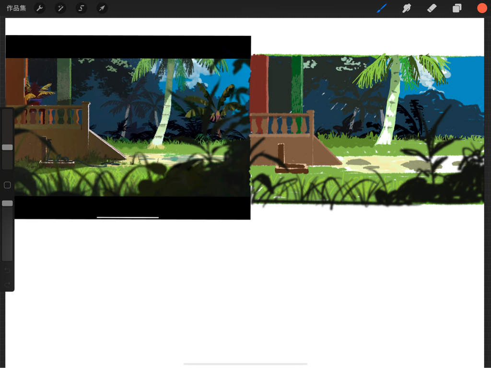
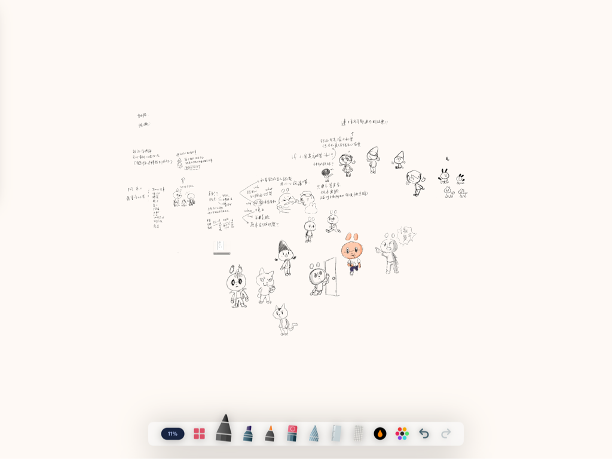

---

title: 為什麼我沒有買 2021 M1 iPad Pro？ iPad Pro 2020 12.9寸 設計師/創作者/學習愛好者心得
categories:
    - 生活風格
    - 3C產品
date: 2021-11-04 00:00:00
description: 想購入 iPad Pro 非常久了，尤其是 2018 年 Apple 更新了 iPad Pro 的外觀和超級好用的 Apple Pencil 2 ！
image: A756CB67-8FCA-4495-85E7-8A8B910F09A7.png
slug: whyidontbuym1ipadpro2021myipadpro2020
draft: false
tags:
    - ipad
    - iPad pro
    - 設計
    - 畫畫
    - 購物

---
# 為什麼我沒有買 2021 M1 iPad Pro？ iPad Pro 2020 12.9寸 設計師/創作者/學習愛好者心得

想購入 iPad Pro 非常久了，尤其是 2018 年 Apple 更新了 iPad Pro 的外觀和超級好用的 Apple Pencil 2 ！可惜當時礙於預算原因且需求沒有現在那麼大，當時只有拿來塗鴉的需求，所以 9.7 寸、可以使用 Apple Pencil 一代的 iPad 2018對我來說就夠了。

經過3年，在我購入 M1 晶片的 Mac mini 之後，Apple竟發表了M1 晶片的 iPad Pro！一直很好奇螢幕刷新率 120 Hz 究竟寫起來怎麼樣，還有 Apple Pencil 2 究竟好不好用（其實我光看可以磁吸充電就香到一個不行，一代的充電方式即使充電很快，還是讓我很怕會弄斷他的充電頭。），而且我好想要 Procreate 的圖層可以多一點，有時候工作可能會用到，如果遇到需要保留製作過程的專案（預備被修改用），圖層數就會爆多。iPad 2018 畢竟是入門款，圖層數量還是少了 iPad pro 一節，不是很方便。

除此之外，我得老實說，我大部分的需求在 iPad 2018 都可以做到，像看 YouTube 、 打文章、玩遊戲（有些會閃退就是了，但我不太常在 iPad 上玩遊戲。）和畫畫等等，幾乎都還是可以很順暢的運作，我甚至測試了 3D 建模軟體 Nomad ，也可以順暢的開啟使用，蠻驚人的！

這一次購入 iPad pro 的需求原因與心得：

# 大尺寸的螢幕

我目前沒有筆記型電腦，所以在學習一些線上教學不太方便，原本的iPad 2018 螢幕只有 9.7 寸，在多工處理的時候畫面實在是太小了，尤其在學習寫程式，只有左邊畫面放 YouTube 影片，根本看不到影片上的內容，字實在太小了，學習起來很累。

另外一個需求是我需要使用 Jump Desktop 連結到自己放在家裡的電腦來使用，螢幕太小使用起來有點痛苦，如果遇到一些電腦軟體超過螢幕大小，無法拉回來的話會很崩潰！

所以我這次特別選擇了12.9寸的iPad pro ，我希望可以靠iPad 完成我八九成的需求。

# 效能與圖層數量

iPad 2018

iPad pro 2020

iPad上最方便直覺的 app 還是 Procreate ，以 A4 尺寸 300dpi 來說，iPad 2018 可以開啟 19 層，iPad pro 2020 可以使用 73 層，相差非常多，如果你買的是M1 版本的 iPad pro ，那圖層數還可以更多。

# 實際的需求

我真的有需要使用到  M1 的 iPad pro 嗎？前一代的 iPad pro 2020 我可以找到比最新一代便宜一萬多的價格，且買新的我又要再花4千多來購買 Apple care + ，這不是一個很小的數目。

後來比較了自己的需求，其實最核心的重點是螢幕尺寸，因為我是主要想買來學習和畫畫使用，還有很想體驗 120 Hz 的 Promotion 螢幕刷新率，以這些需求其實 2017 年的 iPad pro 也有，但如前面說的， Apple Pencil 2 真的太香了，不買新一點的說不過去！

後來還是選擇了 iPad pro 2020 ，雖然沒有買到 M1 有點可惜，但我用到現在好幾週了，還沒有遇過任何卡頓的問題， Apple Pencil 2 加持下，也讓我更常使用 iPad pro 來畫草稿、創作，不會再有之前 Apple Pencil 一代的方到用時筆沒電的問題，非常順手！

# 入手後使用心得

## 學習

大螢幕就是好，幾乎是 2 倍大的 iPad 2018 ，讓我可以一半開啟 YouTube ，一半開啟 GoodNotes ，無壓力的邊學習邊筆記，相當方便！ iPad 上的學習 app 也比 iPhone 上豐富，看教學影片也因為螢幕大的關係，看得很清楚，尤其是最近在學寫程式，很需要看到螢幕上的小字，用 iPhone 看簡直太極限了， iPad 的大螢幕在這裡就很有優勢。

想學習語言，看雜誌學英文等等，在大螢幕上也是相當吃香，可以使用 Flexcil2 或是蒙哥閱讀器來閱讀外文讀物，非常方便，如果擔心 iPad 亮度太亮眼睛會不舒服，也一定要記得到設定裡的輔助使用把降低白點值打開，眼睛會比較舒服。如果有時常切換的需求，也可以把輔助功能放進控制中心，就可以隨時切換開關了！

## 創作設計

搭配 Procreate ， iPad 就變成一個自帶畫具的白紙，真的是很方便。因為螢幕大，我的手可以自然的放在螢幕上畫，舒適度就是比螢幕 9.7 寸的 iPad 2018 好很多，手不會卡到機身邊緣。

除了圖層比較多之外，其實體驗上和 iPad 2018 差不多，這邊就不多贅述。

最近看到 Procreate 5.2 版準備加入實時 3D 模型貼圖繪製的功能，很令人期待，我想我的 iPad pro 2020 是準備好了！

另外我除了用 procreate 畫畫，還有發想一些角色故事和世界觀的需求，最近發現一款叫做 InfDraft 的 app ，我非常喜歡裡面鉛筆的筆刷，很接近我用鉛筆在紙上畫畫的感覺，而且他有很大張的畫布，我可以很自由的在白紙上面發想很多故事，也不用像實體紙張一樣產生很多紙出來，沒有地方放，我的家裡有一區地板就是被我的草稿紙佔滿了，有點小困擾啊～。

## 串連電腦（ Mac mini ）

有些時候我在處理比較複雜的設計案件時，還是需要用到電腦來執行。

目前是使用 Jump Desktop 搭配 MacOS 的並行功能來使用，因為我的主要使用場景是家裡和公司，Mac mini 本身也不大，攜帶起來還算方便，於是常常把 iPad 當成螢幕來使用電腦。

目前有2種方式來串連：

### 直接使用 Jump Desktop 
如果你的桌機連結著網路，並且已經安裝好 Jump Desktop 的設定，我們只要在 iPad 上開啟 Jump Desktop 直接連結就可以使用了，雖然鍵盤在一些細節無法百分之百跟直接使用電腦一樣，但也有還原到 90% 了。

這種方法很需要穩定的網路，像我家網路不是很好，所以常常用一半就會卡卡的，後來才發展出下面用並行的方法。

### 使用 macOS 並行

這個方法需要 Mac mini 在同一個 Wi-Fi 底下，你可以使用 Apple script 讓電腦自動連結自己的 iPad ，可惜我一直失敗，所以我之後就直接使用 Jump Desktop 連結電腦再開啟並行到 iPad 上，這樣就可以實現把 iPad 當電腦螢幕的用法。

並行使用起來是幾乎沒有延遲的，體驗起來就像是直接在用電腦一樣，很不錯！

# 總結

整體而言，購買 iPad pro 2020 我很滿意，雖然不便宜，但是對於有學習習慣和創作習慣的人，擁有一台真的是會降低開始行動的阻礙，我可以更快的開始學習或是創作，相當值得！畢竟時間是最寶貴的資源，不能再隨意浪費。

---

我們是 Peckystudios 。
擅長設計吉祥物與角色相關的動靜態設計，這裡是我推廣創作的部落格，希望大家能藉由我的內容從創作中找到樂趣。

如果您正在尋找設計師為您設計吉祥物，
歡迎您到[服務項目](https://peckyhsieh.wixsite.com/peckystudiosservice)頁面瞭解相關資訊
也歡迎您寄信到 peckystudios@gmail.com 與我聯絡！

謝謝

---

如果喜歡我們的文章，歡迎到[我們的選物店](https://www.rakuten.com.tw/shop/peckystudio/)支持我們，讓我們更有動力創作喔！