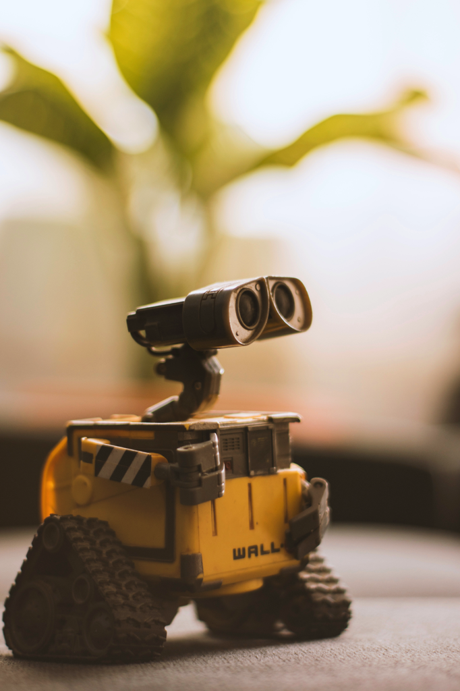
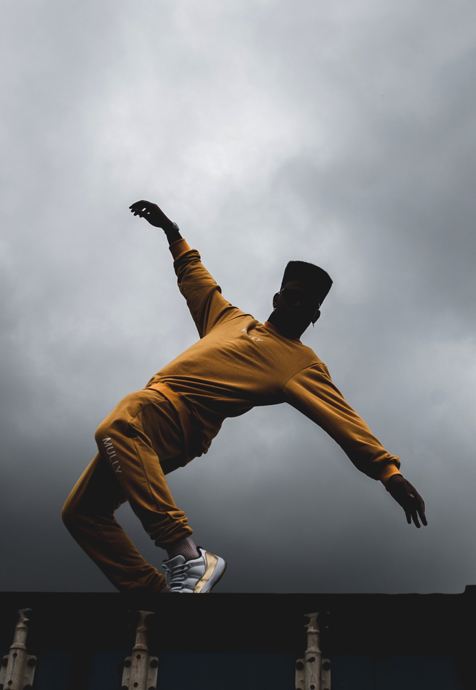

---

title: 10 個想成為吉祥物設計師必學的能力！缺一不可
categories:
    - IP經營
    - 角色設計
    - 吉祥物

date: 2021-12-01 00:00:00
description: 你想成為吉祥物設計師但不知道從何開始嗎？這邊整理出我認為吉祥物設計師必須要學會的10項能力，如果你是剛入門的設計師，希望能對你有幫助🙂️。

image: 10 個想成為吉祥物設計師必學的能力！缺一不可.png
slug: mascotdeignerneedtolearn
draft: false
tags:
    - IP
    - IP開發
    - 創作
    - 吉祥物
    - 吉祥物設計
    - 角色
    - 角色設計
    - 吉祥物設計師
    - 設計師

---

你想成為吉祥物設計師但不知道從何開始嗎？這邊整理出我認為吉祥物設計師必須要學會的10項能力，如果你是剛入門的設計師，希望能對你有幫助🙂️。

# 造型設計能力

造型在任何美術與設計領域中都非常重要，例如概念藝術家（Concept Artist）在做場景設計時，不管是山景還是岩石、地面，最先處理的一定是造型，因為人眼在辨識一張圖的時候會先看圖的輪廓來瞭解圖像想表達的意思，我們設計與美術領域經常應用這一點來讓自己的作品更加完善。

在吉祥物設計師的領域，如何能夠設計出一個能讓人記住、充滿辨識度的造型是設計師必須要做的功課。

# 人體骨架與結構

大部分的吉祥物都是擬人化的，且經常需要設計角色表演、擺 POSE 等等，如果不瞭解人體骨架與結構，設計出來的角色表演會比較生硬不自然。人體的肌肉與骨骼有很多細節，我們吉祥物設計師在設計時如何使用簡單的線條來表達結構是必須多加練習的事情。

# 角色肢體表演

承接人體骨架與結構，角色肢體表演是指我們想讓吉祥物表達一個情緒或是情境時，如何用全身上下來表達清楚我們希望觀衆知道的事情，例如脊椎如何彎曲、手擺上面還是下面、腳內八還是外巴，通過種種組合，我們可以塑造出不同的情緒表現，也可以應用這些表演來塑造吉祥物角色的個性，例如如何走路、如何跑步、如何吃東西等等，變化萬千，吉祥物設計師平常就必須多多觀察人群，才會有足夠的素材來設計吉祥物角色。

# 人體表情情緒表達

人的臉部肌肉是全身最多的，這也是讓我們擁有萬千表情的原因之一。表情的細緻變化可以小到輕佻眉毛、嘴角一個抖動就可以表達不同的情緒，相當有趣！搭配個性的變化更是多元，例如一個平常沒什麼表情的角色如果突然睜大雙眼、嘴巴大張，露出驚恐的神情，是不是會讓人聯想到這個角色可能看到了令自己非常驚訝到連表情都守不住的事情？再搭配故事的塑造，吉祥物設計師可以拼湊的材料可以說是相當的多。

# 美術知識與能力

這邊提到的美術知識是指對於大眾標準的知識，例如人對於顏色的感受、人如何辨識一張圖、基本的色彩學、對比等等最基礎的美術知識。有時候我們吉祥物設計師會面對到不是自己完全擅長的案件，在這個時候，這些知識就會成為設計師強大的後盾。設計師可以應用這些知識到設計上，讓最終的設計成果仍然在水準之上，這才是一個設計師該有的專業。

# 平面設計

可能你會覺得很奇怪，為什麼要學平面設計？其實平面設計在吉祥物設計師的領域滿常碰到的，例如我們在製作 Guidebook 需要知道如何排版或是在設計吉祥物的搭配 pattern 時，我們都需要應用到平面設計。

學習平面設計也可以應用在很多領域，例如作品集或是社群貼文，所以不用覺得會不會用不到，現在自媒體時代你會常常用到他的！

# 學習製作 Guidebook

Guidebook 作為與廠商溝通用的工具，吉祥物設計師是不能不會做的。雖然很多線上課程會直接教你如何製作的步驟教學，但我在這邊會推薦學習的是，如果我設計的吉祥物有一個特別的設計需要說明，我該用什麼樣的表達方式才能讓非本科系的廠商都能看得懂，這是在做 Guidebook 時最重要的核心概念，可以在設計吉祥物角色時多問問自己這個問題。

# 心理學

心理學現在也越來越常被提起，會推薦學習心理學是因為很多心理學是有經過實際的實驗測出來，多多學習可以讓你在設計吉祥物角色時可以更有底氣，應用在設計中也可以讓你在客戶面前站得住腳，說服力大增。例如你可以舉例為什麼我們要選擇可愛擬人的風格，而不是畫得很寫實的風格，這是因為恐怖谷效應，人在物品很像人的時候反而會覺得恐怖而不是可愛，這樣對於我們想要親近人群時是不利的選擇，所以選擇可愛的風格會比較理想。

# 說故事

說故事的能力不管在任何領域都是必學，例如提案簡報、做個人品牌、行銷都與說故事有關。

這邊說的說故事能力是指瞭解故事的結構，試著去應用的能力，而不只是編故事劇情而已。當瞭解故事的架構，我們甚至可以拆解故事，再用不同的敘事手法去描述故事，會塑造出不同的情緒感受，相當有趣，吉祥物設計師們可以試試看。

# 自媒體行銷方式

自媒體時代，這個能力是必學。包含了如何規劃經營自媒體、如何設計社群貼文、如何撰寫文案與腳本等等等，在吉祥物主要的曝光管道社群媒體上是很重要的能力。吉祥物設計師也可以為自己經營一個個人品牌，增添自己曝光的機會，也才有更多機會接觸到客戶，為自己帶來案件。

# 總結

以上列出了 10 點吉祥物設計師必須學習的事，但除了這些，我也推薦你可以多看看其他美術或是設計領域是如何創作，有時候會意外的看到可以幫助自己更上層樓的概念喔！像我最近也有購買 [《像素藝術背景畫法完全解析：ULTIMATE PIXEL CREW REPORT配色x構圖x透視》這本書](https://easymall.co/2txUK?uid1=blog&uid2=pixelbook)，也在書中學到一些之前沒有注意到的細節，收穫頗豐。
 
---

我們是 Peckystudios 。

擅長設計吉祥物與角色相關的動靜態設計，這裡是我推廣創作的部落格，希望大家能藉由我的內容從創作中找到樂趣。

如果您正在尋找設計師為您設計吉祥物，歡迎您到[服務項目](https://peckyhsieh.wixsite.com/peckystudiosservice)頁面瞭解相關資訊，也歡迎您寄信到 peckystudios@gmail.com 與我聯絡！

謝謝

---

如果喜歡我們的文章，歡迎到[我們的選物店](https://www.rakuten.com.tw/shop/peckystudio/)支持我們，讓我們更有動力創作喔！