---

title: 如何在illustrator進行多頁面設計？新增工作區域
categories:
    - illustrator
date: 2022-08-06 00:00:00
Description: 在設計專案的時候，一次可能設計好幾種圖像或圖標，如何能夠在同個檔案裡面包含多個圖呢？
image: 如何在illustrator進行多頁面設計？新增工作區域.png
slug: illustrator-addworkarea
draft: false
tags:
    - illustrator
    - 教學
    - 技巧

---

# 問題
1. 在設計專案的時候，一次可能設計好幾種圖像或圖標，如何能夠在同個檔案裡面包含多個圖呢？

# 解決方案
我們可以使用illustrator的工作區域功能來達到在檔案中製作多圖的目的。

## 工作區域是什麼？
簡單來說就是畫布，我們可以在 illustrator 裡面開啟多個且大小不同的畫布，在 illustrator 裡面稱之為工作區域。

就是我們打開 illustrator 之後看到的白色區域。
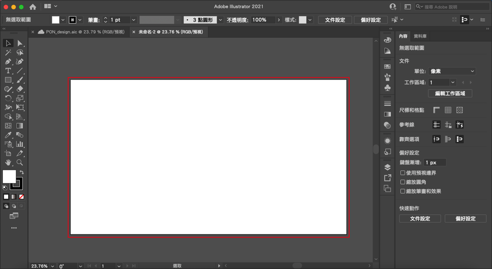

## 如何新增工作區域
### 方法1
點擊工具列的「工作區域工具」，或是快捷鍵 shift + o ，開啟工作區域工具。
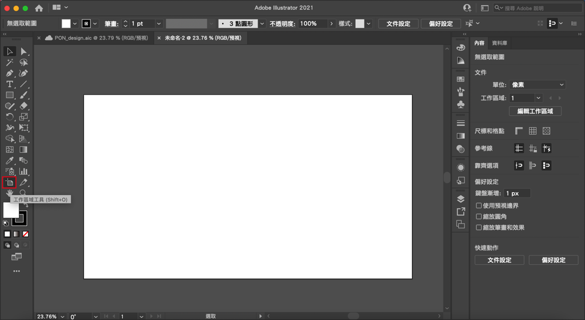

在畫面灰色區域用左鍵拉出方形，就是一個新的工作區域囉！
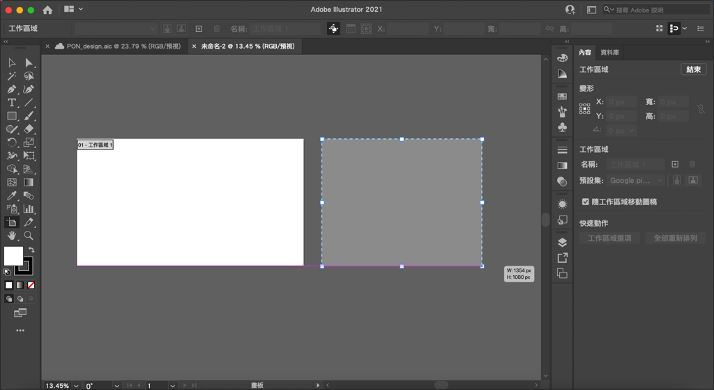

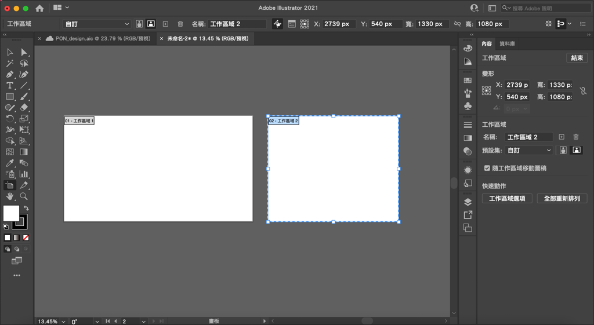

### 方法2
點擊畫面右邊的快捷工具欄「圖層」的按鈕，再點擊「工作區域」的分頁。
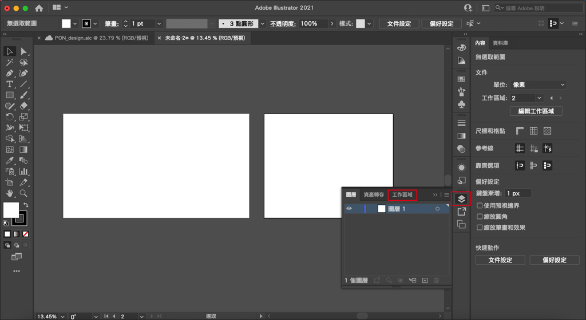

點擊下方的「+」號，就會自動生成一個新的且和前一個一樣大小的工作區域囉！
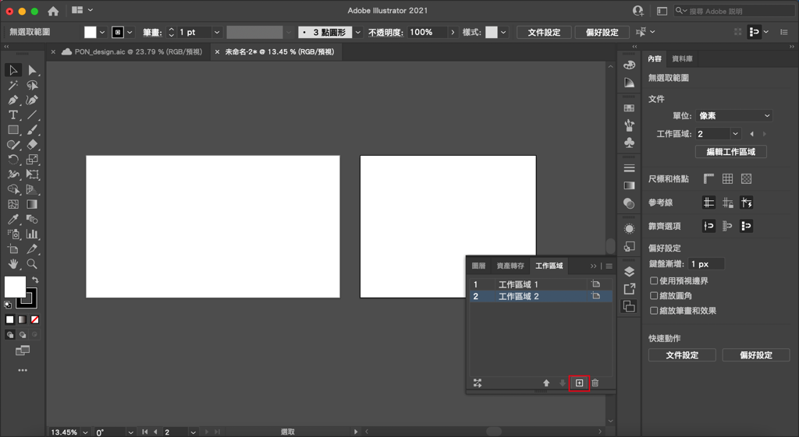

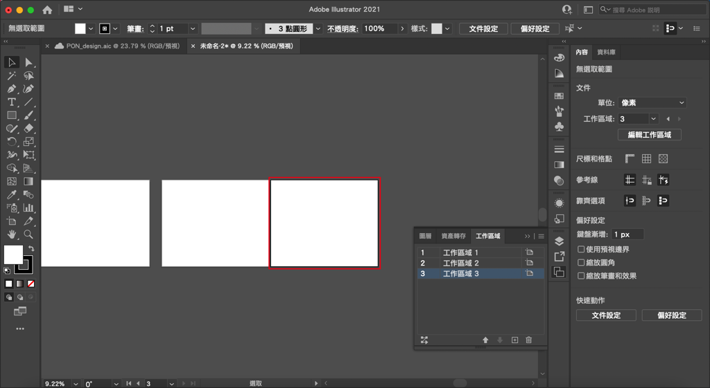

### Bonus
如果在已經有圖形的狀況下，先將圖形群組成一個物件，再使用「工作區域工具」直接左鍵點擊圖形，軟體會自動生成一個可以包覆圖形範圍的工作區域，這個在切圖的時候很實用！

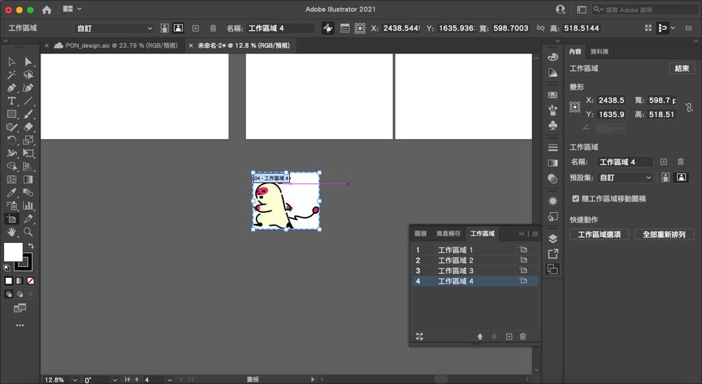

## 如何整理工作區域
### 方法1
使用「工作區域工具」左鍵點擊一次現有的工作區域，再用左鍵拖拉工作區域就可以移動了喔！

此時如果工作區域內部的圖形沒有被鎖定，就會跟著工作區域移動。

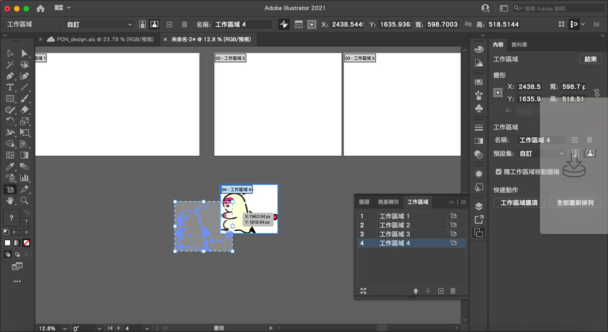

### 方法2
點擊右方工作區域視窗右上角的選單，最下方有一個「重新排列所有工作區域順序」。
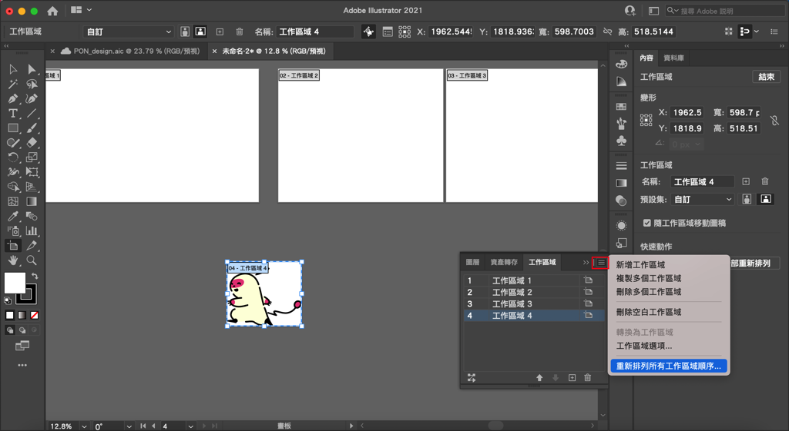

以下介紹一下選單的各個功能。
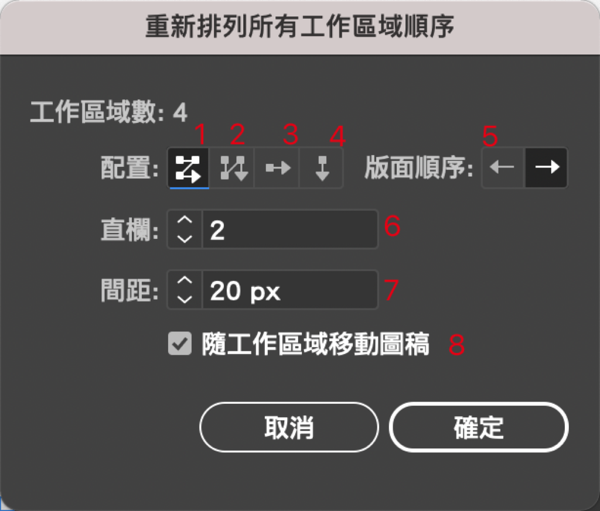

1. 由左到右排列數個（這個數就是下方直欄或橫欄設定的數值），再從上往下排列，每一橫排都是數個工作區域。
2. 由上到下排列數個（這個數就是下方直欄或橫欄設定的數值），再從左往右排列，每一橫排都是數個工作區域。
3. 從左到右排列。
4. 從上到下排列。
5. 可切換是從右到左還是左到右到按鈕。
6. 如 1.、2. 所說，可以設定排列的數量。
7. 每個工作區域之間的距離。
8. 可設定是否要把工作區域上的圖稿跟著一起移動

設定完之後點擊確定之後就會把所有工作區域進行重新排列。
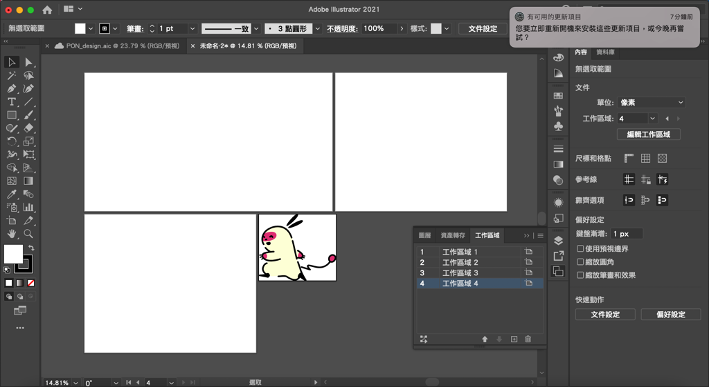
就可以獲得整齊的工作區域啦！

以上就是今天的教學，如果有什麼問題歡迎在下面留言，也歡迎留言給我鼓勵喔！

---

我們是 Peckystudios 。

擅長設計吉祥物與角色相關的設計，這裡是我推廣創作的部落格，希望大家能藉由我的內容從創作中找到樂趣。

如果您正在尋找設計師為您設計吉祥物，歡迎您到[服務項目](https://peckyhsieh.wixsite.com/peckystudiosservice)頁面瞭解相關資訊，也歡迎您寄信到 peckystudios@gmail.com 與我聯絡！

謝謝

---

如果喜歡我們的文章，歡迎到[我們的選物店](https://www.rakuten.com.tw/shop/peckystudio/)支持我們，讓我們更有動力創作喔！