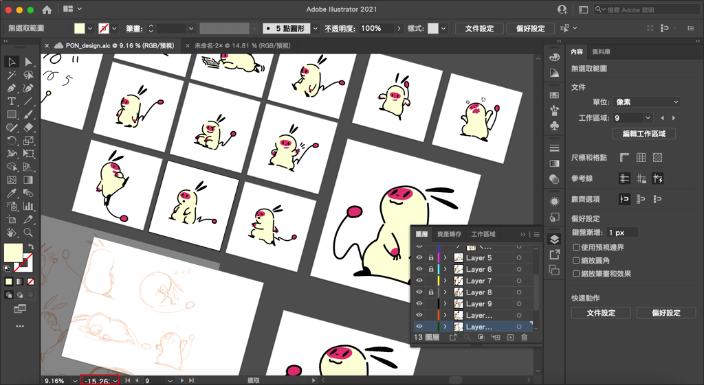
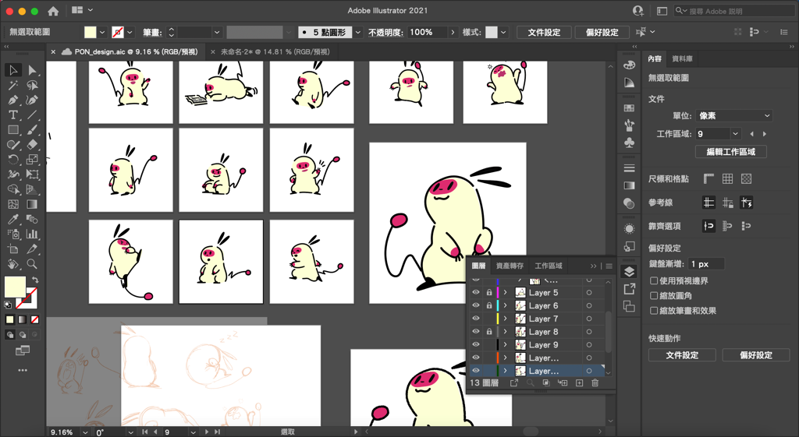

---

title: 如何將不小心旋轉的畫布轉正？
categories:
    - illustrator
date: 2022-08-06 00:03:00
Description: 使用筆電的時候，不小心用觸控板旋轉了畫布視窗，使用 shift + H 的旋轉檢視工具無法標準的轉正，該怎麼辦？
image: 如何將不小心旋轉的畫布轉正？.png
slug: illustrator-huabuzhuznzheng
draft: false
tags:
    - illustrator
    - 教學
    - 技巧

---

# 問題
1. 使用筆電的時候，不小心用觸控板旋轉了畫布視窗，使用 shift + H 的旋轉檢視工具無法標準的轉正，該怎麼辦？

# 解決方案
畫面左下角的度數改為0度就可以囉！

