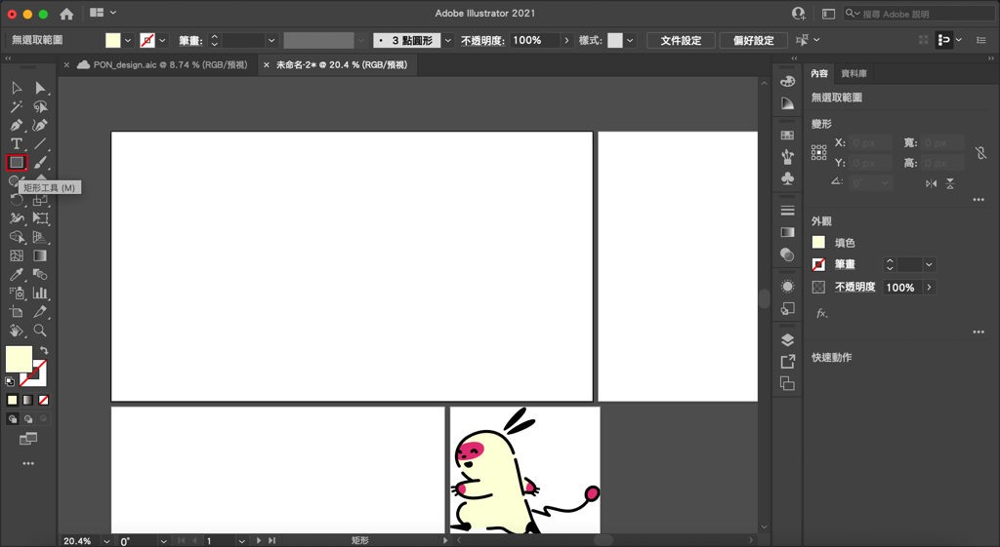
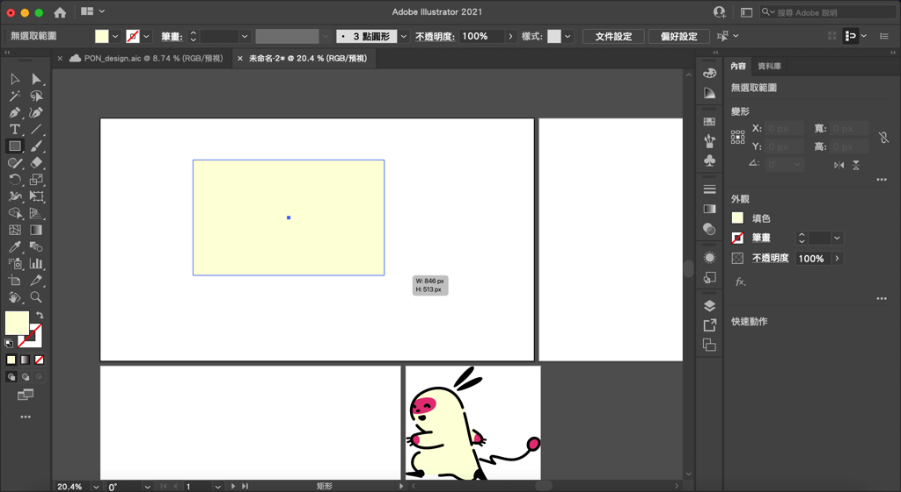
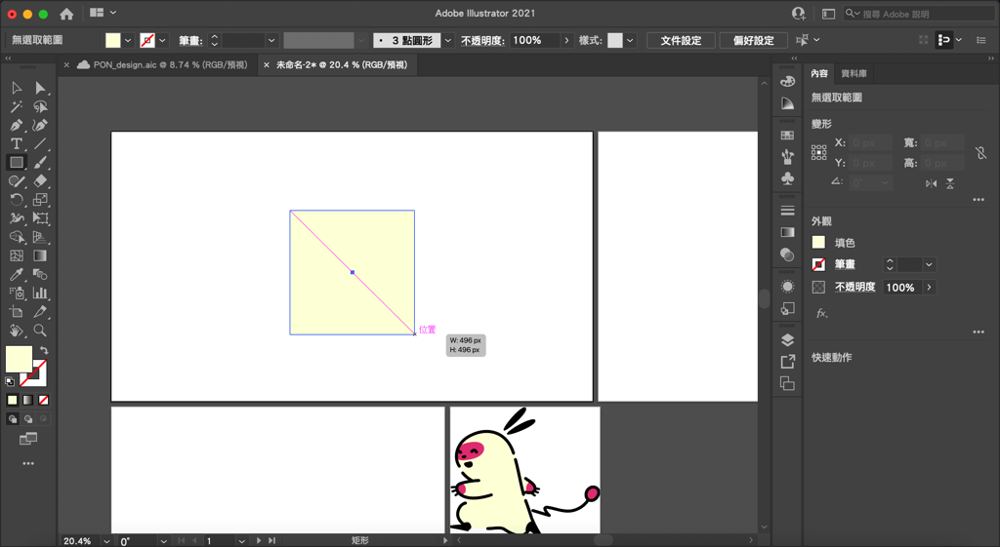

---

title: 如何在illustrator畫方形/正方形？矩形工具
categories:
    - illustrator
date: 2022-08-11 00:00:00
Description: 我想在 illustrator 裡面畫出方形/正方形，請問要怎麼做呢？
image: 如何在illustrator畫方形/正方形？矩形工具.png
slug: illustrator-square
draft: false
tags:
    - illustrator
    - 教學

---

# 問題
1. 我想在 illustrator 裡面畫出方形/正方形，請問要怎麼做呢？

# 解決方案
使用矩形工具（快捷鍵M）就可以簡單的繪製出方形/正方形囉！

左鍵按住畫布往右下拉，就可以看到一個矩形，手放開就畫好囉！

## 如何畫出正方形？
很簡單，只要和剛剛一樣的動作，在按住的時候也按住 shift ，就會發現矩形變成正方形囉！

## 如何以點擊的位置為中心畫出方形/正方形？
重複上面的動作，同時再按著 alt ，就會發現畫出來的矩形變成以點擊處為中心的方形/正方形。

以上就是今天的教學，如果有什麼問題歡迎在下面留言，也歡迎留言給我鼓勵喔！

---

我們是 Peckystudios 。

擅長設計吉祥物與角色相關的設計，這裡是我推廣創作的部落格，希望大家能藉由我的內容從創作中找到樂趣。

如果您正在尋找設計師為您設計吉祥物，歡迎您到[服務項目](https://peckyhsieh.wixsite.com/peckystudiosservice)頁面瞭解相關資訊，也歡迎您寄信到 peckystudios@gmail.com 與我聯絡！

謝謝

---

如果喜歡我們的文章，歡迎到[我們的選物店](https://www.rakuten.com.tw/shop/peckystudio/)支持我們，讓我們更有動力創作喔！