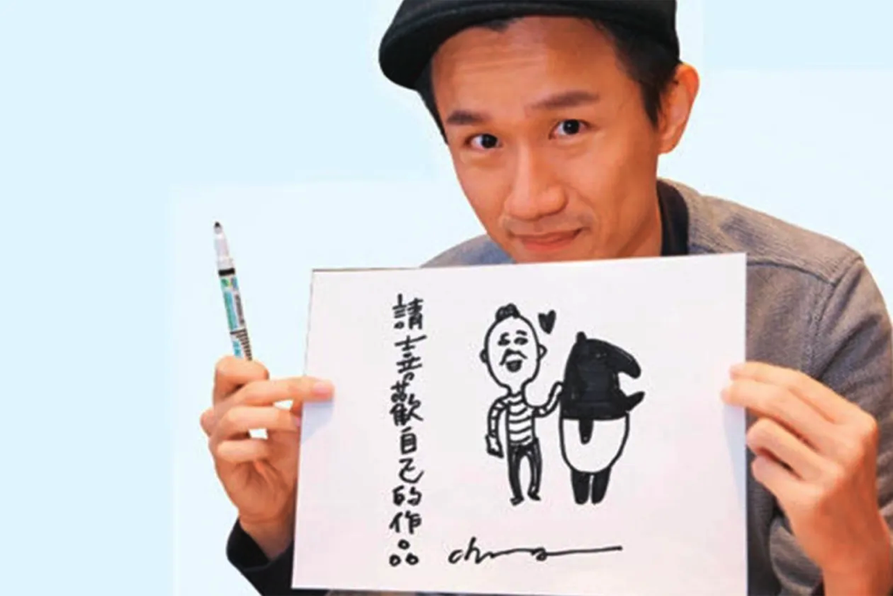

---

title: 圖文故事角色、圖像角色IP與吉祥物的差別
categories:
    - 吉祥物
    - IP經營
date: 2022-08-11 00:00:00
Description: 馬來貘、拉拉熊、角落生物（角落小伙伴）、卡納赫拉、皮卡丘、熊本熊、大同寶寶…….這些耳熟能詳的角色你都看過了嗎？哪些是圖文故事角色，哪些是圖像角色 IP ，又有哪些是吉祥物呢？
image: 圖文故事角色、圖像角色IP與吉祥物的差別.png
slug: mascot-3diffrentn
draft: false
tags:
    - 圖文創作
    - 吉祥物
    - IP經營
    - 角色
    - 角色設計
    - IP

---

馬來貘、拉拉熊、角落生物（角落小伙伴）、卡納赫拉、皮卡丘、熊本熊、大同寶寶…….

這些耳熟能詳的角色你都看過了嗎？

哪些是圖文故事角色，哪些是圖像角色 IP ，又有哪些是吉祥物呢？

這幾個東西其實非常的像，如果你問我這兩個東西的差別是在哪裡的話，我會說其實只差在目的、你的需求與最終的經營方式而已。

如果你是為了品牌企業而設計吉祥物的話，你可能只是想要有一個代言人或是想要藉由吉祥物來傳達你的品牌價值。而如果你現在在經營一個圖像角色 IP 的話你可能是想要傳達一個故事主題與創作角色間的精彩互動。

其實兩個東西是非常像的，只是名字不一樣而已。人家說做品牌其實就是說故事，我們在做圖像 IP 的時候，我們也是在說故事，整個架構都非常相似，要說差異，主要還是在目標客群是誰和經營方式如何執行。

我們只是在一樣的結構上做不一樣的事情而已。

現在所有的設計的交界處其實都越來越模糊，我漸漸的再也不不用一個專有名詞去硬要劃分所有的東西，而是將這些文字理解成一個抽象的概念，用本質去理解他，這對於未來要學習其他知識也有很好搬移學過的類似框架很有幫助。

# 圖文故事角色

[曾被批評畫得好醜！馬來貘插畫家：要從心底喜歡自己的作品｜天下雜誌](https://www.cw.com.tw/article/5118319?template=fashion)

例如馬來貘，以我的觀察，最早是在 Facebook 以有趣又與現代青年和上班族有共鳴而爆紅。

美術風格上通常不會像本科系一樣在角色設計有一套一脈相承的設計作法，而是走很有自我風格的畫風，以馬來貘來舉例的話，他就是以簡單的線條來勾勒，並且用對於社會上事件的細緻觀察來取勝。

因為很有自我風格，所以也很容易在這片網路海被認出來、記住。

如果你對於創作很有興趣，可是一直擔心自己不是本科系做不到，我會鼓勵你不用害怕，不是本科系但擁有成功 IP 的人非常多，只要多多了解自己，運用自己擅長的優點，你一樣可以擁有一個屬於自己的優秀 IP 。

圖文故事角色大多會以小篇的圖文漫畫為載體，在現有的網路平台發表，例如 Facebook 、 Instagram 、 部落格等等。

最早比較紅的就是像彎彎、四小折這些創作者，擁有自己的個人部落格，可以很好的累積自己的流量，後來 Facebook 風潮，在大家都在使用 Facebook 時，也漸漸有很多創作者來到這裡，可惜後來 Facebook 降低觸及率，現在較多的創作者會選擇到 Instagram 平台上發表，可以藉由 tag 來增加外部流量。

# 圖像角色 IP
其實只要是經營角色都算是圖像角色 IP ，圖像 IP 授權是每個角色故事創作者都要了解的事情，尤其是著作權、商標法等等知識，都非常重要，我們花了很多心思創作出來的寶貝角色，一定要多注意法律面的安全，多多保護自己的創作。

圖像 IP 授權的大大好處就是，現在市場上有越來越多的廠商需要角色的魅力來增加自己產品的價值，我看過的就有一般常見的生活用品、壁貼、便利商店的零食甚至飯店的活動，都會有圖像角色 IP 的出現，如果創作者可以多了解這塊多話，未來如果有相關的機會，這也是一個可以賺進收入的重要管道，要好好把握！

# 吉祥物
之前在[為什麼企業品牌需要吉祥物](https://peckystudios.com/p/whybrandingneedcharacter/)、[7個吉祥物設計可以帶來的好處](https://peckystudios.com/p/7mascotdesigngoodpoint/)也有提到，吉祥物通常代表了一個品牌或是一個活動，例如米其林與奧運會。

吉祥物肩負傳遞品牌價值與活動精神的重大任務，所以通常包袱會比一般圖文創作還要高，舉手頭足之間傳遞的訊息都必須小心，如果一不小心觸怒自己的顧客，那就不好了。

因為以上緣由，大部分的吉祥物都是走傳遞正向價值、可愛、討喜為方向來設計，比較少會用像卡娜赫拉那種微微厭世的內容，除非品牌公司是像日清杯麵公司 這樣很大膽行銷的公司，不然在設計的時候一定要多注意。

# 總結
像前面所提到，雖然文章內我用這3個名字來區分不同類型的 IP ，但其實核心都是一樣的，我們在學習的時候也可以多多參考自己經營項目以外的其他知識，有時候你會在這種隔壁種類的知識體系裡面找到對自己有幫助的內容，也許會找到可以對自己有大幫助的知識喔！