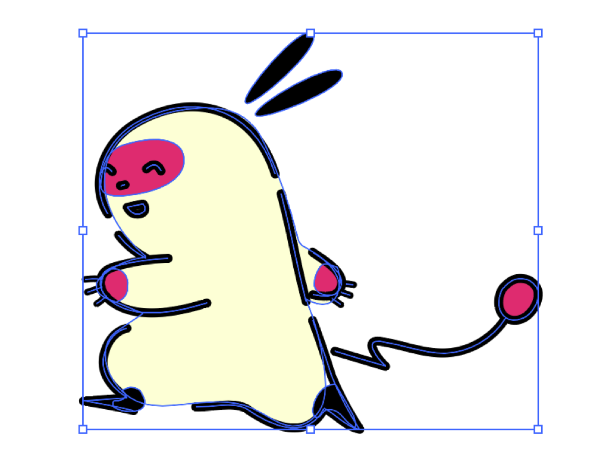
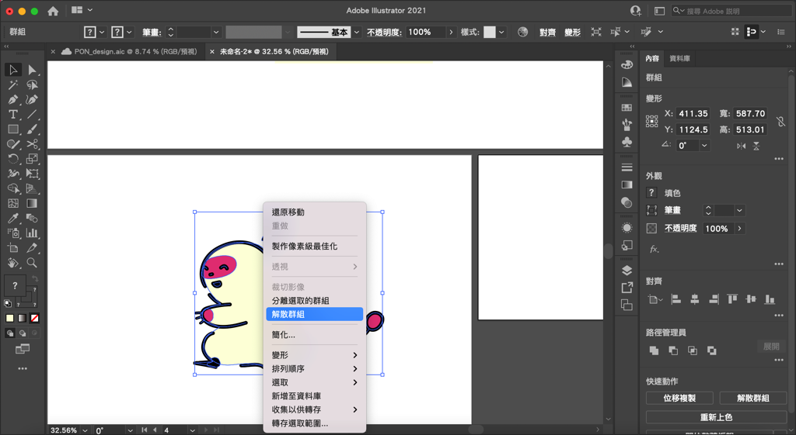
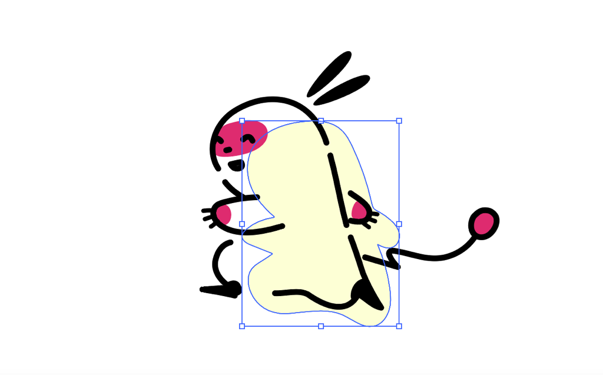
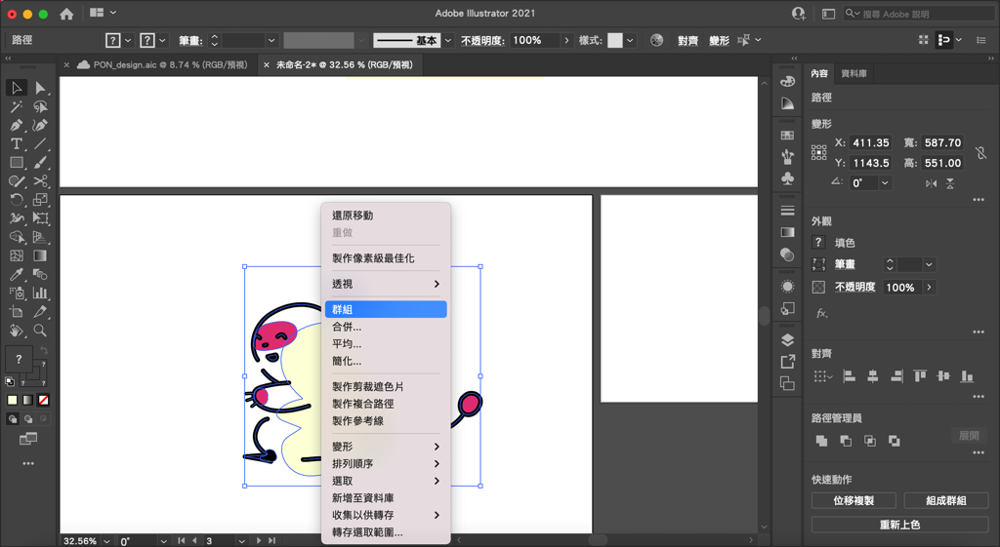
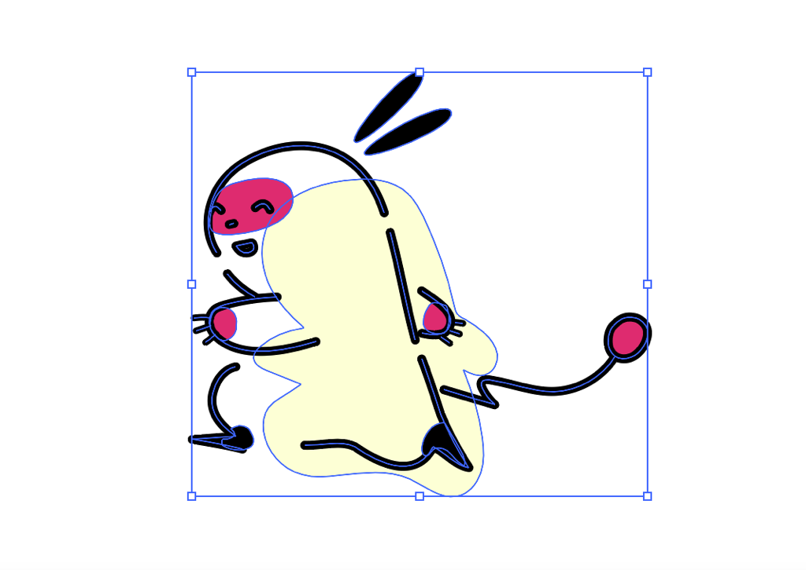
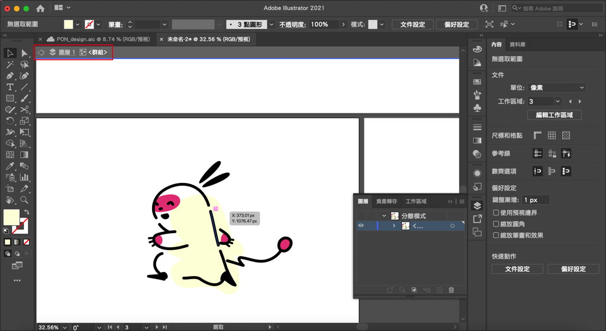
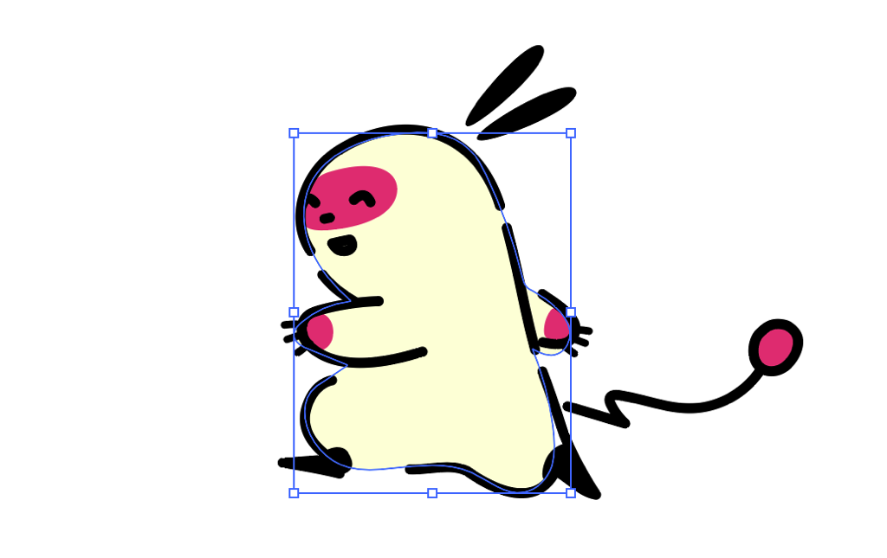

---

title: 如何在illustrator將圖形組合成一個物件？Group群組功能
categories:
    - illustrator
date: 2022-08-13 00:00:00
Description: 1. 繪製圖形時有了很多的形狀，我希望可以將繪製好的物件變成一個可以選擇的物件，以方便編輯，該怎麼做呢？2. 群組完了，可以在不更動群組的狀態下編輯群組內的形狀嗎？
image: 如何在illustrator將圖形組合成一個物件？Group群組功能.png
slug: illustrator-group
draft: false
tags:
    - illustrator
    - 教學

---

# 問題

1. 繪製圖形時有了很多的形狀，我希望可以將繪製好的物件變成一個可以選擇的物件，以方便編輯，該怎麼做呢？
2. 群組完了，可以在不更動群組的狀態下編輯群組內的形狀嗎？

# 解決方案
## 什麼是群組？
可以想像成假設我們有20個人，每個人代表 illustrator 裡面的一個形狀，我希望可以把人群中的女生挑出來變為一個群體，這樣在溝通上會比較方便，不用一個名字一個名字的叫，只要說請全部的女生出來就可以了。群組的功能也是一樣，我們可以選擇我們想要群組的所有形狀，再用「群組」功能將形狀變為一個群體，這樣我們在編輯（與軟體溝通）上就會比較方便。

可以參考這個吉祥物小PON的例子，他是由形狀和線條所組成的群組。

## 如何使用群組？
我先將上面這個小PON解開群組，再示範一次群組。在已經群組好的物件上按右鍵，選擇解散群組，即可將群組解開。

解開之後會發現我們在選擇的時候變為一個一個的形狀。

接下來，我們來將小PON群組起來吧！先選取所有想要群組的形狀起來，再右鍵，選擇「群組」。

群組就完成囉！我們會發現選擇時，我們是直接選擇了一整個群組。

## 如何編輯群組內的形狀？
現在大家可以看到小PON的身體顏色位置跑掉了，我想要編輯，但不希望影響到群組，我可以怎麼做呢？

很簡單，用滑鼠在群組上左鍵點擊2次，會發現 illustrator 會進入「分離模式」，也就是我們進入了一個只可以編輯群組的空間裡，在這裡我們就可以對群組內的形狀進行編輯。

可以注意進入分離模式會在左上角顯示所在的圖層位置，有出現這個才代表有成功進入分離模式喔！

接下來我們將身體顏色移動回去。

離開分離模式只要左鍵點擊旁邊空白處2次就可以了！

## Bonus
群組不是只可以群組一層而已，而是可以很多層，例如我畫一個人背著一個包包，包包上面有小花，我可以先將小花群組起來，再選擇小花和包包群組起來，最後再將人、包包和小花一起群組，這個時候可以試著用分離模式看看，點擊第一次時我們會先進入人、包包和小花的群組，如果要編輯小花，就要進入小花和包包的群組，再進入小花的群組才可以編輯小花。這個邏輯在 illustrator 裡面很重要，對圖面的編輯效率來說會是關鍵，推薦學習！

以上就是今天的教學，如果有什麼問題歡迎在下面留言，也歡迎留言給我鼓勵喔！

---

我們是 Peckystudios 。

擅長設計吉祥物與角色相關的設計，這裡是我推廣創作的部落格，希望大家能藉由我的內容從創作中找到樂趣。

如果您正在尋找設計師為您設計吉祥物，歡迎您到[服務項目](https://peckyhsieh.wixsite.com/peckystudiosservice)頁面瞭解相關資訊，也歡迎您寄信到 peckystudios@gmail.com 與我聯絡！

謝謝

---

如果喜歡我們的文章，歡迎到[我們的選物店](https://www.rakuten.com.tw/shop/peckystudio/)支持我們，讓我們更有動力創作喔！